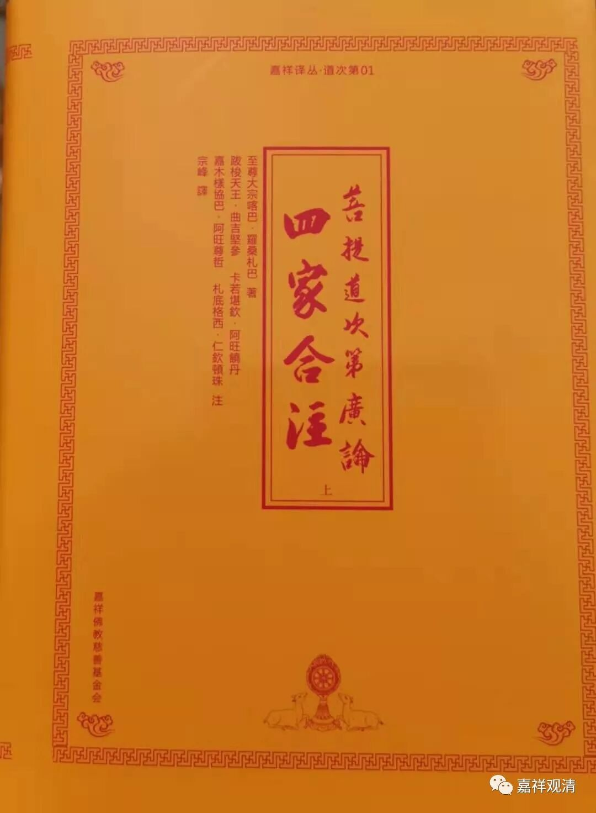

**《善说精髓》079（四）**

** 慧见不见诸德本，根除有寂诸衰损，”

** 

应知** “慧”**是** “诸”**功** “德”**的根** “本”**。

这里的“见、不见”是什么意思呢？单从文字上来说，就是“现见”、“不现见”，但对此“现见、不现见”有几种不同的理解了。

《广论》引龙树颂“慧为见不见，一切功德本，为办此二故，应当摄受慧”，宗大师解释为“慧是现后一切功德根本”，也就是“** 慧见不见诸德本**”这一句的来处。《广论》解释“见、不见”，就说是“现后”，就是现在、将来。《四家合注》跋梭天王解释说：“二、将见不见作为现世、后世来解释，（《广论》）此处是依后者（“现后世”说）。”

《四家合注》中跋梭天王还提到了一种说法：

** “一、总则事势比量、极成比量之境为‘见’，而信许比量之境则为‘不见’。”**

也有从“现量见”、“不现量见”（现前知、不现前知）这样来解释的，这也还是格鲁系统大佬的说法……不过似乎更饶了。不多谈了，我们就依宗大师解释为现后世好了。

总的来说，“** 慧见不见诸德本”**的意思是——慧是一个功德的根本。《广论》说：

“一切功德皆从慧生者，如云：‘世间圆满从慧生，如母育子有何奇，善逝十力超胜力，一切无等最胜事，及余一切功德聚，皆依如是慧因生。世间艺术及胜藏，所有如眼诸经典，救护觉慧及咒等，种种建立法差别。众多异门解脱门，彼彼利益世间相，大力佛子所显示，此等皆从慧力生。’”

说是世间、出世间一切功德的根本。上述“见、不见”的第三说就是从这里音声开去的，意为：出世间“现前知”的为“见”，世间的“非现前知”为“不见”。也是一种说法。

** “根除有寂”**当中的** “有”**就是三有（欲有、色有、无色有，就是三界），就是指的轮回；** “寂”**就是寂灭，这里指的是二乘的解脱。意思是什么呢？轮回固然是一边，是我们要断除的，但是比如说，像声闻乘单纯地为了自己的解脱落入寂灭，这也是一边。如果你单纯地为了自己的解脱落入寂灭边的话，就不会去想更进一步圆满地修行。

所以说呢，这就是二边——有边和寂边。轮回，固然是** “衰损”**，寂灭这类声闻的解脱，对大乘而言也是** “衰损”**，也是不够圆满的。比如说我们现在经常会讲职业规划的问题，如果你之前的职业规划是有问题的，那么你就是花了再大的力气，对更远的目标来说，可能都是衰损。所以要根除轮回和寂灭边的种种衰损。

