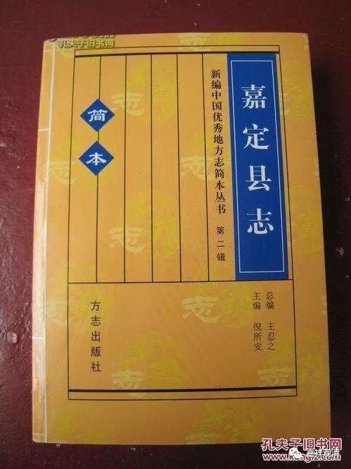
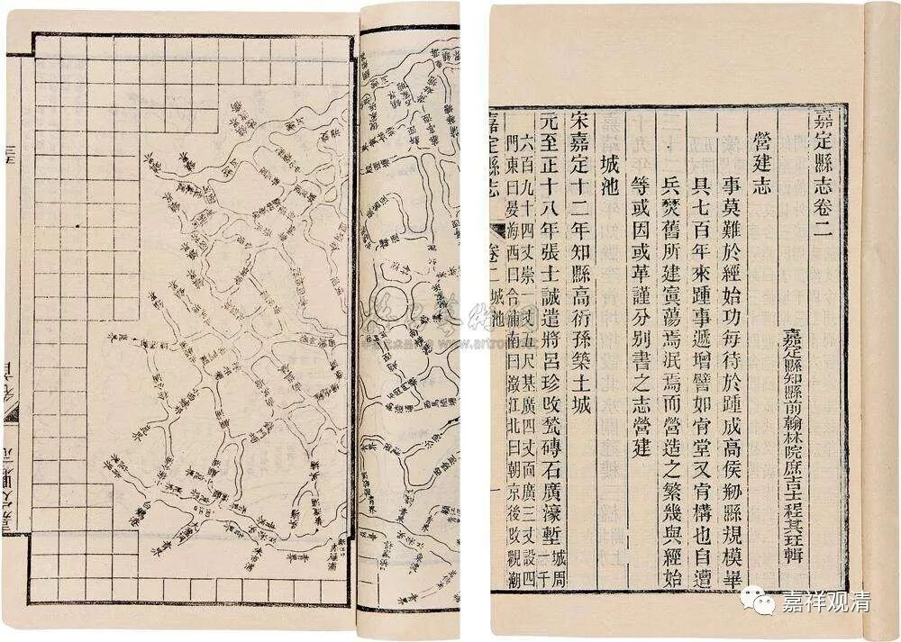
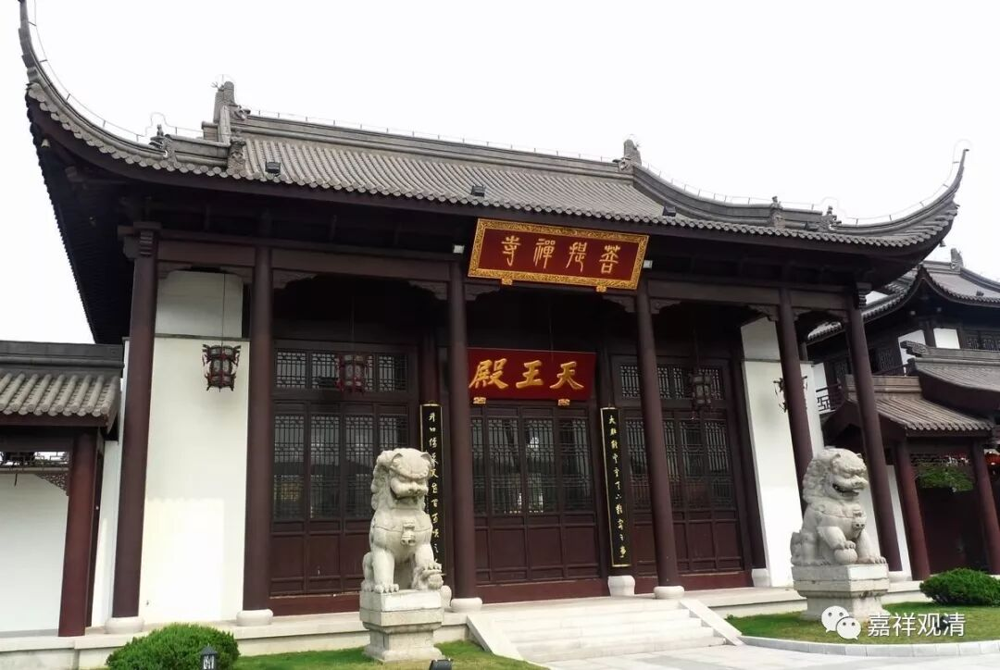

**新编县志里的历代寺僧数字**

最近学会网购，疯狂买买买中，书橱瞬间不够用了……

手滑有时候书就买重复了，最高纪录是《华南海盗》一下子手滑买了五本，不知道的可能还以为我跟海盗有啥渊源呢……存心买的不算。比如叶少勇的《中论颂》先后买了大概有七本——“三窟”各放一本，随身带一本，一本可以乱写乱画，送人一本，另有一本备用……《中论颂》一版一刷的是锁线装订，现在刚出的19年7月的十一刷是胶装的，胶装的书容易散，所以随身带着的是一版一刷的。

买了嘉定县县志正续编，以为是依照明清版本重排的，到手发现是八九十年代新编的，但也发现有用的部分。

我以为会是这个样子的

上海嘉定县最早有寺院是在三国东吴时期（赤乌二年），就是安亭的菩提寺，那个寺院我去过几回，但不知道它的历史这么久了。

安亭菩提寺

嘉定县寺院、佛教极盛是在南朝至唐代，至唐乾符年间，仅南翔讲寺一寺便有僧众700余人，为“东南巨刹”。寺名“讲寺”，说明是教下天台宗的寺院，可见彼时讲学之盛。其实那时候千人以上的寺院并不少见，南翔讲寺之“巨寺”说法略有夸张（编辑县志的人没见过世面吧）。

元代另有寺院兴废，全县有僧尼600余人。明初洪武年间整顿佛教，全县一百二十余座寺院撤并为二十四所，严禁新剃，劝奖还俗，全县僧尼降至300余人。清末（1911年），全县寺庵19座，1913年有寺僧的寺院25座，僧尼54人，大部分就一个看门的了。49年有僧尼75人，土地改革后大部分还俗。78年恢复活动，仅剩一寺二尼。84年行政区划调整，此寺划出归临县区，全境乃无寺无僧……

《县志》（01年出版的）到这里就……没了。不过现在隔了快二十年了，应该恢复了几个寺院了吧，比如说安亭的菩提寺……

