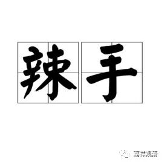
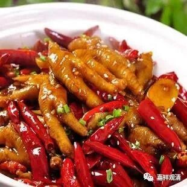
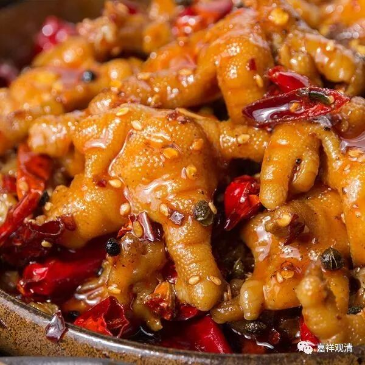
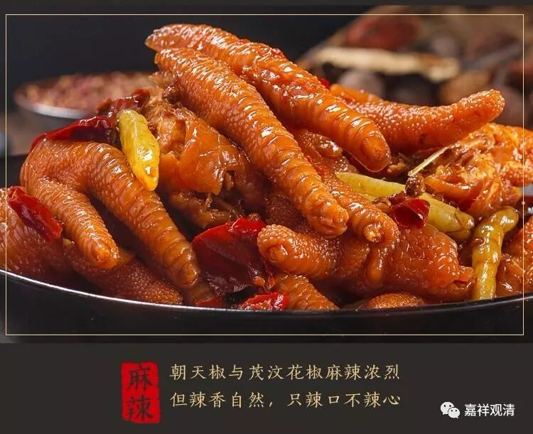
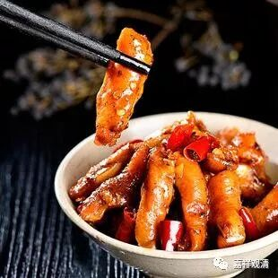

上海话里有“辣手”一词，比如说“某某人辣手格！”意思是这个人很厉害，“辣手”相当于“厉害”、厉害手段，有时候也说“结棍”。大概，“辣手”的原意就是毒“辣”的“手”段，而引申为“厉害”。如上海话里也会说“某某人手条子辣格！”，“手条子辣”、“手辣”和“辣手”意思差不多。

“辣手”这一词在禅宗语录里也常见到，比如虚堂和尚的《送先侍者》：

**“半怯春寒病未甦，出门无力为三呼。**

** 诸方辣手如灵验，秋晚应归捋虎须。”**

这是说：你现在出门参学，得到各位善知识的峻烈教育（“诸方辣手”）如果有效，过段时间再回来咱继续聊聊。

《严大参和牧牛图颂·初调》：

** “生狞如虎鼻难穿，赖得牧童有索鞭，**

** 不是一番施辣手，个时劣性恐难牵。”**

这是说，牧牛郎辣手施教，耕牛才听调教。

中峰明本禅师也说“……老僧不具此驱耕夺食、换斗移星之辣手……”，意思是我这里没有那么厉害的手段：

尼清光禅师示众：

** “一棒一条痕，一掌一握血，辣手不容情。”**

也是厉害手段的意思。

类似的公案里这种用法，都可以按今天上海话的意思来理解，指禅师的厉害、严厉的手段。

有时候“辣手”和“婆心（老婆婆的心肠，指慈悲）”对举，如云：“谒俍和尚于水西。谈笑欢洽间，忽出《涅槃末后句》相示。嗟乎，嗟乎！婆心辣手遂至此耶？”就是一例。

