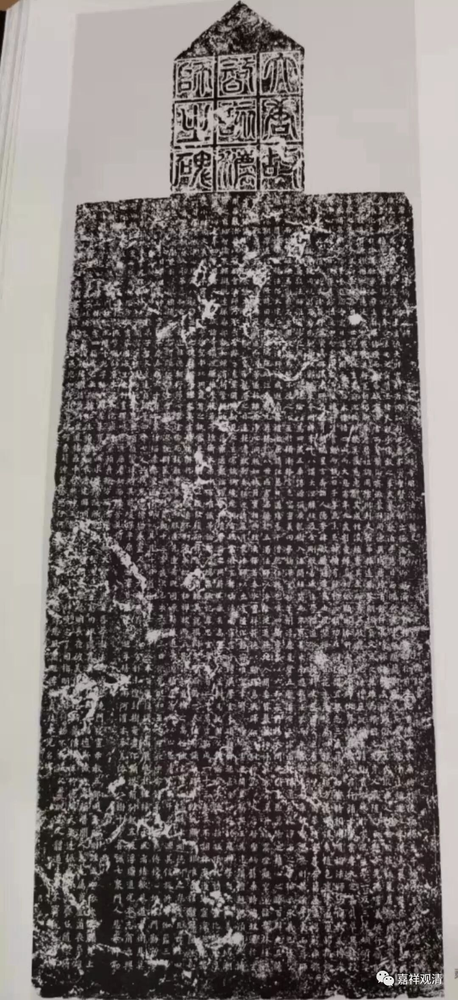
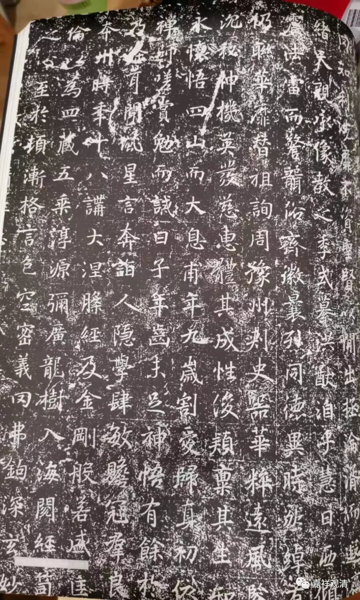

**《智该法师碑》解读正误（三）**

继续谈《智该法师碑》的解读中的问题。

先看最初一段的这一段文字，现存三文句读都不相同。

一、《全唐文补编》：

** ……天，亲承像教之季。式纂洪猷，洎乎慧日。西倾余光，东照腾兰。嗣大义而□止澄什，匡颓运以来仪夷夏。何其宏謩幽口。翼其神化。至于跨蹑融肇，吞孕生林，耀传灯而鉴昏城，震法雷而警聾俗，齐徽曩烈，同德异时。然绰有余行，其唯智该法师矣。**

二、《长安发现唐智该法师碑》：

** 天亲承像，教之季式，摹洪猷洎乎慧日。西倾徐光，东照腾兰，嗣大义而废止澄什，匡颓运以来仪夷夏。何其宏暮，幽□真其神化。至于跨鸳融肇，吞孕生林，耀传灯而鉴昏城，震法雷而警聋俗，齐徽曩烈，同德异时，然绰有余行，其唯智该法师矣。**

三、《佛教新出碑志集萃》：

** 天亲承像教之季。式纂洪猷，泊乎慧日。西倾余光，东照腾蓝。嗣大义而□止澄什，匡颓运以来仪夷夏。何其宏謩，幽口翼其神化。至于跨蹑融肇，吞孕生林，耀传灯而鉴昏城，震法雷而警聾俗，齐微曩烈，同德异时。然绰有余行，其唯智该法师矣。**

为了解读，专门去买了一本《西安碑林名碑书法艺术赏析》

这一段骈体，涉及佛教知识比较多，三篇文章都在这里集中出现了错误点，在这里做一下解释。

一、天亲，即世亲论师，人名。《补编》把“天亲”拆属两句，误。

二、像教，佛教分正法、像法、末法时代，也称正教、像教……“像教之季”，在像教的时候。《发现》把“像教”拆开，“季”与“式”连，误。

三、式纂：继承之义。《发现》把它拆开，“纂”读为“摹”误。

四、慧日西倾、余光东照：此二句对仗工整，此处三文断句皆误。

五、腾兰：此即摄摩腾、竺法兰二人之简称，《集萃》“兰”作“蓝”，误。

六、澄什：此即佛图澄、鸠摩罗什二人。

七、腾兰嗣大义而废止，澄什匡颓运以来仪：此二句对仗工整，三文皆误。这主要是不知四位人物所致。《集萃》虽举出四人，而误作“迦摩腾、竺法蓝”，皆误。

八、融肇、生林：前者指僧融、僧肇，后者为道生、道林（竺道生、支道林），都是南北朝时期的高僧。《集萃》注释、白话中都没能读出这是指的四位高僧，做含糊处理了。

九、齐徽：徽，美好。齐徽，与美好相并列，意指智该法师齐于（上述四位）先贤。《集萃》作“齐微”，误读。

十、曩烈：曩，以往。曩烈：先贤。即上述四位高僧。《集萃》白话解释为和佛相比，误。

下面对这一小段做一下新的标点：

** 天亲承像教之季。式纂洪猷。洎乎慧日西倾，余光东照，腾兰嗣大义而废止，澄什匡颓运以来仪；夷夏何其宏謩，幽口翼其神化。至于跨蹑融肇，吞孕生林，耀传灯而鉴昏城，震法雷而警聋俗，齐徽曩烈，同德异时，然绰有余行，其唯智该法师矣。**

        修改于