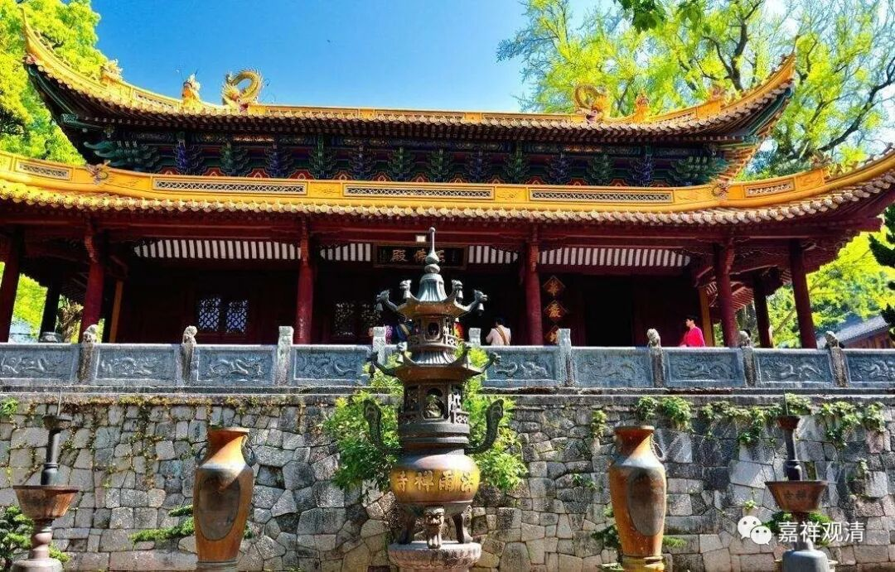
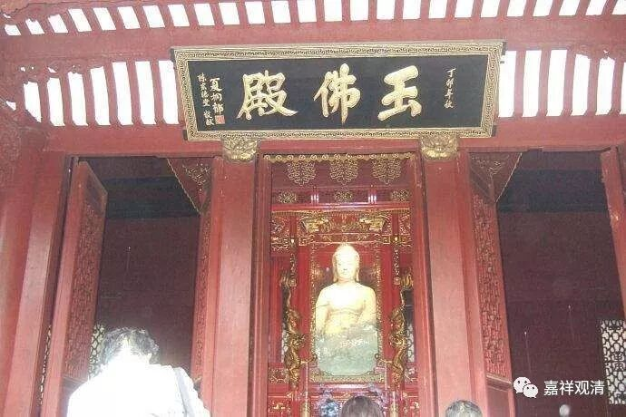
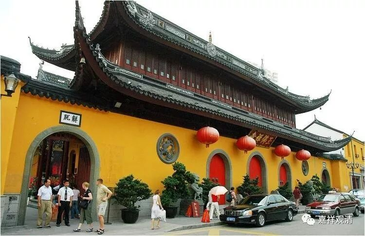

**法雨寺·玉佛寺和上海普陀区**

普陀山法雨寺有个玉佛殿，说起来，和上海的玉佛寺有点关系。

清末，普陀山慧根法师从缅甸请来五尊玉佛欲请回普陀山，途径上海。但当时并没有大型起重机，遂由盛宣怀父亲出面，将两尊大玉佛留在上海，三尊稍小的转运至普陀山。留在上海的两尊大玉佛择地建了“玉佛寺”，运至普陀山的三尊玉佛就在法雨寺了。法雨寺以前在上海有下院，就是“大佛厂寺”，正名应该是“镇海禅院”（在上海的法雨寺下院有为法雨寺募化的功能）。现在的“大佛厂寺”没了，门前的大佛厂路改名叫“大昌路”了。

玉佛寺原来在江湾车站边上。玉佛寺建寺后不久，就在宣统三年进京请藏经。据杨玉良《清<龙藏经>刊刻情况拾遗》一文所录，宣统三年“又有……松江府宝山县玉佛寺僧印慈……各请印了一部（龙藏）”（江湾，原属松江府宝山县为江湾乡），这里的玉佛寺就是此处所说玉佛寺。

玉佛寺第一任住持即前述普陀山慧根法师，第二任即本照法师，据《上海的宗教》中《近代名刹玉佛寺》一文所载“……本照任住持，他继承先志，躬自晋京，请得雍正年所刻《大藏经》（即《龙藏》）一部，供养寺内……”。这里，与《拾遗》一文所说“玉佛寺僧印慈”不符，或者此“印慈”即“本照”之字？

《名刹》一文说“雍正年** 所**刻之大藏经”当作“雍正年** 始**刻”，《龙藏》即《乾隆大藏经》，乾隆时刻完全藏，并做删补。

1909年请来大藏经，1911年辛亥革命，而后国民政府实行庙产兴学，寺院被占，二迁而至今址。因玉佛来源和普陀山有关，后来新址附近一条路就被命名为“普陀路”，解放后上海行政区划大调整，便将辖区命名为“普陀区”了。

