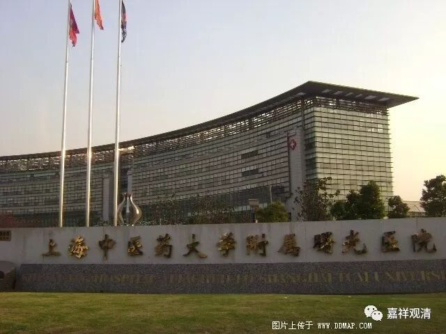
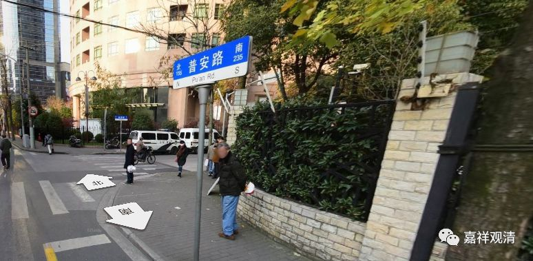
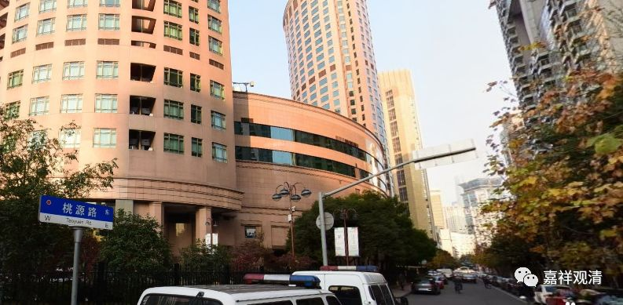

**“国恩寺”小考**

上海曙光医院边上以前是一个大寺院呢。

上海中医药大学附属曙光医院（西院）在今天普安路（185号）上，其附近（普安路159号）以前有一个大寺院——国恩寺，有江苏省当时最大的佛像，高三丈。今天十米高的佛像所在皆是，解放前却是极难得一见的。

早先，此地叫“八仙桥”（后来此地有“八仙桥路”，就是今天的桃源路）

有寺院名“桂香庵”，时久而废。光绪七年“普陀山紫竹林”僧智参来沪受戒后，于此地重建寺院，改名“福莲禅院”，为普陀山紫竹林下院。当时江浙一带很多寺院到上海开下院为本寺募集资金，普陀山几大寺院在上海基本都有下院，比如前文所说，“大佛厂寺”为法雨寺下院。

光绪二十五年（1899年），智参师父去北京请藏经回寺院。据《上海掌故大辞典》载，智参师去北京请藏经是与南市广福寺（在今上海城隍庙古玩市场）僧竹禅、九华山甘露寺僧大航同去，而据杨玉良《清<龙藏经>刊刻情况拾遗》一文所记载，光绪年间，上海请藏经的只有一家：“光绪年间……有……松江府上海县报德庵僧道源……各请刷一部（《龙藏》）……”，并无“福莲禅院”、“广福寺”、“甘露寺”在列。

国恩寺后来建有“藏经楼”，并明说收藏“有半套藏经”，所以可能的事实是：“福莲禅院”、“广福寺”、“甘露寺”三个寺院以“松江府上海县报德庵”的名义合请了一套藏经，各自领回一部分（很可能国恩寺领回的就是一半），“道源”可能是智参法师的字号。此时寺院或者已经叫“报德庵”了——这是一个过渡的名字，因为请藏经是比较隆重、难得的（乾隆二十七年直至清亡总共只印了32部），得有一个比“福莲禅院”更正规、大气一点的名字。

智参法师请藏经回上海后，就改寺院名为“国恩寺”，意思是寺院获赐藏经得沐“国恩”（前文说过，印藏经和装订的钱都得自己出）。请藏经、改寺名还有一个意思，就是寺院正式独立了，是得到朝廷认可的“大”寺院而不再是紫竹林的下院了。（当时驻上海的各大寺庙“下院”其实在一段时间积累以后先后独立。）

“大”寺院还有一个标志，就是——传戒！1899年请回藏经，1900年国恩寺就传戒了，至1923年一共传戒五次。

江湖上“大寺院”还有一个标志就是——启建水陆法会。国恩寺也经常做“水陆道场”。

然而……佛说世间是无常的，兴废也就在瞬间……1956年该寺停止佛事活动，58年原地兴办玩具厂，71年拆藏经楼，76年全部拆除……现在是新的大楼了……

