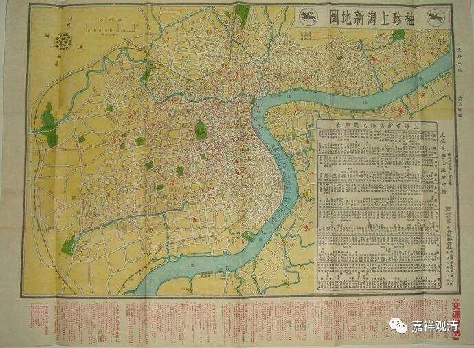
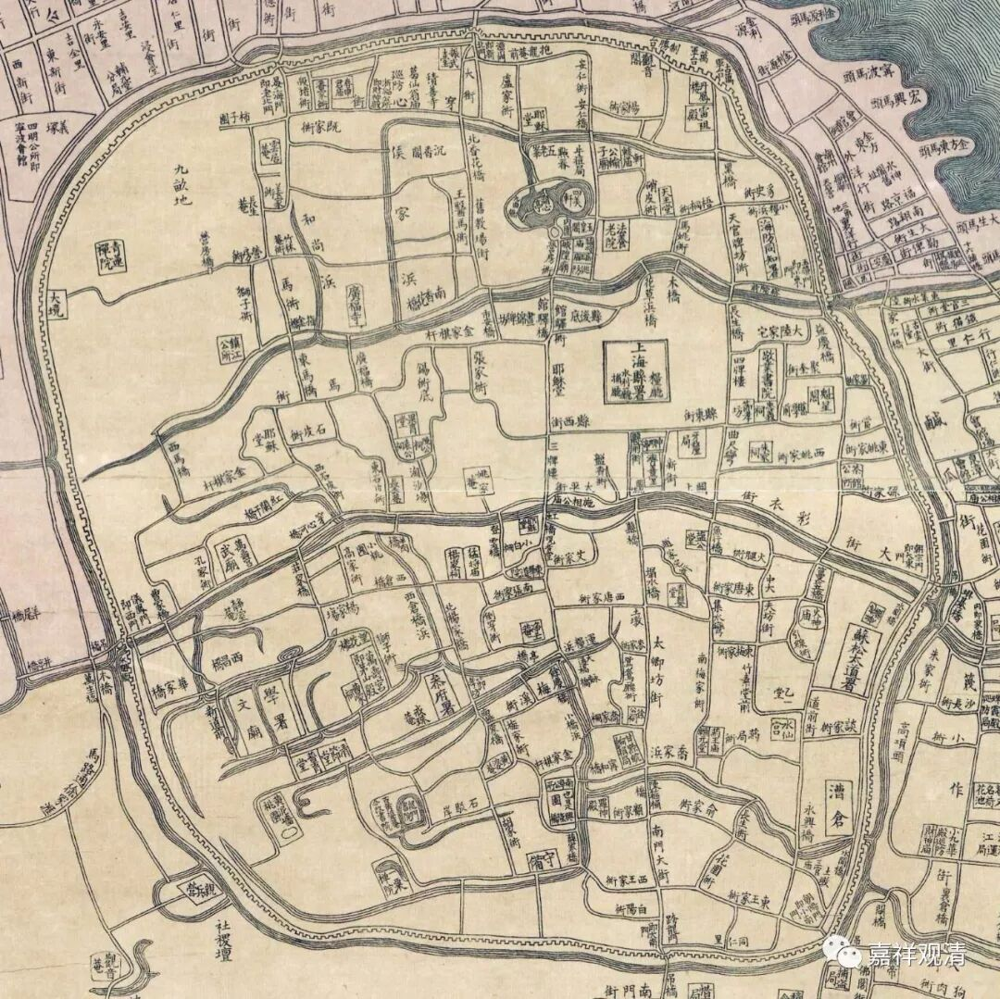
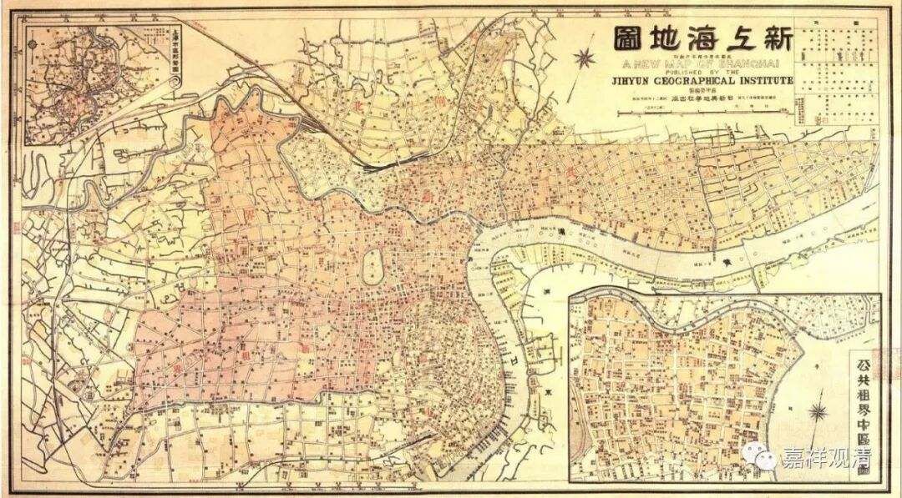
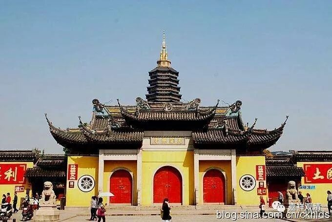
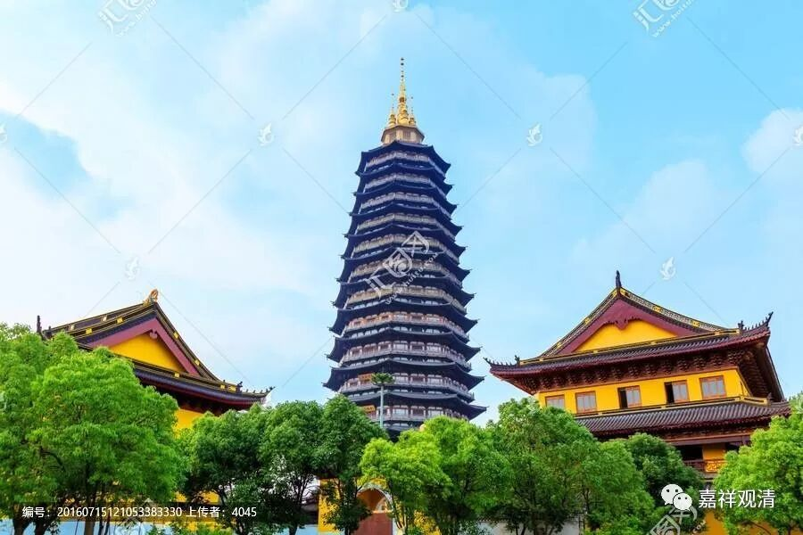
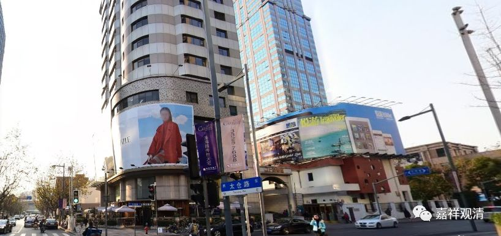
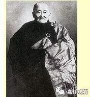
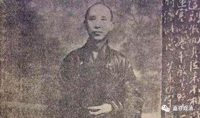
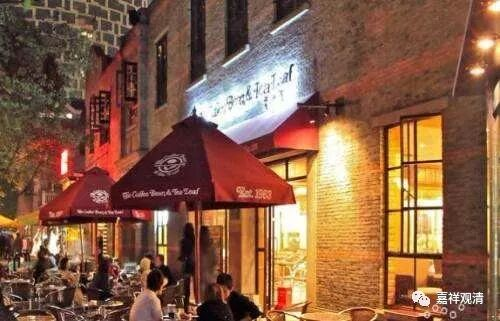

**庄严寺的兴废**

上海自开埠以后，资源丰富、人员集中，佛教在当时的上海（旧城区，以上海县城为中心向外辐射，这里的“上海”大致可以理解为上海县城、英租界、法租界、公共租界、华界，略扩大一点的话，可以理解为内环线以内。和今天的“上海市”的行政区划不是一个概念。）得到很快发展，据《上海近代佛教简史》记载，新建佛教寺院达149所，48年出版的《上海市大观》则谓民国以后新增寺院71所。这些寺院主要集中在黄埔、卢湾、南市一带，如法藏讲寺、庄严寺、国恩寺等。

上海、租界全图

昨天聊了“国恩寺”，今天聊聊“庄严寺”，明天聊聊“法藏讲寺”……他们依次在曙光医院北边、西边和南面，还有一个西林禅寺，在曙光医院东面方向，我们就依次来谈一谈吧。

上海开埠，原来和其他开埠城市差别不大，但开埠后不久，“太平天国”呼啸而来，整个江南因此残破，文化、宗教、经济等各方面受伤害极大，“天国”势力所在、兵锋所向，寺院庙堂几乎被扫荡一空。战事一停，江南各大寺院都忙着恢复，而上海人员多、经济好，于是纷纷来上海“化缘”筹款以建寺安僧。

今日天宁寺

常州天宁寺当时是全国性的名刹，和镇江金山寺、扬州高旻寺齐名，有民谣称“金山的腿子高旻的香，天宁寺的唱腔盖三江”（也有说“……天宁寺的包子……”）。

常州天宁寺

1927年，天宁寺在今天上海金陵中路（凯自迩路）、嵩山路（葛罗路）口置产（今天淮海路枣子树北边，延安路绿地南口）收租供给寺院常住。

太仓路马当路口，庄严寺旧址所在

抗战爆发，天宁寺证莲和尚到沪，售出此地，而在今太仓路购置百余间房产，继续收租供天宁寺数百僧人口粮，并辟四亩地、三十余间房改建为寺院作为天宁寺下院，名为“庄严寺”，庄严寺的佛像、法器、家具皆从天宁寺运来，乃至住持、僧人亦来自天宁寺。

应慈法师

守培法师

1941年正式开光，并延请应慈法师、守培法师等高僧讲经，迅速名闻海上。

此后，作为下院，庄严寺全力资助常州天宁寺，常州佛教医院常规支出款项也全部来自庄严寺。

49年住持证莲法师移居香港，55年停止佛事活动，56年改为电器厂，即今太仓路140号（马当路口）。

庄严寺从正式开光到停止活动，走了十四年……它，辉煌过

庄严寺旧址往南不远，就是上海新地标——“新天地”。

