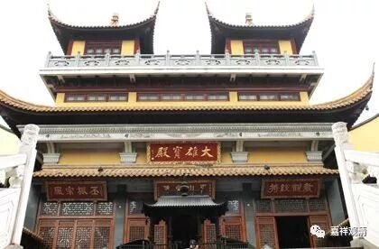
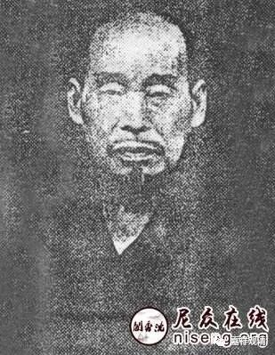
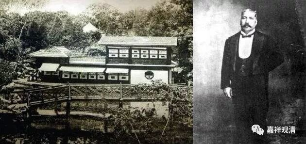
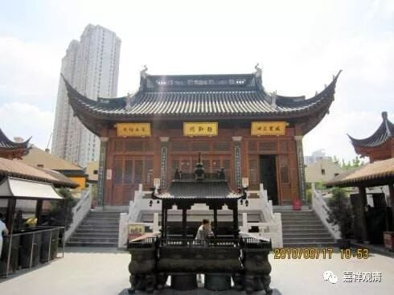
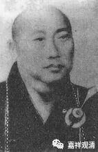
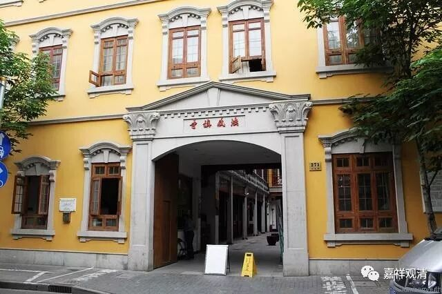
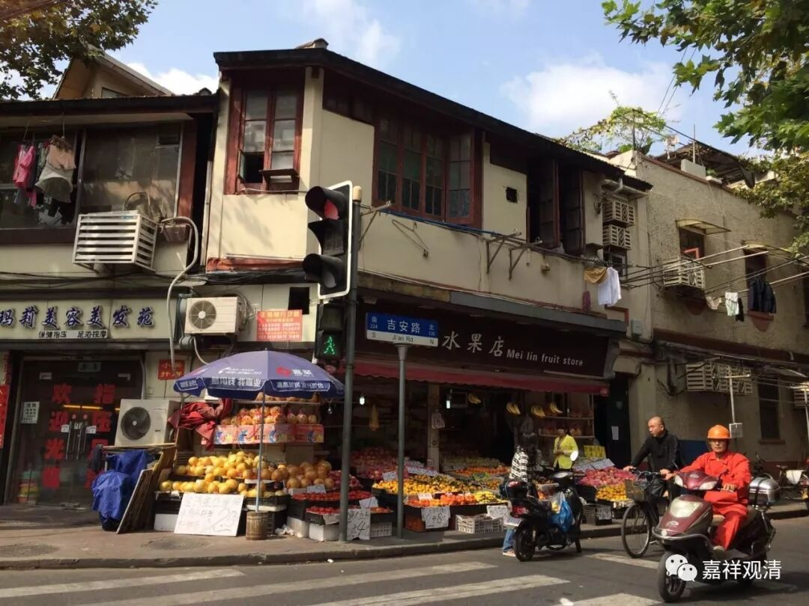

**聊聊法藏讲寺**

法藏寺，全名法藏讲寺，是我们成年以后重新对外开放（1993年重建，1999年10月对外开放）的，确实上海很多人还不知道市中心还有这样一个寺院。

兴慈法师像

法藏寺“开山”也不久，它和民国时期的高僧兴慈法师有关。

兴慈法师是天台宗僧人，所以寺名全程是“法藏讲寺”，“讲寺”的意思，说明他是天台宗的寺院。元代分佛教为“讲宗”、“禅宗”、“律宗”，天台属于“教下”，列入讲宗。明代沿用，改为“讲宗”、“禅宗”、“瑜伽宗”，弃“律宗”，其所谓的“瑜伽宗”。就是赶经忏的“香花和尚”。朱元璋说经忏和尚能超度，是“大乘”利他的行为，讲禅之流多属自利，被他打压……今天从很多寺院名字上也可以看出些“名堂”，如法藏讲寺、戒幢律寺、白云禅寺（哈哈！你们懂的）……

哈同和哈同花园

上海开埠后，有个犹太富商叫哈同，他们夫妻俩信佛，在上海为佛教出了不少力——办过大学（华严大学）、刻过藏经（频迦藏）。因办学之故，请兴慈法师来沪讲经，得到当时“买办”王一亭（王氏早年信基督，后虔诚信佛）资助，在茄勒路（今吉安路）近辣菲德路（今复兴中路）置地五亩，创建法藏讲寺。1929年建成，便由兴慈法师任方丈，遂成名寺。

50年兴慈法师圆寂，公推苇舫法师（时为玉佛寺住持）接任负责寺委会。

苇舫法师像

1954年寺委会解散，寺院被辟为“同乐小学”，后改为吉安路小学。此后又改为工厂……90年佛协收回，我认识的一个法师（差点和他做了师兄弟，当时他从中国佛学院刚毕业）接掌此寺。记得最早我去那边的时候，就在改造厂房。

法藏寺在市中心，交通很方便，但门庭不开阔，一般人路过基本不会注意到。附近有地铁站，它北距曙光医院、东去黄浦区豫园街道医院都不远，所以中午经常能约了医生们在那里吃素馄饨……

今天的吉安路、复兴中路口，原茄勒路、辣菲德路口

馋虫这就勾起来了，过两天去吃馄饨咯，有陪同的吗？

