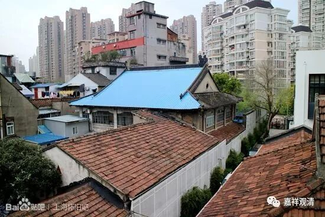
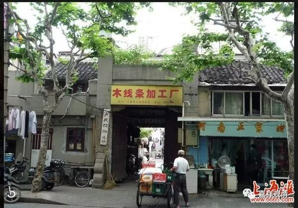
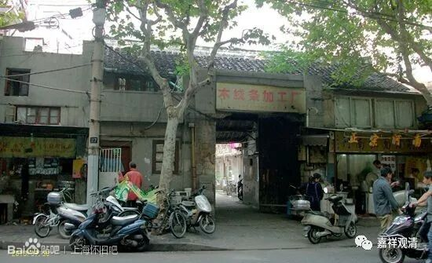
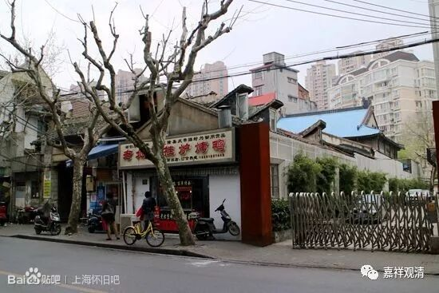
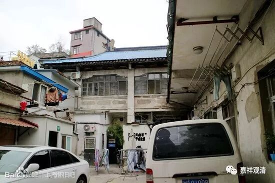

**法藏寺下院之**

** 海会寺**

法藏寺1929年建成，历史并不久，但它在上海很快有了两家下院：三观堂和海会寺。有趣的是，这两个寺院名称都和上海其他寺院撞车。

说起法藏寺在上海迅速做大，和兴慈法师的名望、交游有关。当年法藏寺大雄宝殿的楹联，是由国民党元老于右任、李烈钧所题。于右任的楹联是：“五眼六通，彻悟人身，有为莫非泡影；三身四智，明观宇宙，无限各具同缘。”李烈钧做的楹联是：“平等愿终偿，圆棹漫谈天竺事；大悲观自在，众生咸领海潮音。”另有民国元老章炳麟、叶恭绰等也各有楹联、偈语题词。

建寺后不久，寺院最多时有四百多僧人，于是辟两座下院：三观堂，和南市的海会寺。

上海的“海会寺”有两座，一座早浦东杨南支路上，始建于元代，民国时期成为苏州灵岩山寺下院。（“三观堂”好像也有两座，一在虹口，一在南市。）

海会寺在今天丽园路，原为兴慈法师静养之所。后陆续购置房产，辟为寺院，45年落成，名“海会禅寺”。建有大雄宝殿等六十余间房，占地六亩，最多时有僧人百余。后开办海会寺印刷厂。但寺院很快香火不盛、开支困难。毕竟方丈慧开法师的名望、学养远不及兴慈法师，而且时局也不对。寺院落成后三五年便无以为继，1965年被征用，不久就湮没于“历史长河”了。

这个“木线条加工厂”就是原先海会寺的“山门”。寺院山门的样子大致还能看得出来。

蓝瓦的是大殿，可以大致看到寺院的“影子”了

换个角度

原大雄宝殿正门

回想起来，海会寺的“生灭”和现在的很多著名企业一样，盲目扩张，迅速湮没。

忽然想到。海会寺有个特别的“规制”——“韦驮殿”建在大雄宝殿后面，是不是护法菩萨不高兴啦（开个玩笑……莫怪莫怪）

图片来自网络，过两天亲自去考察一下。

越来越觉得有必要买个大疆……

