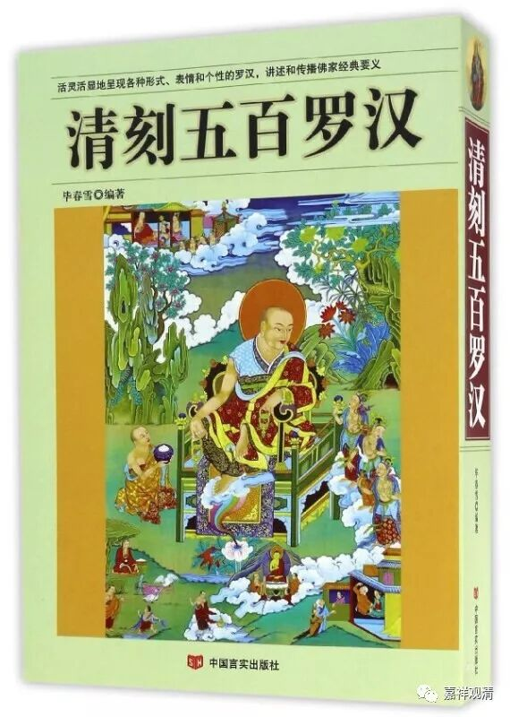
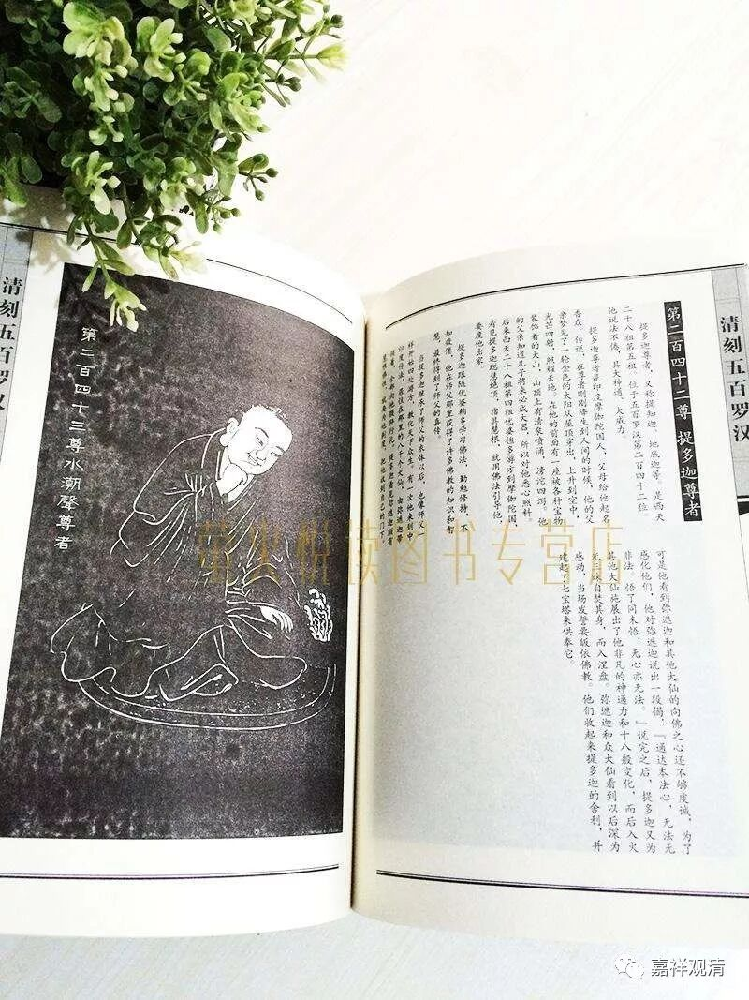
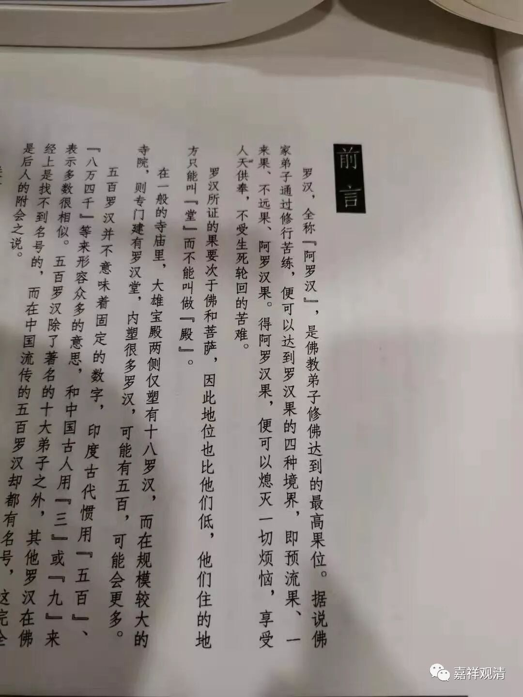
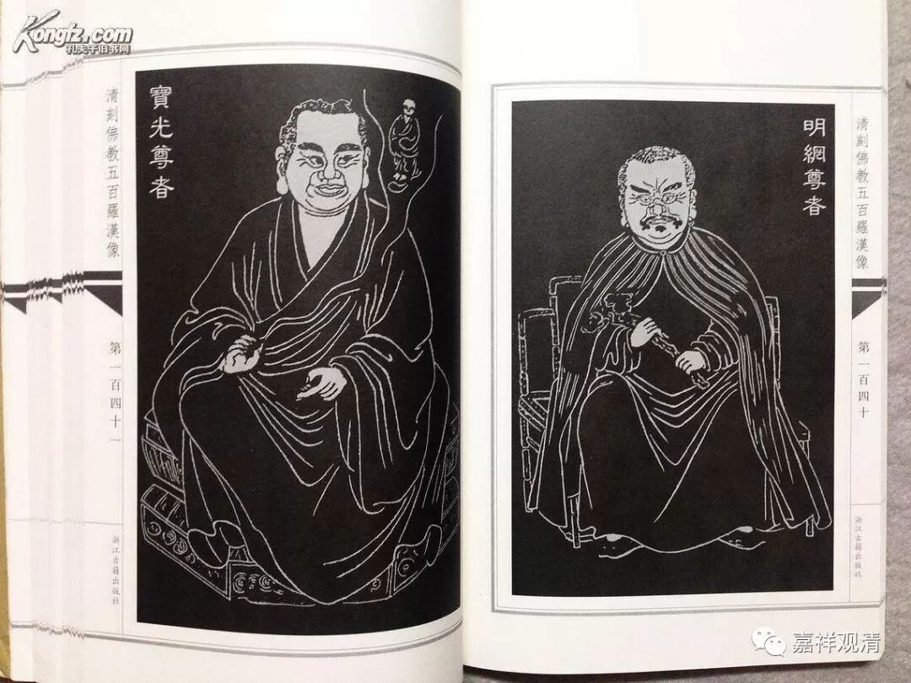
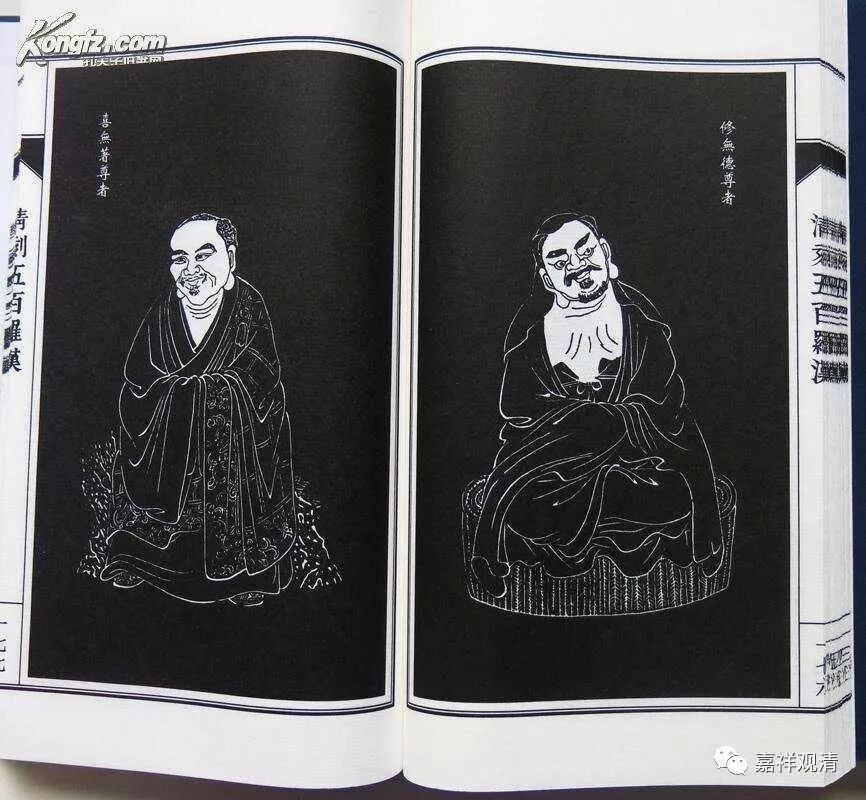

**社会佛知均值**

新买了一本《清刻五百罗汉》，全书五百罗汉像乃取清·嘉庆四年常州天宁寺之五百罗汉碑刻像贴而制作，文字是另配的。

翻开看前言，第一段是这样的：

“罗汉，全称‘阿罗汉’，是佛教弟子修佛达到的最高果位。据说佛家弟子通过修行苦练，片可以达到罗汉果的四种境界，即预流果、一来果、不远果、阿罗汉果。得阿罗汉果，便可以熄灭一切烦恼，享受人天供奉，不受生死轮回的苦难。”

字不多，错误已经不少。

一、佛弟子修学达到的最高果位：大乘说究竟果位是佛果，小乘说最高果位是阿罗汉/

二、四果是声闻果位，不能说是“罗汉果的四种境界”，可以说：“声闻果位有四种”；

三、声闻三果为“不还果”，不是“不远果”。这个不知道是抄错还是印错。不过开玩笑说，三果离阿罗汉果确实也“不远”了。

四、“享受人天供奉”，用“应受”比较好，修行不是为了“享受”供奉，但因道德智慧高超“应受”则没错。

五、“不受生死轮回的苦难”：这个估计是抄什么地方自己加了字，“的苦难”三字画蛇添足。

中国一般知识分子对佛教的理解大致也就上面这个水平了。可以给个名字，叫：社会佛教知识平均值。

不看文字，单看这五百罗汉的清拓这本书还是值得的。而且最近正在打折，才二十几块……

