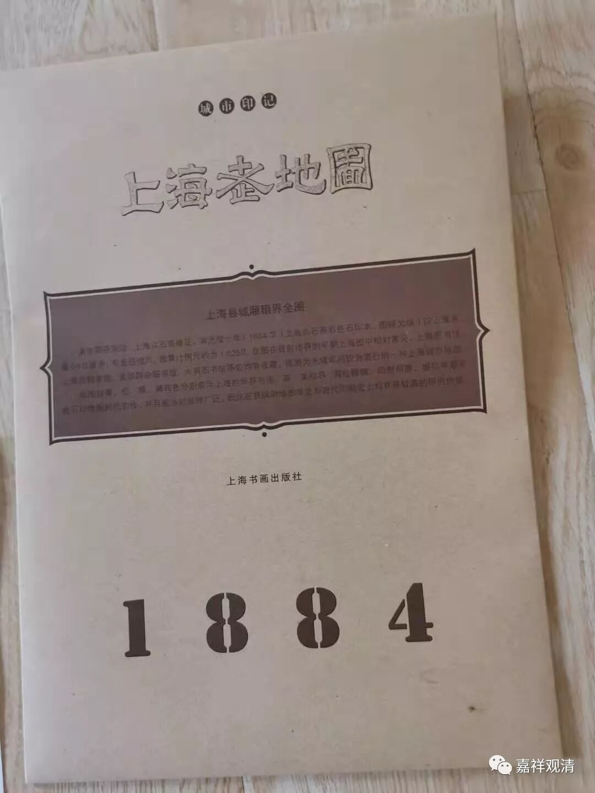
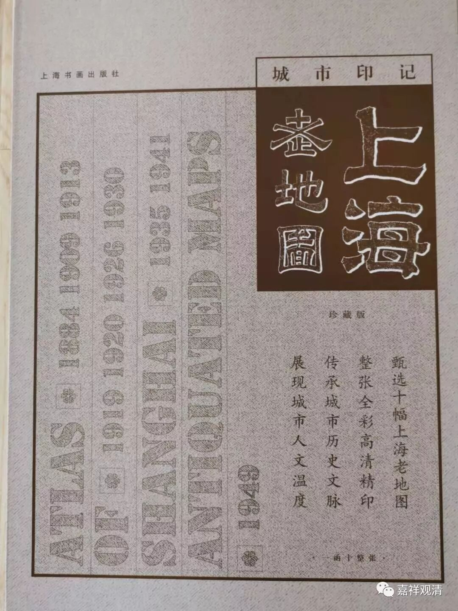
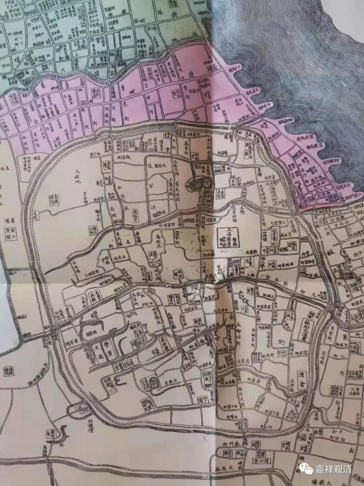

双十一快到了，第一次参与其中买买买。今天到了一套上海老地图，限量版的，只有五百套哦。

打开1884年上海地图，这张主要是旧上海县城的地图，租界从略。我找这些地图的第一目标是：看看有多少宗教活动场所！

下午我发了一段，说粗看寺院十二所，宗教活动场所大约三十多……

我还是小看了中国传统的宗教信仰实力。仔细排查，仅在上海县县城城墙以内，有寺庵17所，基督教场所5处，书院两家，祠堂6家，其余公私信仰场所27处。

佛教（17）：观音阁、报龙庵、积善寺、云居庵、沉香阁、长生庵、青莲禅院、竹林庵、广福寺、姚家庵、长寿庵、观音堂、静室庵、净土庵、地藏庵、戒珠庵、一粟禅院。

基督教（4）：耶稣堂（城东南西北各一）；

天主教（1）：天主堂；

书院（2）：敬业书院、龙门书院（古黄婆庵）；

道教&民间信仰（21）：财神庙、葛仙翁庙、雷祖殿、公输子庙（鲁班庙）、轩辕庙、玉皇阁、猛将庙（同名有2处）、岳王庙、施相公庙、东华道院、盐公堂、火神庙、万寿宫（茅山殿）、药王庙、阁老坊、万寿宫、黄婆庵、罗神殿、三官庙、水仙宫；

官方祭祀（6）：城隍庙、文庙、武庙、忠义阁、节孝坊、魁星阁；

疑为公益慈善（药房？）机构（6）：果育堂、普育堂、济善堂、辅元堂、清节堂、乙一堂；

祠堂（6）：陈公祠、袁公祠、朱家祠、杨家祠、曹家祠、徐公祠。

除疑为公益机构的，公元1887年，松江府上海县县城内共有各类宗教信仰活动场所57处。（城周围另有寺观都不做记录。）

在这个数字上，并考虑金泽乡核心区旧传有“四十二庙”这样一个范例，那么，在今天上海行政区划范围内，在十九世纪末的时候，可能寺观庙堂等信仰活动场所有数千所！这个数字是我在一年前完全想不到的。二十年前，在上海佛协一本油印的资料里看到过上海有两百多所宗教活动场所的名录，当时觉得两百这个数字已经相当可观，现在看来，哪怕再加一个零恐怕都难以触及实际的数字。

从这个缩影来看，旧时中国人的信仰层面，可以说是相当丰富的。

