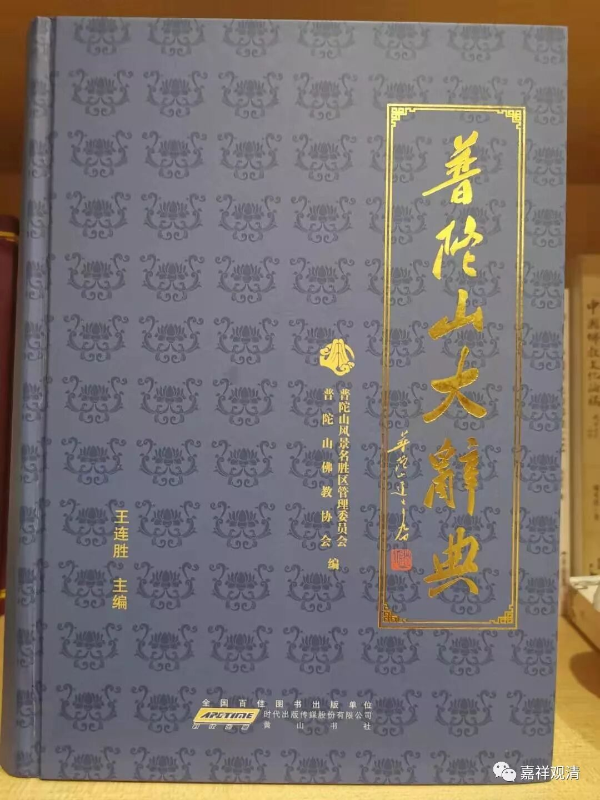

**普陀山在沪所设下院**

之前提到过，上海开埠或者具体说在太平天国衰败以后，江浙一带很多寺院都到上海设立下院（或云接待寺），为寺院化缘、募款、接待往来，如常州天宁寺、普陀山法雨寺、普陀山紫竹林，下面梳理一下当年普陀山各大小寺院在上海设立的下院。

普济寺下院1：松江下院；普济寺在上海县城周围没发现有设立寺院，在松江府（上海县的上一级）设立过一个下院，但很早就荒废了。

法雨寺下院1：上海镇海寺，又名大佛厂寺（在上海县城大南门外）；

慧济寺1：慧济寺下院（在上海老西门）；

洪筏坊2：洪善庵（在大南门）、三昧庵（小南门）；

圆通庵2：莲花庵（法租界贝禘鏖路 Rue Lieutenant Petiot－－成都南路）、龙寿庵（县城西门外）；

三圣寺1：太平寺（上海陈家浜）；

报本堂1：仍名报本堂；

锡麟堂1：锡麟堂下院；

常乐庵1：常乐庵下院；

紫竹林1：国恩寺（八仙桥）；这个我前几天写过，其实后期已经算独立了。

龙寿庵1：龙寿庵下院（霞飞路Avenue Joffre--淮海中路、茄勒路 Galle，Rue吉安路，今淮海中路八仙桥附近，曙光医院以北，与上述圆通庵下院的“龙寿庵”重名）；

文昌阁1：文昌阁下院；

双泉庵1：双泉庵下院；

普慧庵1：普慧庵下院。

除普济寺松江下院（很早就荒废了）以外，旧上海计有普陀山各寺下院15所。今已全部不存。

以上资料数据主要摘自《普陀山大辞典》。

