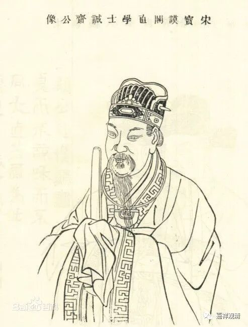
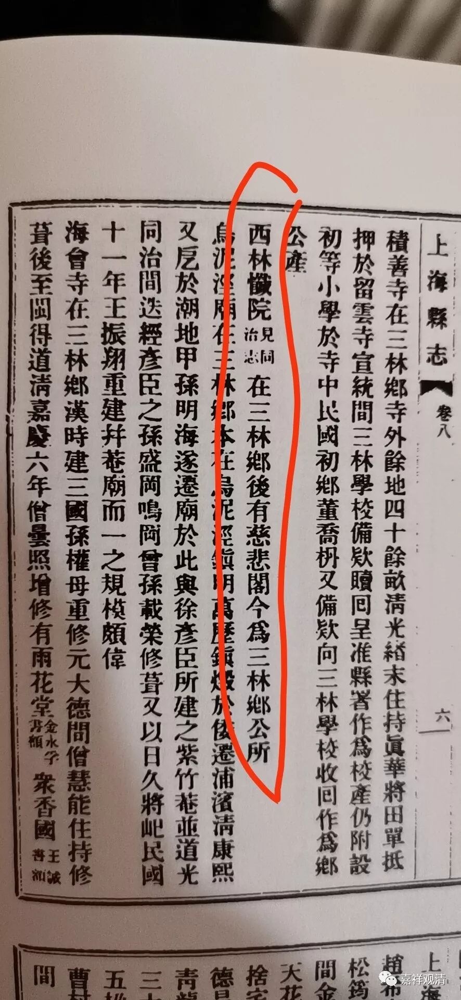
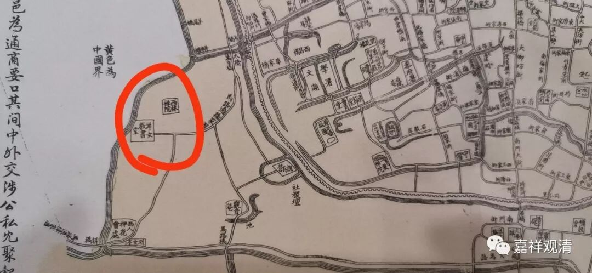
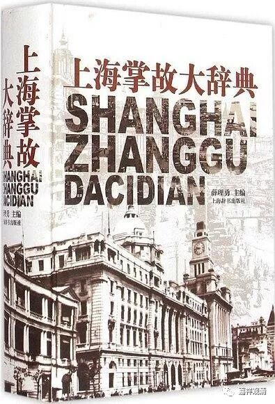
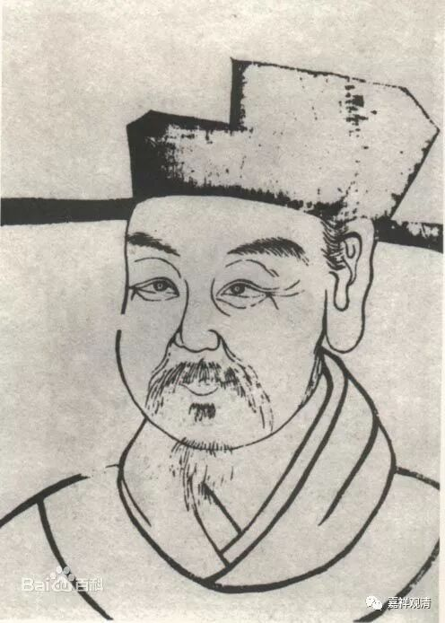

**西林忏院与杨万里？**

上海（今天的行政区划内）历史上有三个西林禅寺，而且周围都有“西林路”：

1、松江府西林禅寺。在今松江区，是一个大寺院。

2、金山去西林禅寺：在今金山县朱泾镇，又称法忍寺，原址在今朱泾西林路以北。此寺东有东林寺，今已重建。实际历史上这个“西林寺”是禅宗史上著名寺院，“船子德诚”可以算是上海境内禅宗唯一名僧。此地原属华亭县。

3、上海县城以西西林禅寺，又称西林忏院。今寺不存。有“西林后路”地名留下。

这三处“西林寺”，松江府的最大、历史沿革最清晰（在府城）；金山的西林寺在禅宗史上最有名，上海县的西林寺……沿革需要讨论一下。我们先说说上海县这个。

上海县西林寺，《民国上海县志》说：“在三林乡，后有慈悲阁……”，即1884年上海县地图法租界以东、上海县城以西。

《同治上海县志》说：“在西门外，本黄氏墓庵，明万历三十年僧宝昙重建，杨万里题额”，《上海掌故大辞典》因此谓初建于宋。但杨万里、宝昙、黄氏墓庵虽在宋，但明万历三十年是《同治县志》明说。

按：杨万里《记略》：“余祖茔之西有黄氏墓，不详其名。房数橼，奉白衣大士，僧宝昙住焉……因募得若干今偿其值，重建为庵……”

当知，杨万里为江西吉水人，其“祖茔”不可能在松江府上海县，故此处《同治县志》和《上海掌故大辞典》皆误。仅作“明万历三十年建”即可。（匾额或为同名之人所提而已。）

西林忏院1853年（咸丰三年）毁于小刀会，1864（同治三年）重建，而成为上海著名寺院。1878年（光绪四年）僧人永全扩建，改名西林禅寺。民国年间渐没落，置三林乡公所。现在剩下西林后路、西林横路之名，原址为西林后路65号。

