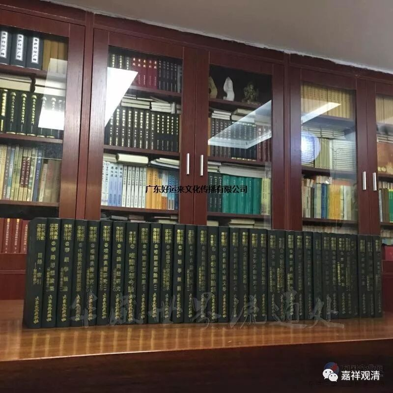
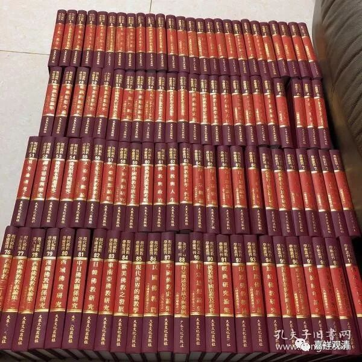

**《善说精髓》讲记 083（上）**

在格鲁系统当中，在止观方面比较重要的著作，一个是《广论》，一个是《略论》。在观的方面比较重要的，还有《入中论》和《入中论善显密意疏》，然后是《中观正理海》，还有《辨了不了义善说藏论》。

现在法尊法师的全集出来了，又出现了新的东西——我们以前没见过的，僧成大师的《入中论》的注释。还有另外一部《俱舍释》也是僧成大师的。现在参考书越来越多了，好像参考书多了以后，我们反而很多都不看了。

哎呀！这几十年翻译的东西很多啊，那接下来差不多可以考虑我们以前的那个计划了，准备编一本格鲁派所有经典的全集。我们当时这个计划预算多少？预算100多万，是吧？哦，北塔已经在做了。那我们就放心了。我们当时连招标书都写过了，到现在已经翻译过很多很多的书卷了，真的可以出个《格鲁藏》了。就是已经翻译过来的有很多，有些已经重复翻译了。北塔的汉译还没做吧？那还是留了一些事业给我们干，是吧？那我们就以这个为基础好了，慢慢地把它补充。

不过这是一个比较大的工程啊，我们这里那套书还没有，是马上准备要请的，就是《现代佛教学术丛刊》，全101册，就是100本，是台湾张曼涛编的。我记得特别有趣，他不知道唐老是谁，然后就给唐老杜撰了一个传记，说唐老是北大毕业的。我一看：“咦，这是谁啊？”

蓝绿封面是老版的，绛红封面是新版的

很可惜啊，张曼涛本来是个出家人，水平是非常不错的。后来呢，师父觉得这个小朋友本身学得不错，文笔啊等等都不错，挺精进的，智慧方面也不错，就派他去日本学习——完了。去了日本以后，他就被台湾过去的一个富二代女孩子看上了，后来就还俗了。他还俗以后就帮助XX法师编撰《现代佛教学术丛刊》，可能那个富二代还是富得有限，好像编了没几本，钱没落实……就开始到处借钱啊等等。那个时候可能整个世界也没多少钱吧，就编得很累，最后终于完成了。在完成以后，他又去了日本，晚上喝了点小酒，就死在了日本，四十多岁就死了。

他这一辈子，就是编完了这套书，被一位大法师给忽悠了，编完这套书就死了。原先只有台湾版的，他为了编这部书专门成立了个出版社，整个出版社好像也没出版过其他东西，国内好像现在有翻版，8000多元。这部书不错，我有很多东西是从里面看的。那个时候在庙里面没事干，就把这套书里比较好的那些册全部搬到我房间里去，没事就在看。

今天我们又看到了新翻译的《俱舍论》，是吧？新译的《俱舍论》。我们不是刚买了一本嘛，第一品还没翻译完，就是廖本圣教授翻译的。实际上《现代佛教学术丛刊》中已经翻译过了，记得是张建木翻译的，《俱舍论》的第一品。就是对下来发现藏文版的和汉文版的差别很大，所以重新翻译了。

好，我们继续。

