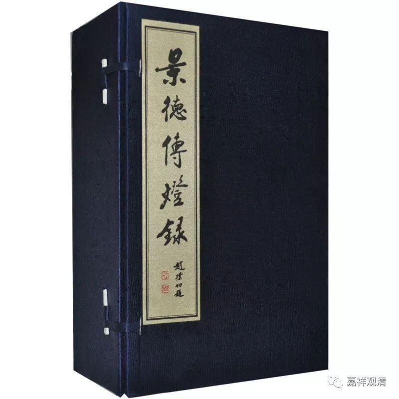
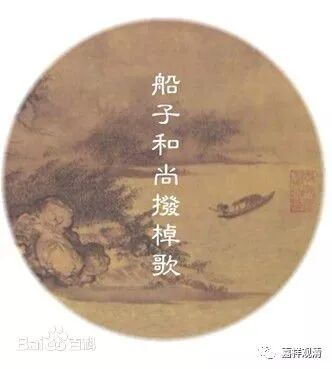
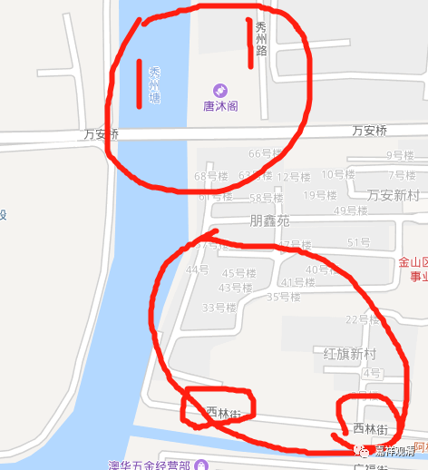

**船子德诚自杀传法？！**

** 好好读书，再到实地考察一下好不？！**

聊朱泾西林禅寺之前，先聊聊船子德诚禅师。朱泾西林寺（金山法忍寺）是为了纪念他而建的。

据《景德传灯录》，船子德诚是药山惟俨禅师门下，有弟子夹山善会禅师。

 

“华亭船子和尚名德诚，嗣药山，甞于华亭吴江汎一小舟，时谓之‘船子和尚’。

师甞谓同参道吾曰：‘他后有灵利坐主指一箇来。’

道吾后激勉京口和尚善会参礼师。

师问曰：坐主住甚寺。

会曰。寺即不住，住即不似。

师曰：不似似箇什么？

会曰：目前无相似。

师曰：何处学得来？

曰非耳目之所到。

师笑曰：一句合头语万劫系驴橛。垂丝千尺，意在深潭，离钩三寸，速道速道。

会拟开口，师便以篙撞在水中，因而大悟。

** 师当下弃舟而逝。莫知其终。**”

船子德诚禅师有诗集传世

说德诚和尚在华亭泛舟，华亭，即今上海。《祖庭钳鎚录》说在“秀洲华亭”，不很准确，秀洲属嘉兴，虽近在咫尺，但没有行政隶属关系。看今天的地图，华亭西林寺原址在上海金山区朱泾镇“秀洲塘”东岸，所以正确表述应该是“华亭县秀洲河边”。

德诚和尚委托师兄天皇道悟介绍个伶俐的弟子来，好师兄就鼓动夹山善会这个半成品去听候点拨。德诚和尚还真“点拨”，直接给他捅下水去了。据说善会禅师这就开悟了。（我下水很多次了都没开悟，下次……）

下面就是禅宗历史上一则“死”了很多人的公案了。《景德传灯录》在这段最后说“弃舟而逝。莫知其终”，大概是德诚和尚打了人了怕客人投诉12315，躲了……但是后来丛林里发挥过头，给这个公案加了个尾巴，说船子德诚把船弄翻跳水自杀了……

！！！！！！

这这这这，大师们，你们去过“江南水乡”吗？这里的河水流不急（流不流的都不太好说），这里的河也不多宽、也不多深，一个“泛舟”的“船子”在上海金山县朱泾镇紧挨着的河边把船搞沉了自杀，简直梦话一样！“弃舟而逝。莫知其终”，就是说当场跑了而已嘛！看到个“逝”就是“死”啊！“时光飞逝”呢？叫“时光”的那个人跳楼死了？！

看下地图

我们先看加的尾巴

《祖庭钳鎚录》：

“山纔上船，师又曰：道道。山拟开口，师又打。

山豁然大悟，乃点头三下。

师曰：竿头丝线从君弄，不犯清波意自殊。

由遂问：抛纶掷钩，师意如何？

师曰：丝悬绿水浮定有无之意。

山曰：语带玄而无路，舌头谈而不谈。

师曰：钓尽江波金鳞始遇。

山乃掩耳。

师曰：如是如是。

乃嘱曰：汝向去，直须藏身处没踪迹，没踪迹处莫藏身。吾二十年在药山，祇明斯事。汝今既得，他后莫住城隍聚落，但向深山里镢头边，覔取一个半个接续，无令断绝。

山乃辞行，频频回顾。

师遂唤：闍黎。

山乃回首。

师竪起桡子曰：汝将谓别有？

** 乃覆船入水而逝**。”

多了一堆葛藤！！！还说是把船搞沉了“** 入水而逝**”，《景德传灯录》是“弃舟”，到这里变成“** 覆船**”了，唉明代的“禅师”真败家！

费隐通容禅师这样还觉得不够high，继续发挥：

“……虽然，船子见夹山疑为别有，竭力** 为渠覆舟而死**，使他剿除。所谓‘解铃须是系铃人’。千古独师大哉！”

最终咬定为了徒弟证悟，师父自杀了！！

这样的禅宗谁敢学？前面为了求法剁个胳膊（慧可事，之前已经说过《续高僧传》里明说是路上被强盗砍的），现在师父为了徒弟要自杀，这两头都堵上了，这是要灭了禅宗吗？！

禅宗的“大师”们！多看点书好！别胡乱发挥在！嘴快一时，误人“一群”！

