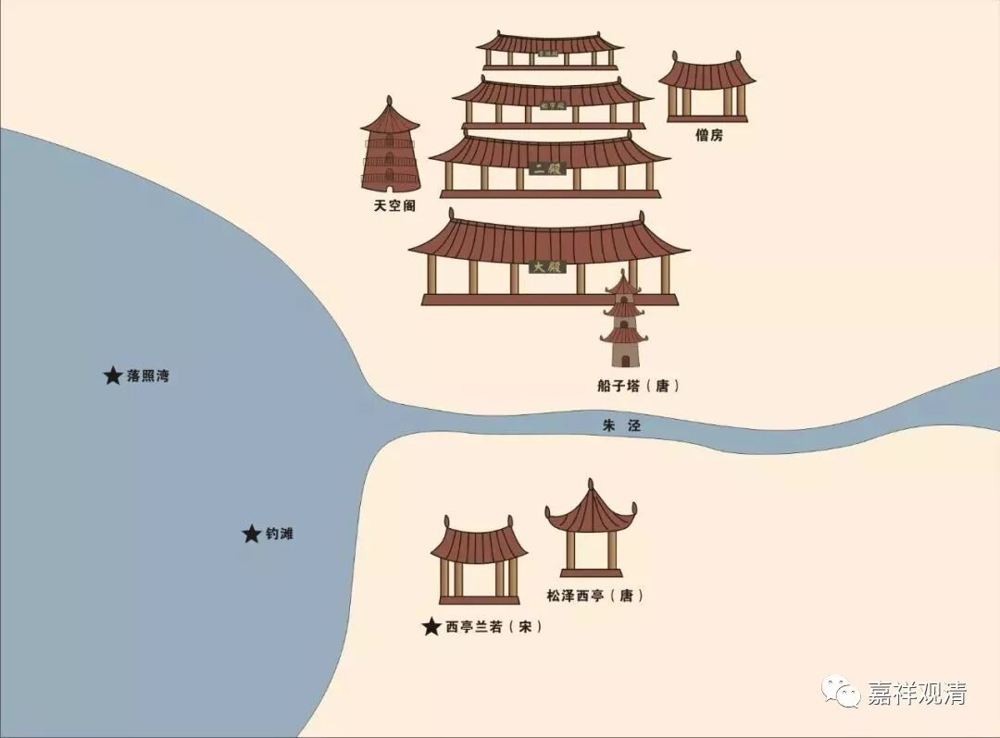

**金山朱泾法忍寺（西林寺）**

夹山善会禅师参船子德诚禅师于华亭秀洲塘侧，此地应当原来就有寺院，但记载阙如。想想应该也是，两个和尚无故在野外河边攀谈也很突兀，这里有寺院就很符合逻辑了。

“西林寺”旧址应该就在照片下方这一片

据宋代碑文《法忍寺结界记》，寺院寻有井阑题记，为会昌年号，或者古寺毁于会昌法难。其后唐咸通十年（公元869年）有僧藏晖在此地建寺，乃名“建兴寺”。（《佛祖纲目》、《乾隆金山县志》）这是“西林寺”有记载之始。

按，兴化存奖禅师有清信弟子“法主”藏晖，时代、地域（兴化在今江苏泰州）都相近。建寺者或即此人。

宋·治平中改为“法忍寺”，米芾书额。元丰初年，僧智圆营治修茸，建立制度（《光绪金山县志》），寺院复兴。元初复毁于兵乱。明洪武十二年僧本一重建。嘉靖、崇祯年两次增修，清康熙、乾隆年间增修天空阁、山门，清末数度毁于风（台风）火，同治年重修山门。今寺不存。仅有“西林路”可以寻迹。

寺南有钓滩庵，为康熙年所建。“钓滩”意为船子德诚禅师在此“钓”着夹山善会禅师，所以建寺纪念。原西林寺也供奉有二人的遗像。

元代寺僧元智禅师在寺东开山，名观音堂，俗称“东法忍寺”。后敕名“东林禅寺”。东林禅寺声明渐起后，原“法忍寺”反被称为“西林禅寺”了。

今天，东林禅寺已经恢复，看起来建的超豪华，过段时间也去访一访……

