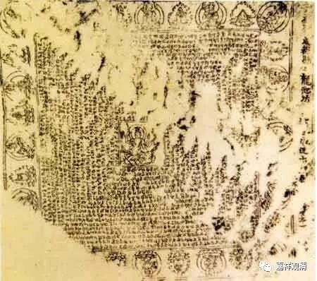
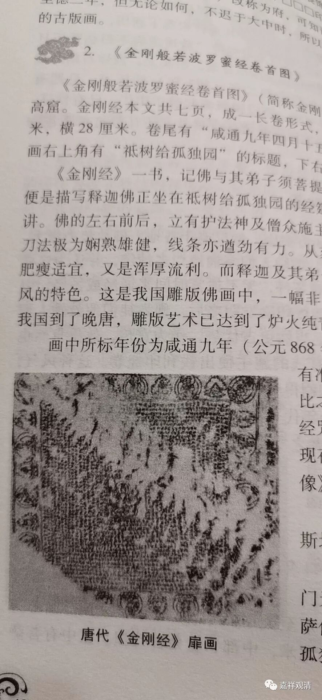

**最早的（佛教）版画**

佛教进入中国，在中国化的过程中，给中国带来很多第一，比如，中国现存最早的版画，也是现存世界最早的版画。

1900年发现与甘肃敦煌藏经洞的一幅《金刚经》卷首的版画，最初被认为是现存世界最早的版画，此件上有款“咸通九年四月十五日为二亲敬造普施……”，明确纪年为咸通九年，即公元868年，这比欧洲最早的木版画《圣克里斯道夫像》要早600多年。但成都《梵文陀罗尼经咒图》的出土，推高了最早版画的年代，此《金刚经说法图》的“最早”前面不得不加几个字——“现存世界最早** 有明确纪年**的版画”。（但很多书还没改过来这个“最早”，源于不知稍后发现的成都出土的《梵文陀罗尼经咒图》。我记得我们大学文献教材里就还在谈“敦煌本《金刚经》最早”，我向老师表示反对，反对无效一刚……）

1944年成都唐墓出土的这幅《梵文陀罗尼经咒图》是现在明确“现存世界最早的版画”，时间约在公元757～850年之间，因为有文“成都府成都县……”，成都置府在唐至德二年（公元757年），故当在此后，而结合墓葬等其余线索综合考量，当在公元800年前后，而不晚于公元850年——这就要比上述《金刚经说法图》版画要早了。

《中国古代版画》一书，在P42这里误放了一幅图片——这是成都的《梵文陀罗尼经咒图》，而不是“唐代《金刚经》扉画”。

这应该是排版的错误，编辑没有发现。

