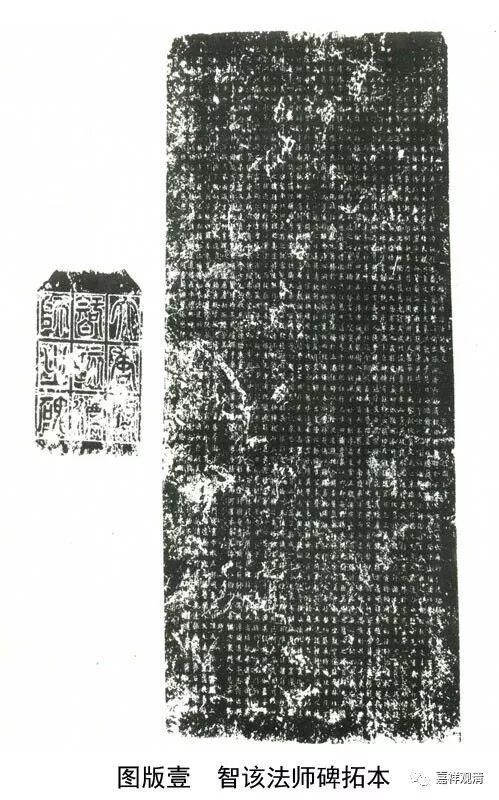

**《智该法师碑》解读（四）**

继续解读《大唐灵化寺故大德智该法师之碑》——

《智该法师碑》：

** “……才磨心镜，慧照方远……”**

《佛教新出碑志集萃》对“心镜”加注解：

** **

** 心镜：佛教禅宗用语，常将身比作菩提树，心比作明镜台，如著名的神秀偈语：“身是菩提树，心如明镜台；时时勤拂拭，勿使惹尘埃。”惠能偈语：“菩提本无树，明镜亦非台；本来无一物，何处惹尘埃。”**

** **

清案：

此处“心镜”其实仅做一般字面解读就可以了，心能观察，镜子能照，故用镜子比喻心，并不是“明镜台”的意思。这里引禅宗文献是不合适的。智该法师生卒年代为公元577～639，神秀禅师生卒年代为公元606～706，慧能禅师生卒年代为公元638～713，故知，二位禅师乃是智该法师晚辈，乃至智该法师圆寂之时，尚无神秀“明镜台”之偈语出现。

《智该法师碑》：

** “爰登五腊，备演三宗。”**

《佛教新出碑志集萃》注解：

** 五腊：道教在五个腊日修斋，祭祀祖先。**

** 三宗：又称三祖，三代祖先。**

** **

清案：

五腊，意指受比丘戒五年。三宗，意指“空、假、中”三宗，或指空宗、有宗、性宗。《集萃》此二注解皆误。

《智该法师碑》：

** “每对扬天问，光阐宗极，万乘回简心之睠……”**

《佛教新出碑志集萃》注解：

** 天间：战国楚屈原所作《楚辞》篇名。**

** 宗极：终极之意。**

清案：

此处“天问”对应下一句“万乘”，“天”和“万乘”都指向皇帝——隋炀帝，和屈原的《天问》没什么关系。

“宗极”，这里指究竟的观点，“宗”是观点，“极”是究竟。《集萃》单纯解释为“终极”没有注解清楚。

        修改于