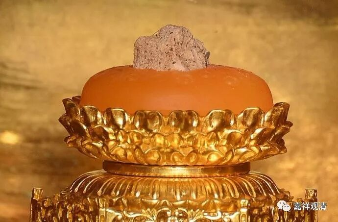
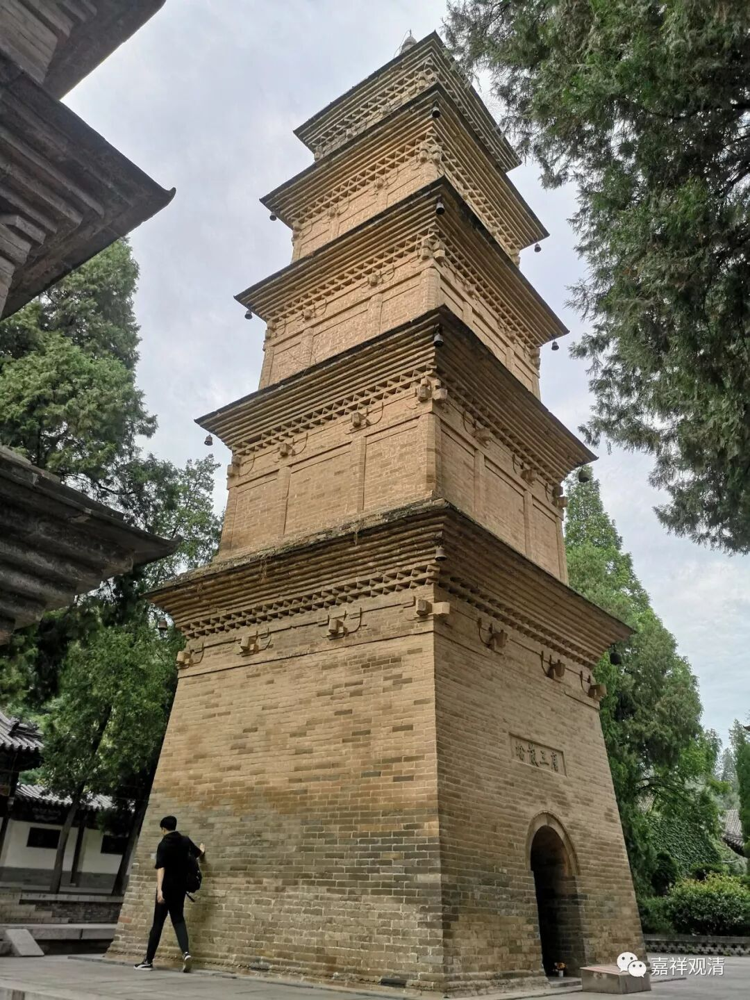

**扭曲的历史：文人“造史”与教徒造假**

《云南宗教史》P105：

“有人称云南鸡足山‘三国蜀汉时期即有佛庵，唐时慈善佛寺多达百余所’。但遍阅古代关于鸡足山的各种文献记载，不见有这种说法的任何依据。因此这种说法近余梦人呓语。

应该看到，明代以前，九曲山没有被说成是鸡足山……”。

《云南宗教史》在这一页的注解里直接说，这是在批评《佛教文化词典》。

一般的书里面很少有这么痛快的骂人了。

前几天我们说到，江南各地涌出一批建于赤乌年间的寺院，应知，这里面但凡有一个属实，就是汉传已知建成最早的寺院了——因为白马寺那个只是传说，而且当年的“寺”也不是今天意义上的寺院，如“大理寺”、“鸿胪寺”。

某些宗教徒喜欢造假，有些笔杆子也有意无意造势。我遇到过某县志办公室增修县志，要求我提供寺院的历史资料，我说“我们也不知道多少”，对方竟然说了一句能唬死我的、极不专业的话：“我们可以一起编！”（我忍住仅回了句：“呵呵，这也可以的吗？我做不来！”）……还遇到过某个地方令守，一起喝茶的时候也同样的说“……寺院的历史可以编的嘛……”

所以，马的骸骨、骆驼牙齿这些也就纷纷装进舍利匣子里面供人礼拜了，所以，在西安兴教寺玄奘全身塔完好的情况下“玄奘顶骨舍利”也已经开始四散了。

大家一起装瞎子呗。

假舍利流行，真经书却没有人读，这不是大师们的悲哀，是我们的悲哀！

