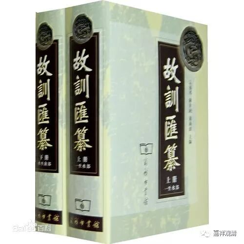
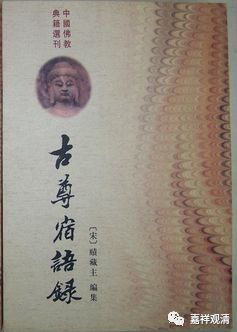

**禮貌&體貌**

正好聊到“禮、體”同源的問題，拿來談談。“禮、體”簡化以後為“礼”“体”，完全看不出相近，實際是音、義、字形都相近的同源字。

《續高僧傳》卷十一《吉藏傳》（中華書局本，大正藏本）：

** **

** “……間施體貌、詞采鋪發……”**

** **

《古今圖書集成選集》：

** “……間施禮貌，詞采鋪發……”**

這裏兩處，一作“禮”，一作“體”，皆不誤（我原來看到的《續高僧傳》文字也做“禮”，手邊查不到了，以後可以再找找）。此“禮、體”同源：

《“體”和“禮”同源關係考》蘭建梅：

** ……“禮”上古屬“脂”韻,來母,上聲。“體” 上古屬“脂”韻,透母,上聲……**

《故訓匯纂》：

** （禮）～，體也。《法言·問道》/《廣雅·釋言》/《玉篇·示部》/《集韻·止韻》**

** （禮）～者，體也。《禮記》“～記”孔穎達疏引《禮器》雲/《淮南子·齊俗》**

** ……**

故“禮貌”，即“體貌”，指吉藏在辯論的時候還以姿勢輔助（大概類似西藏辨經捋袖子、拍巴掌），不是說吉藏辯論時很客氣。

禪宗《燈錄》中也常見“禮貌”，也都是“體貌”的意思，如：

《虛堂和尚語錄》卷九：

** “……景德堂上鏡空禪師，蘊前輩典刑，有尊宿禮貌……”**

這是說鏡空禪師有尊宿、長老的樣子，此“禮貌”亦即“體貌”。

再如《緇門警訓》卷四《大慧禪師看經回向文》：

** “……身口服用之不淨。衣冠禮貌之弗恭……”**

此“禮貌”亦即“體貌”。

《古尊宿語錄·五祖法演》：

** “《寄太平燈長老》：**

** 徧遊五祖山，語笑令人愛，**

** 極目情量寬，禮貌多自在。”**

“禮貌多自在”，亦即“體貌多自在”的意思。

餘處尚多不錄。

今天的“禮貌”，應該是很晚意義上的單詞了。

