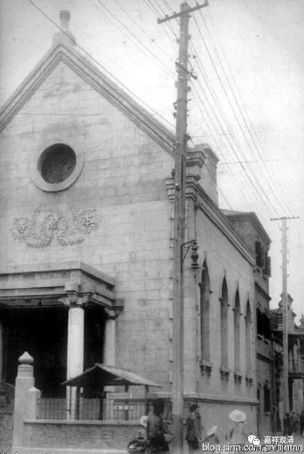
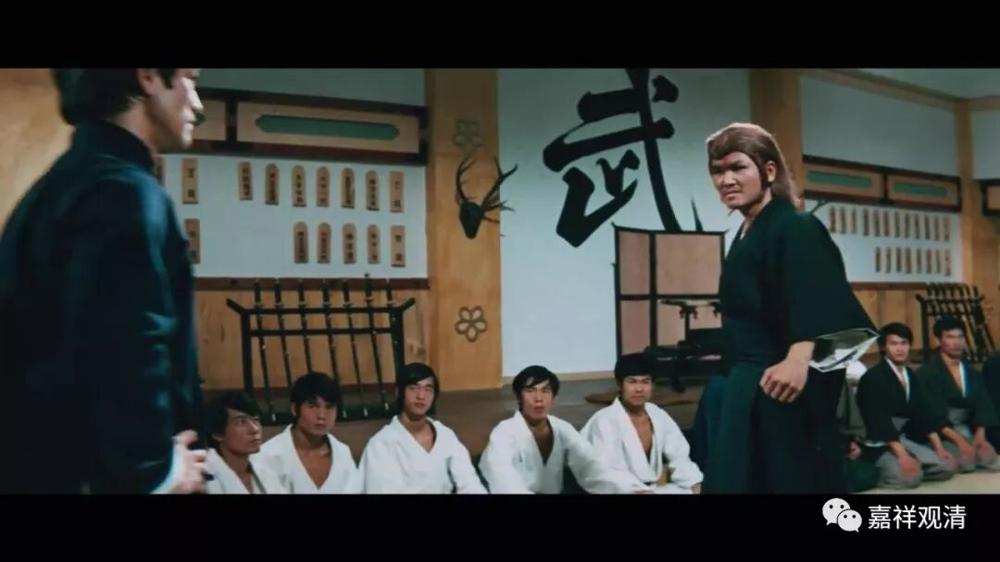
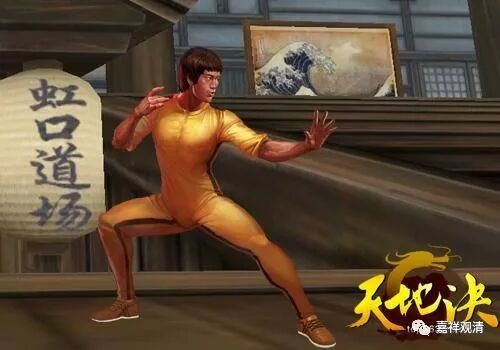
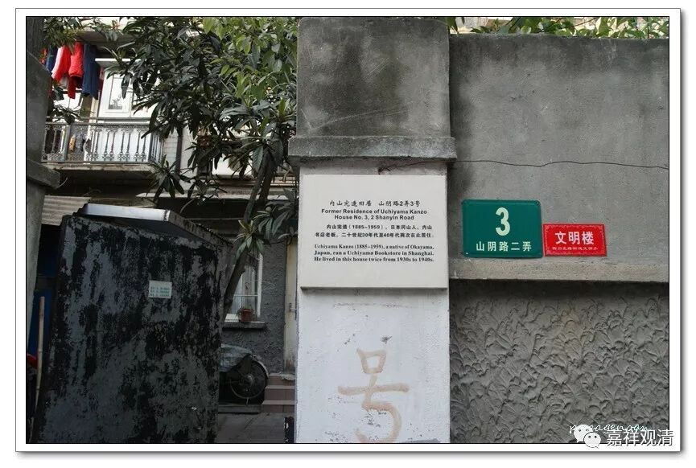
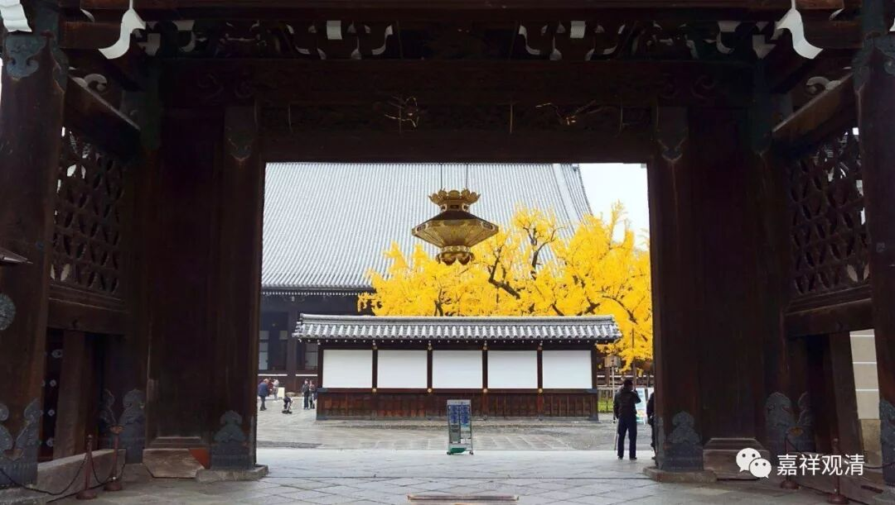
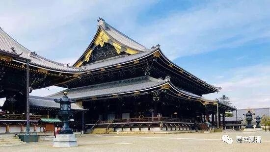
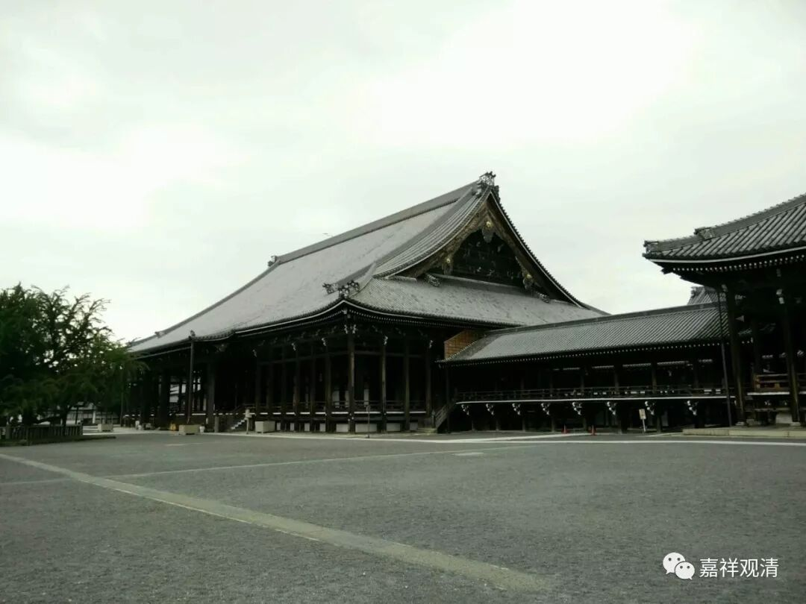
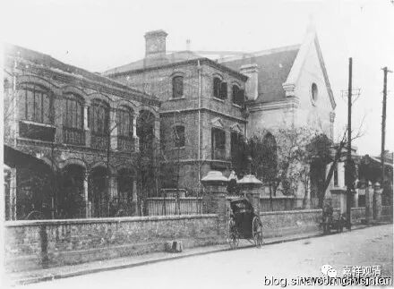
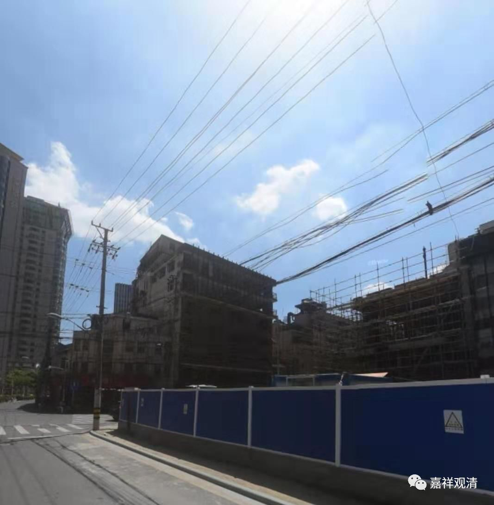

**上海虹口的“东本愿寺”**

日本京都有“东本愿寺”和“西本愿寺”，都是日本佛教的大宗，主要是西方净土信仰背景。原先是一个大派，后来分化成两大山头，分别就叫“东本愿寺”派和“西本愿寺”派。我们几个和尚前几年一起去京都的时候，都去“打卡”了（其中某大师应该算朝拜，知道的人懂的。）。

上海开埠以后，四川北路乃至虹口一带是日本人聚居区。

大家应该记得李小龙演的霍元甲大闹日本人的“虹口道场”。

还有鲁迅的朋友内山完造也住在虹口一带。

所以日本的佛教宗派也带了进来，今天的四川北路到鲁迅公园一带，有几个日本寺院。其中就有东本愿寺、西本愿寺、本圀（念“国”）寺……

先说“东本愿寺”。

这是日本的东本愿寺。

上海的东本愿寺，正面照，题额写的是“本愿寺”

侧面照

清光绪二年（公元1876年），日本东本愿寺僧人在虹口武昌路（旧称日本街）乍浦路口建东本愿寺（分院），有东本愿寺的僧人举行佛教活动。1888年，寺内创办日本小学，专收日侨学生，1906年小学迁出至北四川路（即今虹口区教育学院实验中学），次年，小学独立于东本愿寺，由上海日本侨民接管。二战后日本僧人被遣送回国，寺院被接收。解放后改为民房，1991年拆除。

今天的武昌路乍浦路口，上海虹口东本愿寺旧址应该就是这里了。

《一代宗师》里，宫宝森对章子怡有一句话，我现在越琢磨越有味道——

“有些事，你不看它它就没了……”

