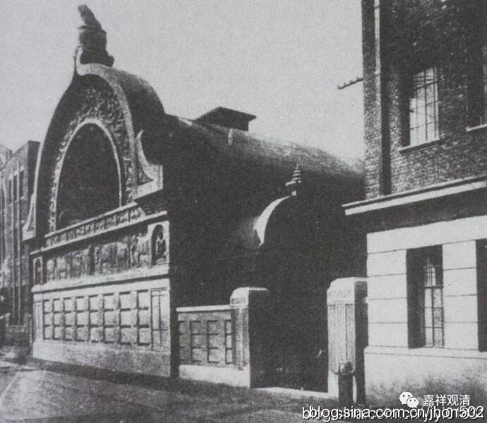

**老上海的“西本愿寺”**

** **

昨天讲了上海的“东本愿寺”，今天谈谈上海的“西本愿寺”。

比“东本愿寺”幸运，今天“西本愿寺”的老建筑还在。

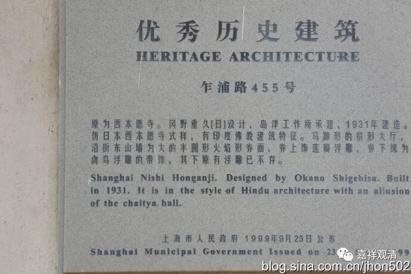

上海西本愿寺是跟现在东京的“築地本願寺”同时代建造的，风格也一样。现址的文物公示牌上说和“仿日本西本愿寺式样……”，这种说法是错的，

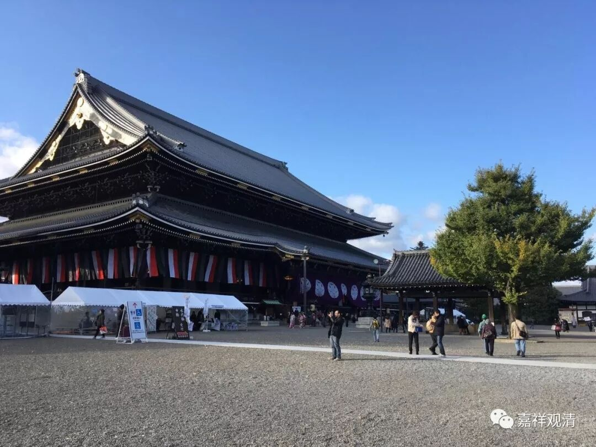

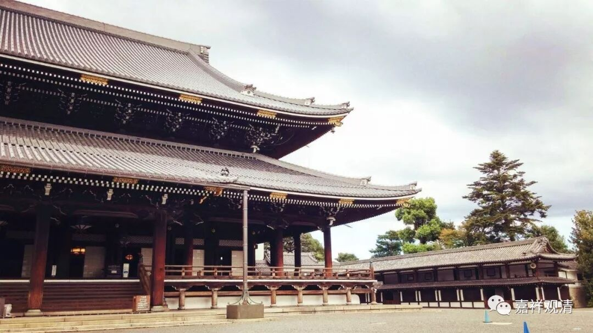

上面这才是“西本愿寺”，在京都。

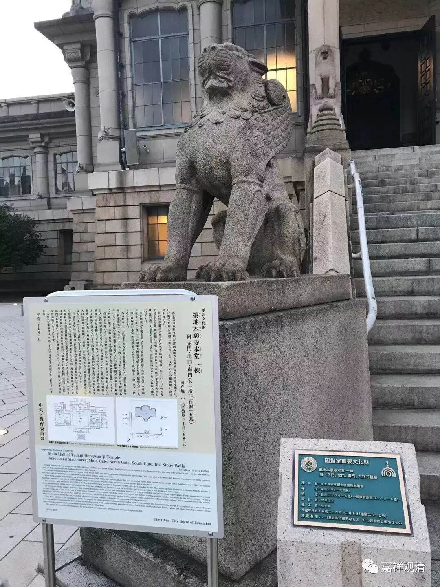

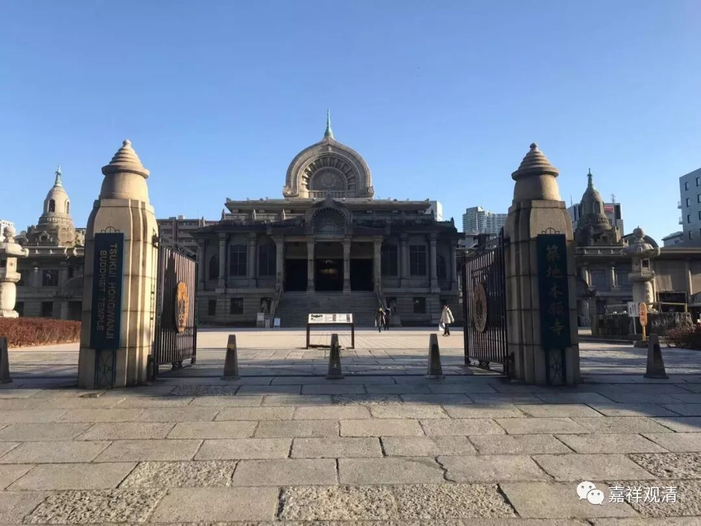

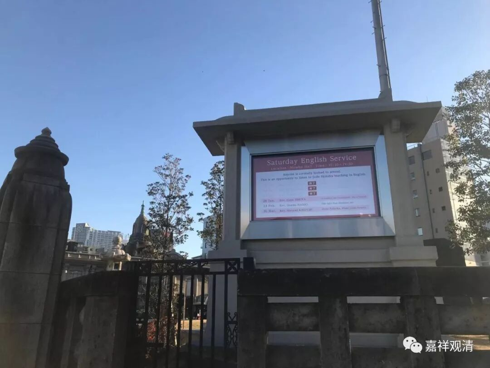

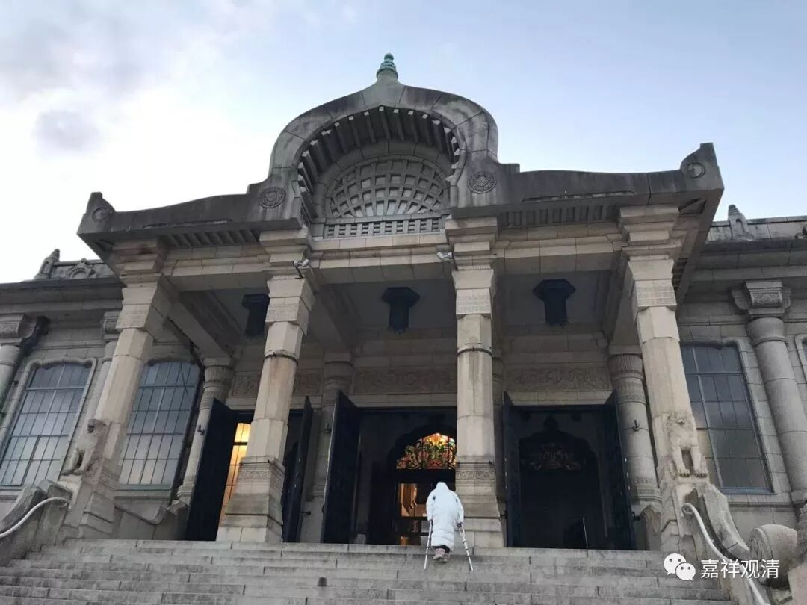

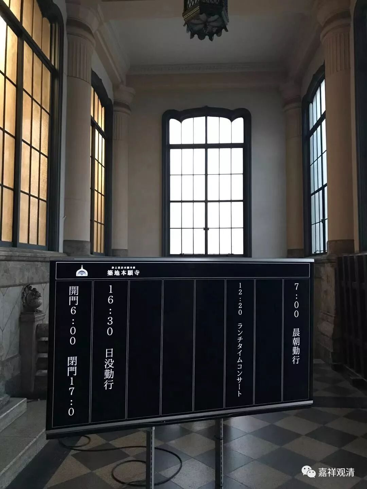

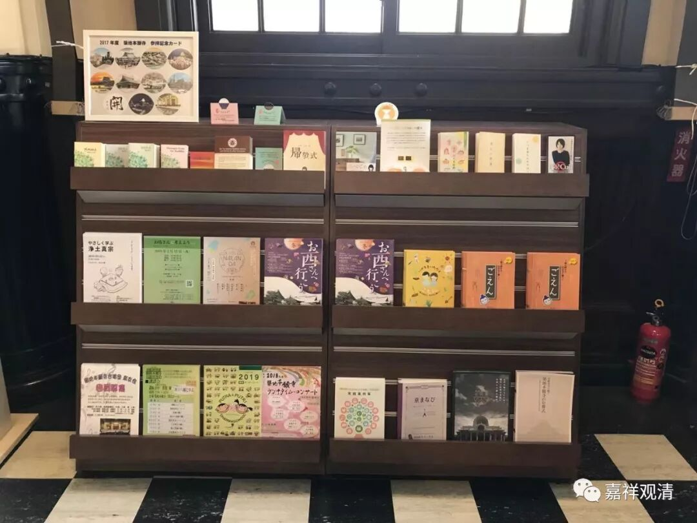

就是築地本願寺，在东京。

因为是築地本願寺是在关东大地震后重修的，当时日本也正“崇洋媚外”，所以就没按原样修，美其名曰——“印度风格”。

 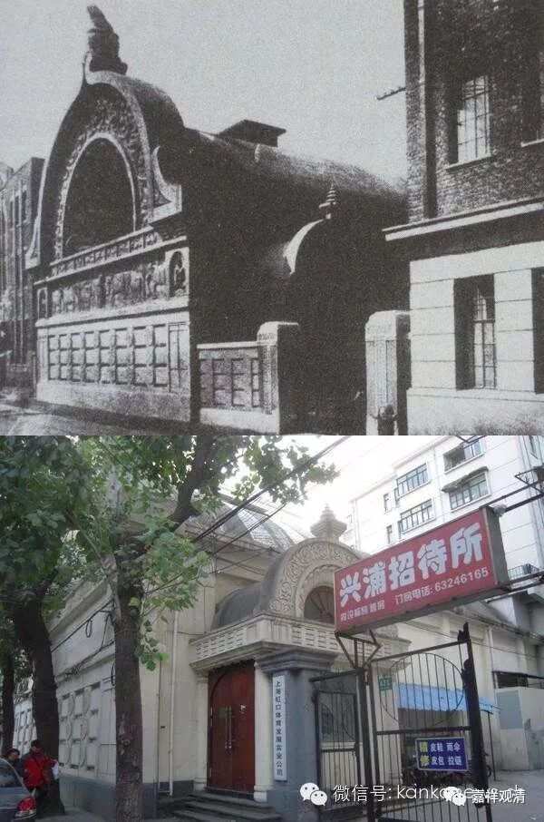 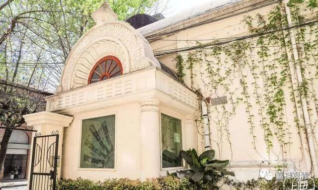

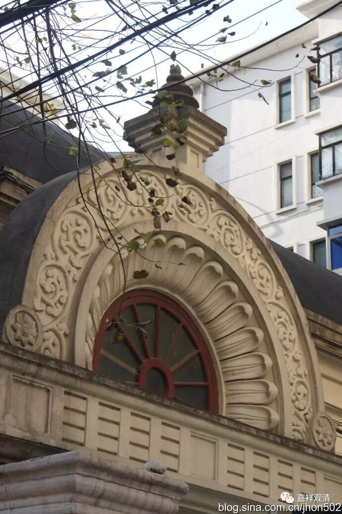

“上海西本愿寺”和“东京築地本願寺”同时代修的，一个风格，和“京都西本愿寺”完全不是一个风格，但“上海西本愿寺”和“东京築地本願寺”都属于“西本愿寺”的分院，“京都西本愿寺”是西本愿寺派的“总本山”。

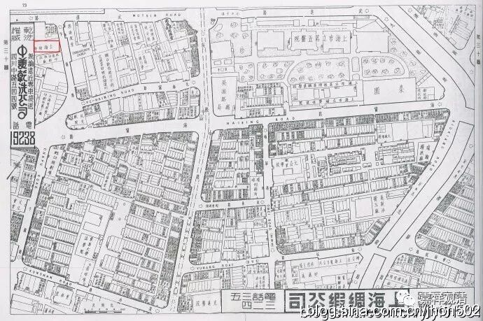

上海西本愿寺最初设在文监师路（今塘沽路口）114号，于光绪三十二年（1906年）开院（一说一九二零年代开院）。1931年，在现址（乍浦路439～455号）建寺院，完全照搬东京築地本願寺“印度”风格。二楼为僧人住所一楼暂存骨灰盒。抗战胜利后，日本僧人被遣返，原址北侧建筑一度作为“上海和平博物馆”，南侧建筑作为上海市政府印刷厂。

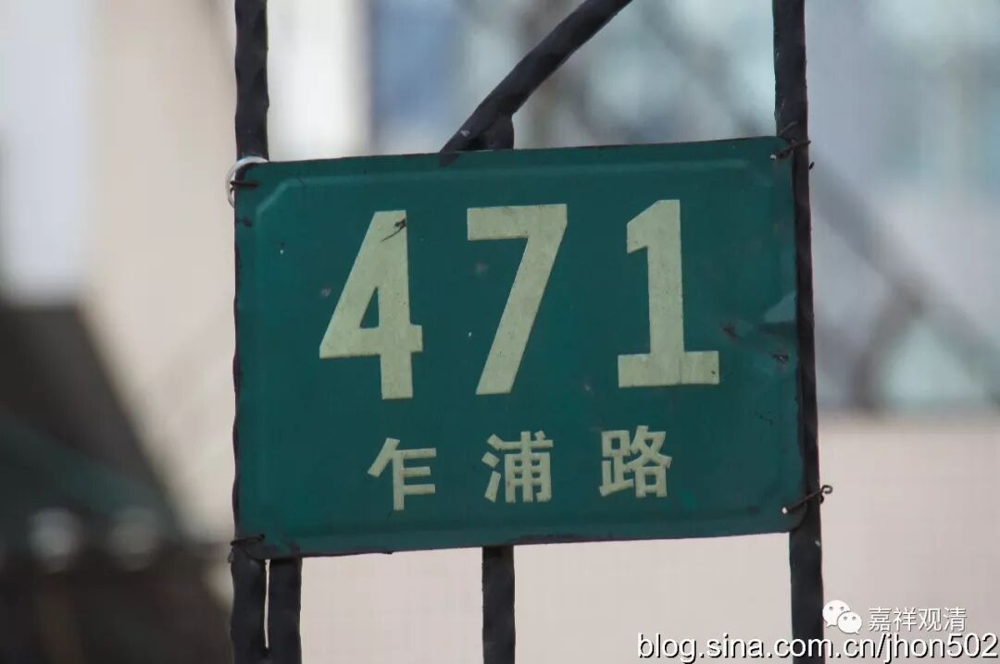

1999年9月28日，上海市人民政府公布西本愿寺旧址为上海市优秀历史建筑。

