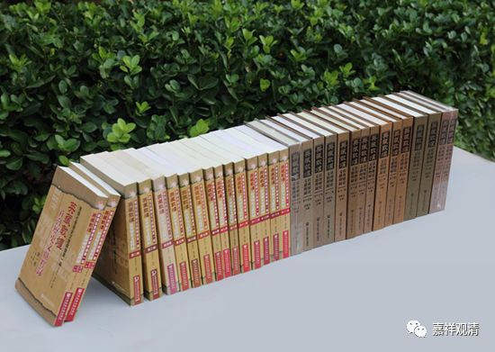
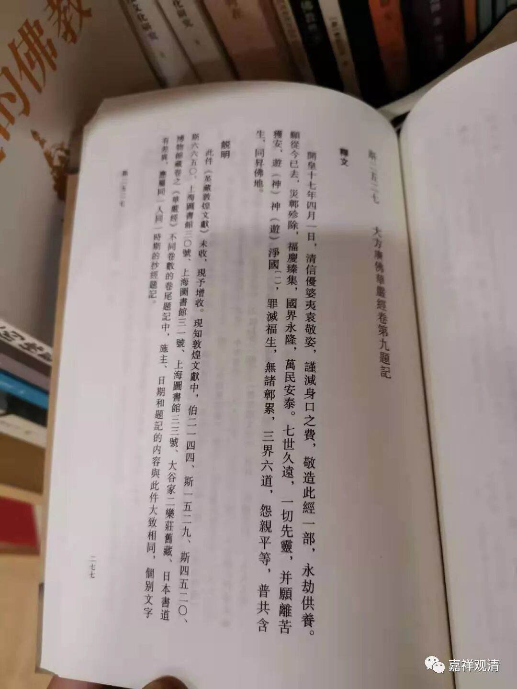

**“神游”与“游神”**

《英藏敦煌社会历史文献释录》第十二卷P277：

** “斯二五二七·大方广佛华严经卷九题记**

** **

** 释文：**

** **

** 开皇十七年四月一日，清信优婆夷袁敬姿，谨减身口之费，敬造此经一部，永劫供养。愿从今已去，灾鄣殄除，福庆臻集，国界永隆，万民安泰。七世久远，一切先灵，并愿离苦获安，游（神）神（游）净国，罪灭福生，无诸鄣累，三界六道，冤亲平等，普共含生，同昇佛地。”**

清案：

《释录》“游神”释作“神游”，误。

《释录》校云：

** “游神”当作“神游”，据文义改。《敦煌学要籥》《敦煌遗书总目索引新编》迳释作“神游”。**

** **

清案：

据文法、文义，若改为“神游”则误，原件“游神”不误。

一、上句“离苦获安”，此句“游神净国”，“离苦”、“游神”都是动宾结构，文字通顺。“游神净土”的文法也没有问题，比如“栖身华苑”。

二、原件“游神净国”，是指愿祖先亡灵（“七世久远，一切先灵”）往生净土（“净国”），若依《释录》改为“神游”，“神游”净土，则“先灵”并不去净土而仅“神游”（想想、看看），和文义不符。

故，《敦煌学要籥》《敦煌遗书总目索引新编》《英藏敦煌社会历史文献释录》此处释读皆误，原件则无误。

