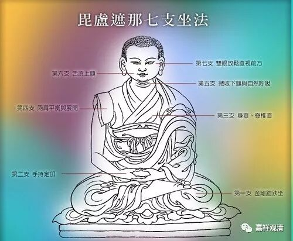
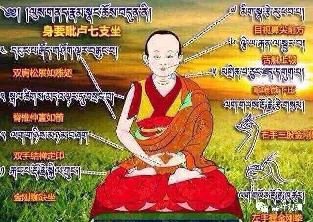

**《善说精髓》084（8）**

** 卯二、依止资粮修奢摩他

**分二：辰一、加行，辰二、正行。**

** 辰一、加行

** 

** 修菩提心等加行。

道次第前面的“**修菩提心等** ”这些所缘都可以看作是专修止观的“**加行** ”。对大乘行者来说，修习止观自然最好摄在菩提心下面，这样所修的内容也都算是大乘道的内容（或是大乘道的加行）了。

**辰二、正行

** 分二：巳一、以何身威仪修，巳二、释修习次第。**

** 巳一、以何身威仪修

**正以具八身威仪,

身威仪，是指身体采用什么姿势。外道有各种姿势，各种凹造型，单脚立的、专门躺着的，我们呢，就是一般常说的“打坐”。

** “正以具八身威仪”，**说一般的姿势按照“八威仪”来禅修。“八威仪”不是八种威仪，是具足八个条件的姿势，

“八威仪”也有说七威仪的，就是这里面少一个“数息”，这被称为“毘卢七支”。

温萨巴（一般称为二世班禅的），有一个颂子是简单总结“毘卢八支”的：

“足、手、腰为三，

唇齿舌合四，

头、眼、肩、息四，

即毘卢八支。”

1、足：就是腿脚，双盘、单盘、散盘这类；

2、手：自然放下，手结定印——掌心向上，右手放在左手上，两大拇指轻轻相触；

3、腰：腰背挺直，不东倒、西歪、前仰、后合；

4、嘴：嘴轻轻地闭上，牙齿也轻轻合上，舌尖轻抵上牙龈；

5、头：头不偏、不倚、不低、不昂，下巴略略内收；

6、眼：半睁半闭，视线在鼻尖……初学也可以轻轻闭着；

7、肩：肩膀平正放松，肩一放松全身就容易放松；

8、息：数息，令心安和。

