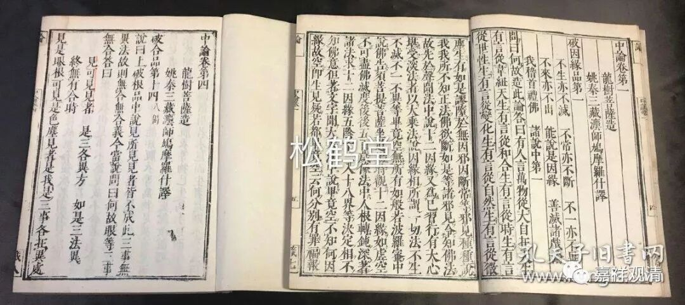

**微课堂佛教史·中观（2）**

早期的中观派迅速达到了一个顶峰，然后迅速进入一个（至少在中观派历史上的）“黑暗期”

中期呢，是以清辨论师、佛护论师、月称论师为代表。这一期呢，可以说是很明显地和唯识宗进行了比较清晰的切割，大乘中观派自身的观点就更加地明晰，和其他宗派的界限会比较清晰一点——这个切割任务是由清辨论师完成的。

这一点有点类似于世界历史上近代的国家的发展，早期各个国家的边界都不是很清楚的，只有“化内”、“化外”，是一个模糊的、变动中的势力范围，后来以现代西方工业文明为代表，就慢慢地有了国家这种概念，国与国之间的界限就越来越清楚了。大乘佛教的发展也是一样，早期呢，可能唯识派和中观派的界线并不是分得很清楚，大家都称自己是“大乘”，都注解《中论》、解释《般若经》，到了中期中观派和唯识派发展的阶段呢，宗派意识起来了，界限越来越清晰了，自他不共的观点渐渐地明确并固定下来，在这基础上各自发挥……这时候的中观思想相对于初期有了发展，所以称之为中期。这一期出现了被后世称为“中观自续”（清辨、观音禁为代表）和“中观应成”（佛护、月称为代表）的两大系统。

中期的中观师，到了寂天论师以后又出现一个小的“空窗期”，没有顶尖的实力派的人物出现，史料上有点欠缺。

那么晚期呢，可能是基于上面说的这个历史背景——因为之前有一大段的历史和论典的阙如。这肯定不是说当时没有中观派，也肯定不是当时没有过中观文献，但是没有被保存下来。后来一大堆的文献、一大堆的人物都集中出现在略晚的一个时期，于是就称为晚期的中观派。寂护、莲花戒、菩提贤、狮子贤、解脱军是其中的代表人物。

晚期的中观派似乎有两个源头和一个趋势，就是唯识、中观的趋近，一类中观师在世俗上采用唯识的观点，比如寂护、莲花戒；另一类中观师原出于唯识系，而在胜义上接受无自性，代表人物是解脱军、狮子贤，这两个方向走出来的中观师算是殊途同归，被后世称作“中观自续顺瑜伽行派”。

