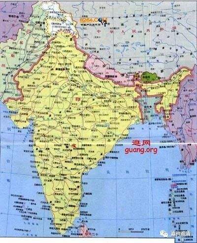
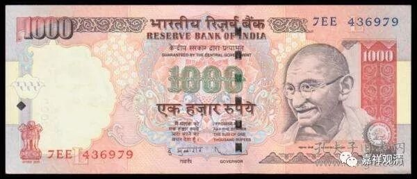

**《微课堂·中观史》（1·3）**

上面的内容基本上把昨天群里聊的又稍微讲了一下。今天要讲的就是最初期的中观佛教，其中最重要的一个代表人物就是圣龙树菩萨，也有称为龙猛菩萨，反正龙树菩萨、圣龙树菩萨都可以。

我们先来看看当时的历史背景，印度当时的文化和经济都已经有了很大的发展，而部派佛教——比如常说的十八部、二十个部派，基本上在那个时代已经全部出现了。用我们现在的话来讲，小乘(或者声闻乘)在当时是非常多的，全部呈现出来了。（说“基本上”，是给经部留个尾巴。在部派佛教里，经部出现的比较晚，最初独立出来的经部师甚至还受到中观的影响，《成实论》还引用到了圣天的颂文。）

这个时候呢，根据一般的说法，大乘的一些经典开始流行。我们认为也确实如此，因为龙树菩萨看到过这些经典嘛。比较重要的有般若经、《华严经》、《法华经》、《涅槃经》、《维摩诘经》等等，一些大乘的经典都开始出现于世。龙树菩萨在经典的注解和他自己的论典当中都提到这些经典，说明他已经看到了，也说明这些经典的出现肯定是在龙树菩萨之前。可以说，这也为中观派的出现奠定了一定的基础，一方面是当时的时代背景或者经济基础，另一方面是当时的佛教背景。

我今天发表的一篇文章中也谈到了一些相关的情况。我们通常会认为大乘佛教在经典的背景下，如何如何地兴盛，好像在当时的印度是占统治地位的，但实际上可能并不是，至少在印度本土，但单从佛教内部而言，声闻佛教从来就没有衰弱过，或者说至少不比大乘佛教弱。

佛教徒们通常对自己还会过分自信，认为佛教在印度曾经是“国教”，事实上，除了个别时期给予和其他教派相对平等的地位以外，佛教基本是不受待见的——它不是印度文化的魂，甚至它还是在它的对立面出现的。

中国人还有一个习惯，喜欢带着自己的文化习惯去看“别人”。比如我们喜欢大一统，这是跟我们自己的历史有关的，但说起来，今天的印度在独立以前，从来就不是一个国家的概念，而更接近于一个地理概念，可以说在英国人入驻印度次大陆之前，印度就没有完全统一过，“印度”在这之前也就是一个地理概念……表现在文化上，他们数十种文字并行，一张印度卢比上五十多种文字。

 

在这样的历史背景下，不同的地域用不同的语言（等等原因）也会形成不同的宗派……可以说，在印度，佛教形成数十种宗派几乎是必然的事件，谁也没太认真的说“我来统一一下各宗派”。很有趣的，中国的大大小小的祖师们基于中华文化的基因，非常热衷于统一佛教，连看过几本书的半文盲都敢出来谈“空有（宗）不二”……没办法，都是大家基因里带的，真的很难矫正。

