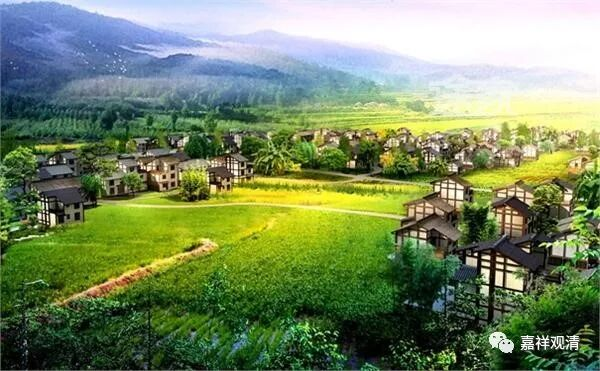
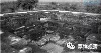
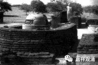

**《微课中观史》3·2**

现在还是继续说龙树菩萨。

上次我们谈到当时印度整个社会各方面的发展已经很不错了，龙树论师在当时的社会环境下名气很大，学问也很高。这个时候呢，他就有了一个弟子，是南印度的国王，后来龙树就去了南印度。南印度有个古迹叫“龙树山”，在印度的西边一点，好像是在海边。我还没去过，但是知道大致在那个地方，这是印度佛教的一个古迹。

龙树菩萨既有水平，又有大量的弟子追随，再加上国王的支持，大乘佛教一下子就兴盛起来了。现在看起来，龙树菩萨的作品还是有很多的，上次我们提到了他的一些作品，比如《中观论》、《十二门论》等等。《十二门论》是汉地所保存的一部经典，相当于《中论》的略论。

龙树菩萨好像确实有这一样一个习惯：他在著作了一部比较大型的论典以后，会对这部论典再进行摄略，写一部略论。这就有点像我们格鲁派的科判性质的论著，比如《菩提道次第广论》、《菩提道次第略论》、《菩提道次第摄颂》这种。龙树菩萨就有这样的习惯。

当然，唯识系统好像也有这样的习惯。这就可以看出是当时的印度有这样的风格，这也是非常好的一种教学方式。其实有些地方教学的基础是非常不错的，有些师父自己的水平也很高，但是由于教学能力不强，不会教，所以底下的弟子的能力也就不行了。也有些师父自己水平一般，但会教，弟子倒带出一批来。而龙树菩萨的教学能力也是相当强的。

我有个师父是头等格西，他谈起他两位很有名的师父，也都是超一流的“诸师之师”，两人的教学方式却大相径庭，KS仁波切的教学方式是：班里只要有一个人听懂了他就讲下去了——他的教学进度看班里最优秀的学生；另一位YJ仁波切，却是看班里最后进的那个，反复讲反复讲，一直到最后那个懂了才继续教下去。格西拉说：“当时我们就喜欢听前一个讲课，过瘾啊！后面那个课呢，我们很烦那个笨的同学，哎呀，还要讲还要讲……太烦了！怎么还不懂啊！但是今天，记得的都是后面那个老师讲课的内容。”

所以有时候老师的专业水平固然很重要，但教学方法也很重要。现在高等院校考核也分两类是吧，科研和教学。

