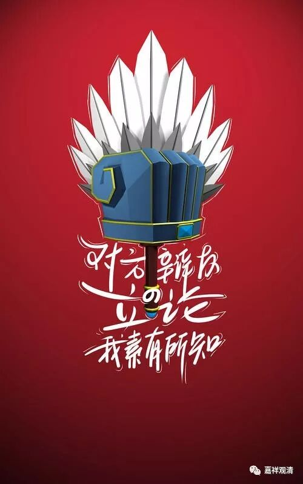

**《微课中观史》4·2**

那么提婆论师呢，就去了南印度，到了那个国家的寺院住下来。他说：砍树要砍根，这个地方三宝不兴，得先搞定那个外道国王！（这个他应该是看龙树大师学样的。）于是应征帮他们训练部队，部队训练得很成功，但他不吃皇粮、不拿钱。国王觉得很奇怪，就把他招到皇宫里面……

国王问他：侬啥宁啊！你谁啊？提婆回答：“我是一切智人！”大概就是印度常说的“薄伽梵”。国王吓傻了：“这可是难得出世的！你怎么证明呢？”提婆说：“你随便问好了。”

好了，就这么两句，提婆已经立于不败之地，国王已经不胜了。

这个国王也是个辩论高手，他想：“呃，这样一句我已经被噎死了，吐都吐不出来。我在国界里是大论议师，大家都知道。现在被他将死了。我要是听他的，问吧，就算是辩论赢了，也不给我增采啊！要是输了，那丢人丢大发了！可要是不问他，更是直接就输了……”

噎了半天，不知道说啥。后来想了一个办法，又问，又不会输——

国王问：“提婆（天）在做什么？”

国王的意思是，初次见面，我问你干啥呢，这不丢面子，也不会输。你不是叫“提婆”吗？你在做啥呢？

提婆马上回答：“天在和阿修罗打仗！”

一句“你随便问”出刀，一句“天在和阿修罗打仗！”就赢了。刀法凌厉！

为什么呢？国王也是聪明人，对方一句话下来，他就明白自己已经输了。

这里，提婆玩了一个双关语甚至三关语。国王问的是“你在干嘛？”，由于“提婆”就是“天”的意思，提婆回的是“天在干嘛？”那——“天在阿修罗打仗！”

国王此时不能说提婆说的不对，因为没法证明；也不能说对，也没理由。而且国王还不能发火，发火了，提婆更对了，“天（提婆）和阿修罗在战斗”，你要是发火了，那你就是阿修罗，而我是提婆（天），我和你在辩论，我又说对了。

一共只说了三句话，提婆就已经赢了。

国王也是个知识分子，讲道理，认输，磕头拜师！

也可以发现，提婆大师放招很狠啊，直切要害，要言不烦！对聪明人、讲道理的人可以说是一下就能拿住。但是，对一般人呢。我估计遇到中国皇帝肯定就是一刀了……

