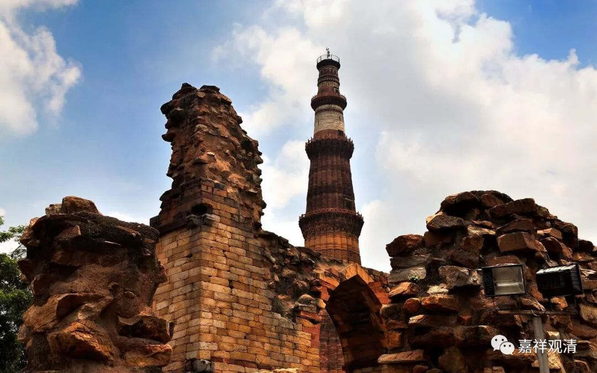

**微课堂佛教史5·1**

** 口传历史还是不如落笔靠谱啊**

**
**

今天我们继续聊聊印度的佛教史。因为群里还有些新人加入，我再给大家稍微讲一下这门课的意思。这个群呢，是我们的一个试点，在微信里用这种微课堂的方式，每次大概讲10分钟左右，谈一点适合大家随便听听的内容，要求记忆的部分不是很多。讲课的主题呢，我们先用佛教史和《心经》来试一试。

佛教史这堂课的编号虽然是从001、002、003……这样开始的，但实际上我们是从历史的中间部分开始讲的，这是因为我们先聊到一个话题，就自然地谈到了中观派的历史。所以我们现在继续来谈一谈中观派的佛教史。

佛教中从大的方面来分，就是我们都听说过的大乘和小乘。大乘佛教在印度最主要的两个宗派就是中观派和唯识派。一般来说，中观派就是讲“空”比较善巧的，唯识派是讲“有”比较善巧的。但是唯识派说自己是“善取空者”，认为自己才是讲“空”究竟、善巧的那个。

中国佛教的每个宗派都说自己能讲“空”，至于讲到什么程度，大家自己可以研究一下。这是因为佛教的三法印或者四法印当中都有“诸法无我”，这个“无我”的“无”字，到底“无”成什么样子，“无我”的范围到底有多大，这就看大家各自的“发挥”了。

那么，我们一般把中观派称为大乘佛教里面的“空宗”。

汉地也有把中观派称为“性宗”的，但这个“性宗”的说法是稍微有点问题的，应该说“性宗”和“空宗”还是有点不一样吧。我们还是按照“空宗”的说法来讲。

中观宗在印度的发展差不多可以分为早期、中期和晚期这样三期来谈。早期呢，大致从公元二世纪前后到公元五世纪，中期呢，从公元五世纪到公元七世纪、八世纪，后期呢，在公元七、八世纪以后。这么区分主要是因为中观派在这三个时期分别有不同的发展方向。

早期或者初期的时候是中观派（大乘）奠基的时代，其中最重要的两个代表人物是圣龙树菩萨和圣天论师。圣龙树菩萨的故事，我们前两天讲了，他并不是像孙悟空那样从石头里蹦出来的，不是那种没娘的孩子。藏传佛教说圣龙树菩萨的老师是萨惹哈——有好几种翻译吧？说还有一位叫“罗睺罗贤”。而龙树菩萨的徒弟——圣天论师有一个弟子也叫罗睺罗贤。于是就有两种说法，说这两个罗睺罗贤是两个人，这样的“可能性”也不能说是没有。

还有一种传说，说马鸣菩萨是龙树菩萨的师父。当然，在汉传佛教当中有好几位叫马鸣的。可以说，早期或者前期的大乘佛教当中一个重要的人物就是马鸣菩萨，后来还有一位叫马鸣的。按照汉传的《龙树传》的说法，还有一位大龙菩萨也算是他的老师，带他去龙宫去阅读了大乘的经典，也算是一位大乘佛教的老师。

龙树菩萨的弟子当中最出色的应该是圣天论师，在藏地经常把他们相提并论的，公认他们两位是最初的中观师。他们两人所讲说的经典，至少在藏传佛教中观派的背景下，其权威程度是相当的。

