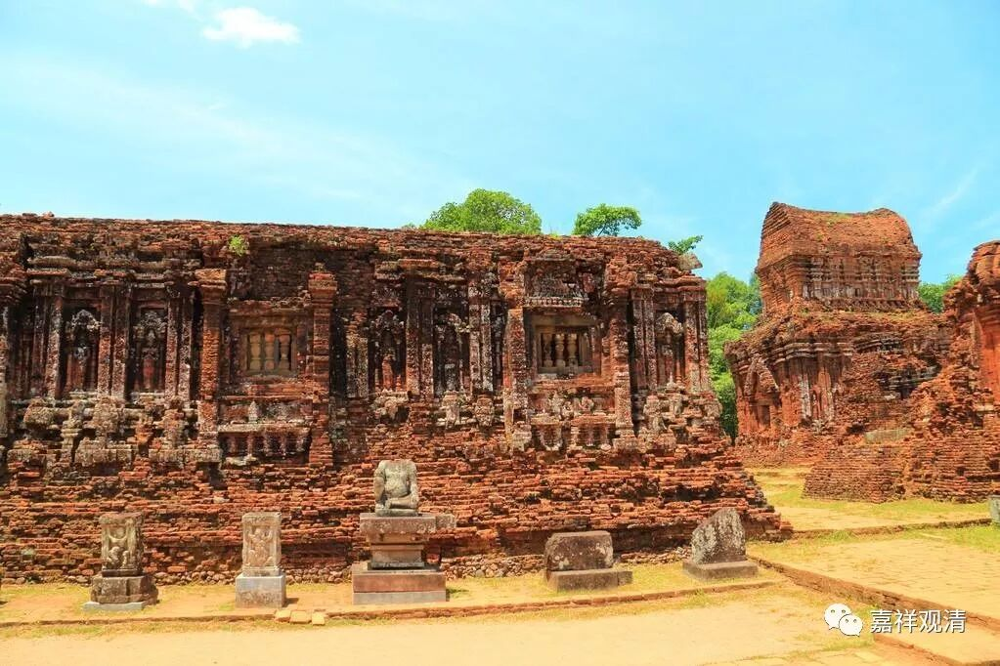

**《微课中观史》5·2**

昨天我们讲了圣天论师的一些传记，他又名圣提婆，阿雅提婆，Aryadeva——就是圣天的意思。他还有一个名字叫迦那提婆——就是一只眼的提婆，他只有一只眼睛。关于这个故事有两个不一样的版本，而且因果上也有点不一样，一个是汉传的，一个是藏传的。

汉传的故事是说他从南印度——斯里兰卡去拜见龙树菩萨，在路上经过一个外道的寺院，这个外道的寺院在祭祀一个天神，他就说这个祭祀没有用，就把那个塑像中天神的眼睛给挖出来了，然后又把自己的眼睛挖出来赔。

藏传的版本则是说这件事情发生在后面，发生在他跟龙树菩萨学习以后。昨天讲过他在辩论的时候对龙树菩萨有点不客气，就因此造成了一个障碍。后来他就碰到这样一个障碍，一只眼睛就挖出来了，所以他变成一只眼睛的提婆。不过我们在唐卡上基本上是看不出来的，唐卡上的画像还是会保持完整的。

提婆论师在和龙树菩萨辩论以后，在去南印度国家之前，在路上好像是经过了恒河，就看到很多人在恒河里面洗澡，因为印度教认为在恒河里面洗澡会获得洗除罪障的结果。那么，提婆论师就（又）过去捣乱（哎，我为什么会说“又”），

他也下到河里，但是不好好洗，闷着头把水往南方泼。

于是就有人忍不住发问：“你在干嘛？你把水往南泼是什么意思啊？”

提婆论师就说：“我的家乡在斯里兰卡，缺水，爹妈都渴呢，所以我把水往哪儿泼一泼。”

那人说：“哎，糊涂了吧你！斯里兰卡那么远，看都看不见，你往那个方向泼水怎么可以解决饥渴的问题呢？”

提婆论师就说：“你们用水能把看不见的障碍都洗干净，那我泼水去斯里兰卡，也就远点而已，为什么就不能解决饥渴的问题呢？”

这些对话很有趣哦，都非常像后来禅宗的语言风格，而且这些文字都是出自一向看起来比较刻板的玄奘法师的手笔，都是他在《大唐西域记》里面写的。

提婆论师的这几个故事表现的风格都差不多——爱怼人。辩论的套路类似演义里面二将交手，先“卖个破绽”，然后一枪戳死……又像围棋高手里面李世石、古力的棋风：你随便怎么下，反正我就是要杀棋！而唯识的祖师们就有点像日本的本格派的棋风，讲究分寸、规矩，甚至还讲究美学。

提婆论师后来到了南方，降服了外道，差不多成为了国师，于是当地的佛教也得到了大力的弘扬。但是，这种弘扬应该说是有两面性的，因为他是用辩论的方式来战胜大家的。

