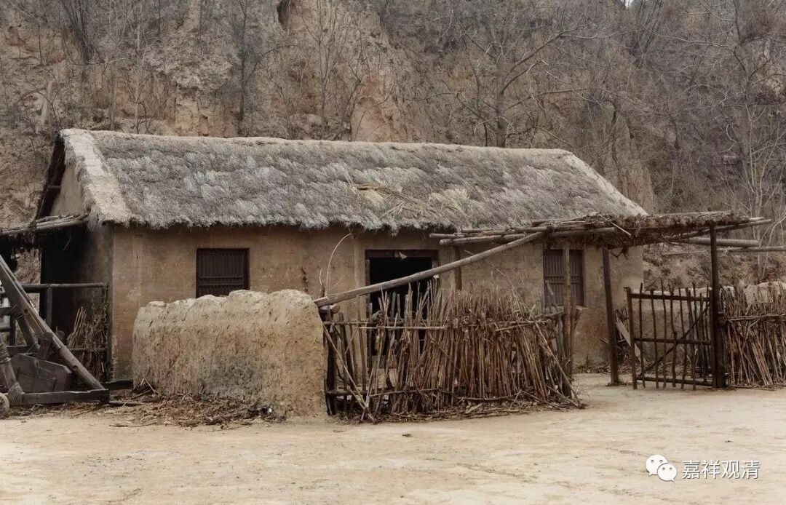

**“婆子烧庵”清解**

《五灯会元》：

“昔有婆子供养一庵主。经二十年，常令一二八女子送饭给侍。

一日，令女子抱定。曰：正恁么时如何。

主曰：“枯木倚寒巖，三冬无暖气。”

女子举似婆。

婆曰：“我二十年祗供养得个俗汉！”

遂遣出。烧却庵。”

清案：

这则“婆子烧庵”之下，多少“禅师”粉身碎骨！

老婆子二十年供养一个和尚，还派女人去抱住人家试探。人家和尚说得很正谨，老婆子反而把小庙给烧了！

往往“禅师”的评唱都去贬低庵主而暗赞婆子，呵呵，这些“禅师”可说——死于言下，妄分宾主、妄作解人也！

二十年的老修行的正谨话没人信服，反而把个烧庙的烦恼炽盛的老婆子当明眼人，一众“禅师”们的“教外别传”的眼光，也实在是有些离谱呢！

这则公案明明是说：你修行好不好，老婆婆们哪里会知道！你要是顺着老婆婆们的烦恼路子去修行，地狱有份着！

颂曰：

婆子烧庵，廿年白干！

无知妄解，盲盲相搀！

