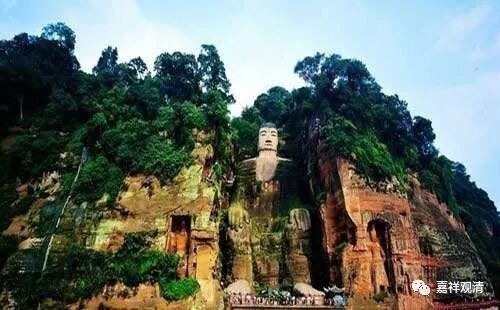

**《微课中观史》6-D**

早期的中观派中还有个知之不详的人物——青目论师，“青”就是青颜色的“青”，“目”就是眼睛那个“目”。当时有留下来的文献就是《青目释》，就是对《中观论》青目论师所作的解释，这也只是在汉传当中有的，而藏传当中有一篇《无畏论》，有点像。在汉传当中说，这部《青目释》是由青目论师所著作的，由鸠摩罗什法师所翻译的，那么他的时代肯定是要早于鸠摩罗什法师的老师，大致的年代是要在中观派的早期。

汉传系统有一种说法，说由龙树至鸠摩罗什的师承关系是：龙树、提婆、罗睺罗跋陀罗、青目、莎车王子、鸠摩罗什，这里面。青目是不是具有这样的承启关系不得而知，但大致而言，这些人名就是相应那个时代的中观代表人物，这应该没问题。

藏地在接触到汉地的一些信息之后，就对中观派的早期人物青目论师有一些推测，我觉得很有趣。我大致看到有这样几种说法：第一种说青目论师就是清辨论师，多某教授说的，大概是听到一个“清”字就认为这是同一个人，这个在年代上也差得太远了。第二种是说青目论师就是提婆论师，因为提婆论师有一个名字叫独眼提婆，而青目论师的名字当中有一个“目”，于是就引发了联想。第三种认为青目论师就是月称论师，呵呵，月称论师的年代比清辨的年代还要晚些呢。总之西藏人的历史观念我们不必太认真，认真你就输了。

基本上在汉藏传或者藏传和其他的经典当中出现历史方面的异议的话，我们就不看藏传的，在历史方面我们还是看重汉地的说法，因为落笔的文献（相对而言）还是强于千年的口传——我指的是历史部分。反正肯定青目论师不是清辨论师，不是月称论师，也不是提婆论师——这是可以肯定的。

刚才说汉传的传说中当中有一个比较明显的中观传承谱系，就是龙树菩萨的弟子是提婆论师，提婆论师的弟子是罗睺罗贤论师，罗睺罗贤论师的弟子是青目论师，青目的弟子莎车（莎车，今天的新疆莎车县）王子，这是俩兄弟，他们是鸠摩罗什的师父——这是汉地的一种说法，当然，汉地也没有第二种说法了。

这种说法能在鸠摩罗什以前拉出一根比较清晰的中观传承线路，但是藏传的佛教传承的中观学似乎至少从青目开始已经和汉传一系的中观分流了。

从青目而莎车王子（莎车，历史上曾经吞并龟兹），由他们再传给鸠摩罗什法师。鸠摩罗什法师是当时的一代大师，然后他去到中国，中国再辗转相传，就是后来的“三论宗”或者“三论师”。很可惜，两位莎车王子目前没有看到有文献传承下来。说个题外话：要被历史记住，就要留下文字，“历史”很“唯物”！

今天的佛教史先讲到这里，差不多早期中观派的几位重要人物都讲完了。

