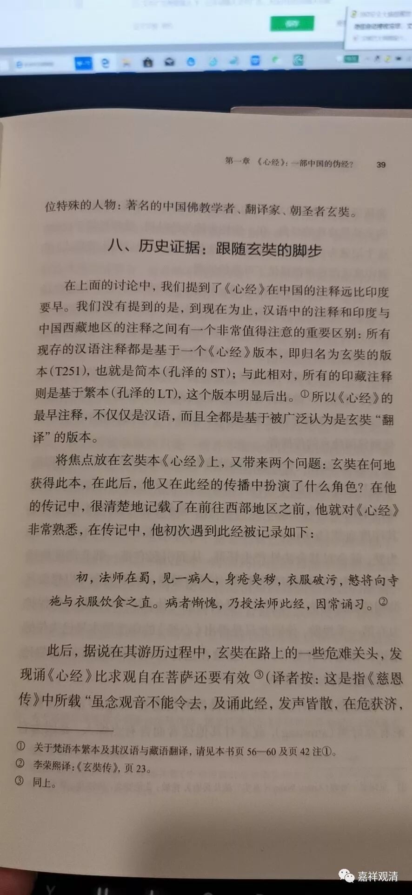

**《微课中观史》8·2**

下面我们再谈谈龙树菩萨的其他作品。上次我们提到过《十二门论》，这个相当于《中观论》的略本，只有在汉传的文献当中保留了，藏文版和梵文版到目前为止都还没有看到。我们一般要说“目前还没有看到”，而不能直接说“没有”。说“没有”就有点过分了，万一明天挖到一本呢？所以应该说现在还没有找到梵文版。《十二门论》大致相当于《中论》的略本，其中还包括了对它的一些解释。（我个人认为，《十二门论》真正的颂文部分只是各品篇首的那一颂，其他颂文都是注解里的。也就是说，单纯谈《十二门论颂》，我以为只有十二颂。）

《十二门论》的所有二十六颂颂文只有五颂目前没有找到相近的本子，其余都出自《中论》和《七十空性论》。

还有一部《大智度论》，也是目前唯独在汉文当中才有的。这部论的篇幅相当大，总共有一百卷，如果去掉其中三十卷《大品般若经》的内容，剩下来的还有七十卷仍然是《大智度论》本身的内容。原来传说《大智度论》是有一千卷的，现在看起来可能篇幅没有一千卷那么大。比如说，我们平时讲的《十万颂》，就是汉地《大般若经》，也就大致相当于四百卷。

《大智度论》里面的内容非常非常地广泛，由于篇幅太大，造成了大家对它很难去弘扬。“三论宗”以前也称为“四论宗”的，但是要讲一遍《大智度论》是非常难的，这个坑有点大，填起来太费时了。但即使如此，《大智度论》对汉传佛教的影响可能又是中观系论典当中最深的，由于他解释的文字洋洋洒洒、不厌其烦，远不似《中论》、《十二门论》、《百论》之晦涩，所以当三论宗章疏被束之高阁的时候，《大智度论》倒迎来了大量阅读他的汉僧。

《十二门论》和《大智度论》的作者，汉传基本上没出现过什么争议，但今天学界很多人本着“一切皆可怀疑，古人说的话不算”的思路，先否定掉了罗什、僧睿们的传说，然后“大胆地假设”为“《大智度论》为罗什所著”，呵呵，这就跟某些外国学者说“《心经》作者是玄奘”一样可笑。我觉得他们似乎有个原始的预设，就是罗什、玄奘这类人人品很差，喜欢造假，经常说瞎话。不然他们干嘛都那么喜欢编造经典、编造传说呢？但他们又认为这两个人很厉害，造假的东西很经典——我总觉得肯定是有人脑子拧巴了，或者是他们，或者是我。

