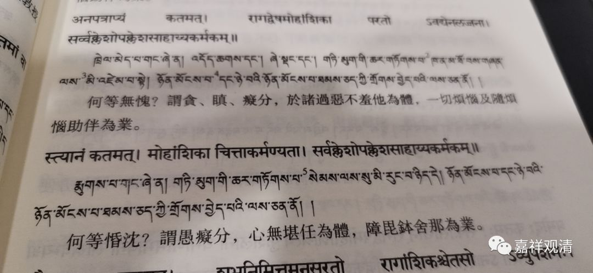

**《善说精髓》084（33）**

下面聊聊汉传对昏沉的理解。还是先放出来做一下对照。

《集论》卷一：

** “何等惛沈？谓愚痴分，心无堪任为体，障毘鉢舍那为业。”**

《成唯识论》卷六：

** “云何惛沈？令心于境无堪任为性，能障轻安、毘鉢舍那为业。”

先说版本差异。

今汉传《集论》说昏沉是“**障毘鉢舍那为业** ”，而今梵藏文皆云“与一切烦恼及随烦恼助伴为业。”。如《广论》引《集论》说：“云何昏沉？谓痴分摄，心无堪能，与一切烦恼及随烦恼助伴为业。”

北塔梵藏汉文对照版《集论》：

安慧的《广五蕴论》说：

“云何昏沈？谓心不调畅、无所堪任，蒙昧为性，是痴之分。与一切烦恼及随烦恼所依为业。”

安慧《唯识三十论释》云：

“昏沉，心无堪住性，即不调畅，不活发状态，就是不调畅，“不活发”就是蒙昧，不能了知所缘，**给一切烦恼随烦恼助伴为业** 。因为是痴之一分施设，并非别有。”

这样，若以汉传《集论》版本，则为“**障毘鉢舍那為業** ”，若依今存之梵藏本，及安慧释，则当作“**与一切烦恼及随烦恼助伴为业** ”。藏传唯识系属于安慧系统，和护法——玄奘系有差异也是正常的。

汉传有《显扬圣教论》，和《集论》一样，作者是无著，《显扬圣教论》和《集论》汉译版在“昏沉”的业用上表达是一致的，《显扬圣教论》卷一：

“惛沈者，谓依身麁重、甘执不进以为乐故，令心沈没为体，**能障毘鉢舍那为业** ，乃至增长惛沈为业，如经说：‘此人生起身意惛沈。’”

也说“昏沉”是“**能障毘鉢舍那为业** ”。

也就是说，不论《集论》版本取什么版本，唯识系统里对昏沉的“业”，至少有三种说法：

1、“**能障毘鉢舍那为业** ”：取此说的有《显扬圣教论》和玄奘版《集论》；

2、**“与一切烦恼及随烦恼助伴为业”** ：取此说的有今存的汉藏版《集论》、安慧《广五蕴论》、安慧《唯识三十颂释》；

3、“**能障轻安、毘鉢舍那为业** ”**：** 取此说的是《成唯识论》。

这个先放着，等讨论到昏沉的业用的时候再展开……

