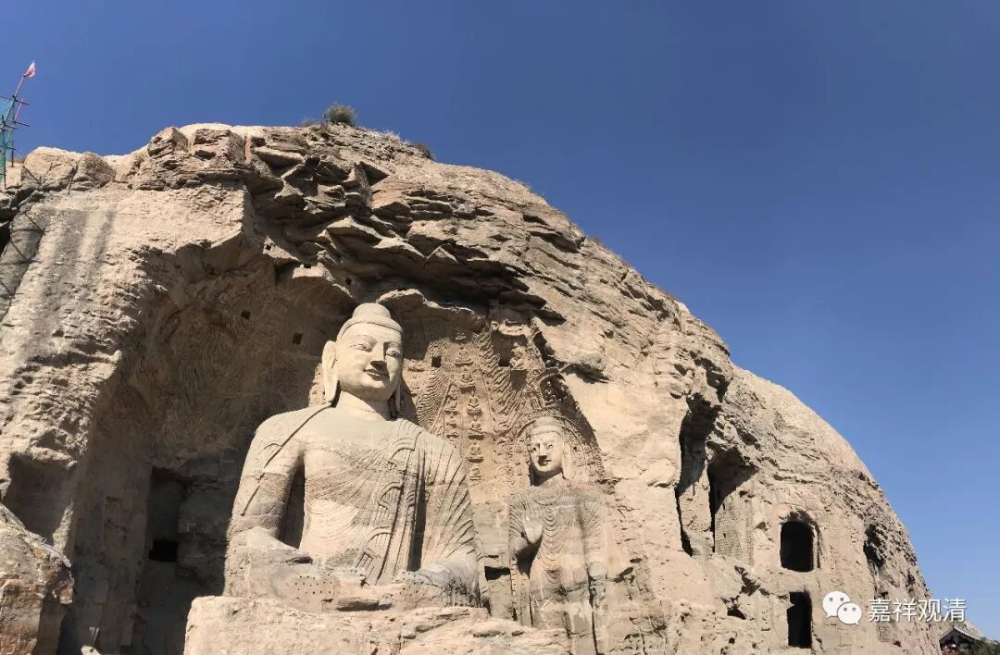

**《微课中观史》11·3**

清辨论师是佛护论师的学弟、师弟，都是僧护大师的弟子，就是年龄相差得有点大。汉传则说清辨继承青目一脉，这可能是因为中间的历史阙如吧，因为在青目之后、清辨之前，汉传没有其他中观师的名字出现，所以一需要出现法脉传承谱系的时候，就直接把这两个人连起来了。

在一些解说当中说，月称论师的老师是跟佛护论师学过，也跟清辨论师学过。好像清辨论师有一个弟子叫观音禁，记得是月称论师的老师。

月称论师是在观察前面这两位大师著作的时候，觉得清辨论师对佛护论师的著作有误解，然后就帮助佛护论师进行讨论，也借鉴了清辨论师的思想和熟练应用因明的长处。这三个人物的师承关系大致是这样的。

佛护论师呢，是最早师从于僧护大师的。僧护大师应该是个中观师，但是目前留下来的文献当中观点有点倾向于唯识。清辨论师是佛护论师的师弟，但是年龄相差比较大。清辨论师有个弟子叫观音禁，也有作品存世。月称论师曾经师从好像是两个或者更多的老师，反正他师从过的老师当中既有佛护论师的弟子（莲花慧），也有清辨论师的弟子（观音禁），他采取了两位大师的善说，更多地维护了佛护论师的观点。（大概记得是这样，有机会再看一下。）

依据后期的中观派大师的观点，这三位是可以很明显地进行区分，佛护论师和月称论师就被称为“应成派”，清辨论师就被称为“自续派”，这三位就是中观自续派和应成派最早的祖师。后来又把清辨论师和后期的寂护论师区别开来，称清辨为“顺经部行的中观自续派”，寂护为“顺瑜伽行的中观自续派”。

“自续派”和“应成派”的称呼最终是在宗喀巴大师的时候定型的，并不是以前没有这种说法，但是定型是在宗喀巴大师的时候。以前还有一种说法，说月称论师所顺有部行的——顺毗婆沙的。

