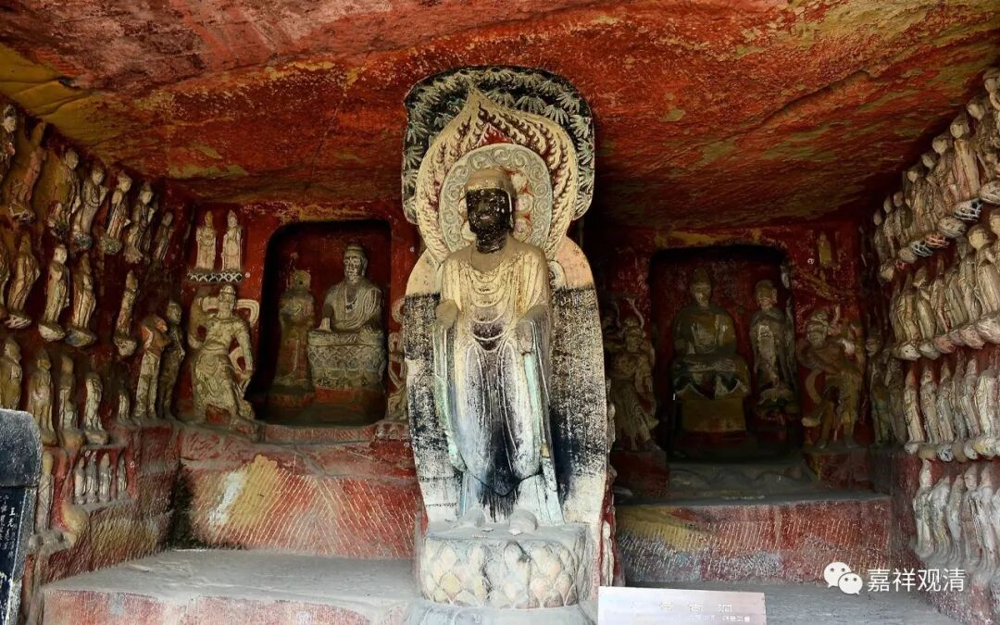

**《微课堂佛教史》012·1**

我们现在还是继续讲中观派的历史。上次讲到中观派中期的几位重要人物，就是在公元五到七世纪或者公元五到八世纪的时候，中观派最核心的人物有这样三位——佛护论师、清辨论师和月称论师。如果把后面的寂天论师也算进来的话，最重要的人物就是四位。

佛护论师的生平不算很清楚，只能知道他的时代大致比清辨论师稍微早一点，他可以算得上是清辨论师同门中比较早期的师兄。他本人和清辨论师之间是没有师承关系的，年代比清辨论师略早，是师从同一位老师这种性质的。

佛护论师最主要的一篇文献，或者说他留下来的文献当中——有没有第二篇现在不知道，最重要的就是他的《中观论释》。这本《中观论释》以前在汉地是没有的，现在好像是有人在翻译了。第一品——观因缘品已经翻译出来了，我好像在网上有看到过，大家有兴趣的话可以去看一下。(现在已经出版了，《中论佛护释》)

接下来要多讲一点清辨论师。清辨论师在佛教史上是非常有名的人物，在汉传佛教传说印度的佛教故事当中，他是非常有名的，现在讲起来也是脾气比较大的一个人物。这个我不知道怎么说，反正看起来就是这样。

上次我们已经说过他的一个故事。当时已经出现了几十部对《中观论》的注解，清辨论师在学习的过程中就发现，很多属于唯识系统的注解和中观派的原意很不一样。他也学习了很多唯识系统的内容，因明也掌握得非常善巧，还专门著有因明的书籍。

那么，清辨论师就觉得弥勒系的经典或者论师，对于中观系的解释，或者说对《般若经》的解释，和龙树菩萨的意思是完全不一样的。所以他就对弥勒系的解读有点质疑，特别是对三性三无性的解释。当然，他自己对三性三无性也有一个说法，就是关于遍计所执性这些内容，和弥勒系的说法稍微有点不同。

从历史的角度来看，“中观派”这个“概念”是从清辨开始发生的，之前可以说都算是“大乘一脉”，清辨论师发现，中观系对般若经的理解和弥勒系很不一样，在究竟、了义的层面双方有分歧，细节的解释上有差异。所以中国佛教历史上有人说，现在也基本成为定论，说：龙树、提婆、无著、世亲固然先后出世，但作为“中观派”和“瑜伽行派”两个大乘的独立的“流派”，是到清辨以后才定型的。也就是说，清辨论师是一个划时代的人物！

