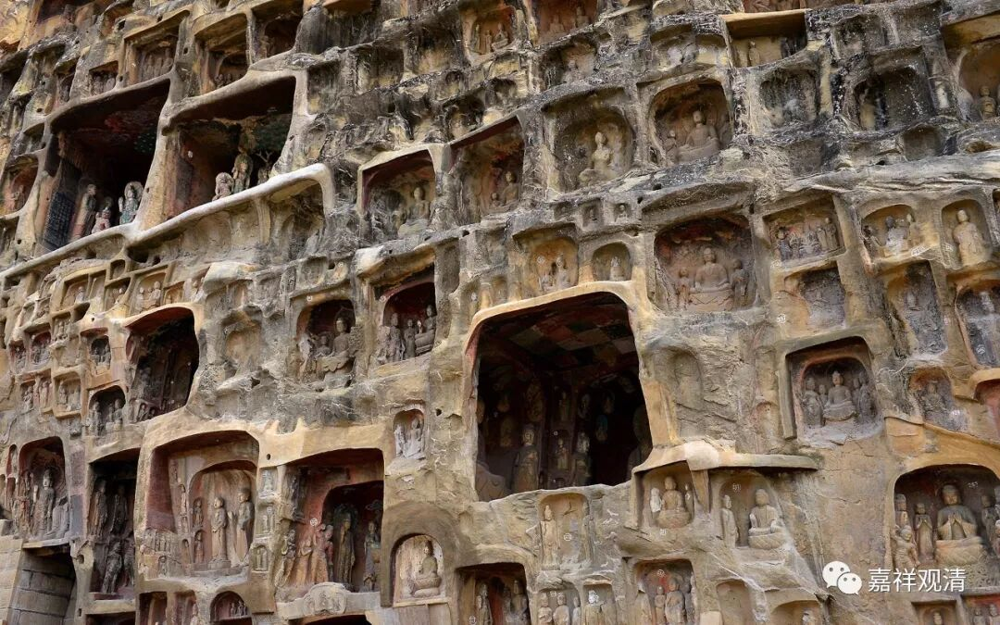

**《微课中观史》12·2**

在汉地玄奘法师流传下来的传说当中，说清辨论师后来要找护法论师进行辩论，但护法论师就是不见他，他带着弟子就到处去找护法论师。说起来呢，清辨论师当时名气大得很，护法论师虽然名望不低，但毕竟是个后生晚辈（护法出名很早，去世时也才三十一岁好像），而且身体也不好，哪里敢和清辨论师硬杠，确实躲开是最佳选择了。但他在自己的著作中还是回应了清辨提出的一些质难，当然这种回应可以看作是对之前唯识宗一些细节的优化了。

我们现在说起来，护法论师就是玄奘法师的师公，因为玄奘法师的师父是戒贤法师，而戒贤法师的师父是护法论师。不过，护法论师的年纪要比戒贤法师小，也有称他的名字为法护论师的。

我突然想起来，上次我好像在什么地方说西藏没有护法论师的著作，这个说法是错误的。我记得是在藏汉的某部词典当中，还是在藏经的一个对勘当中，看到过有护法论师的著作。可能不是很大篇幅的作品，但不能说护法论师的作品在藏地没有。我是刚刚突然想起来，藏地也应该是有的。

清辨论师和护法论师应该是差不多同时代的，也就是说，他大概比玄奘法师大五、六十岁左右。玄奘法师到印度的时候，他的老师——戒贤论师一百岁了，而玄奘法师本人应该是三十岁左右——我没有仔细算哦，应该三十岁左右。清辨论师和护法论师应该是差不多年纪的，而护法论师好像比戒贤论师年轻个两三岁。所以我们可以大致推断出来，清辨论师的年代比玄奘法师的年代早五、六十年左右。

佛护论师比清辨论师再早一、二十年或者二、三十年，而月称论师则比清辨论师再晚二、三十年，或者更多一点，因为月称论师好像没有碰到过清辨论师。因此，一般学界认为月称论师的年代应该和玄奘法师差不多。

那么，就有一个问题：为什么玄奘法师没有见过月称论师呢？当时和玄奘法师是有过来往的一位中观师，是智光论师，他和玄奘法师后来还有书信来往的。但是从名字上看起来，月称论师和智光论师并没有什么交集。等到比玄奘法师稍晚的义净法师就提到月称论师了。民国初期有人认为玄奘系有贬抑中观系的情况，内学院的熊十力（当时还是叫熊子真，还没叫熊十力，也还没独立开派）张建木都参与了这场论争。

