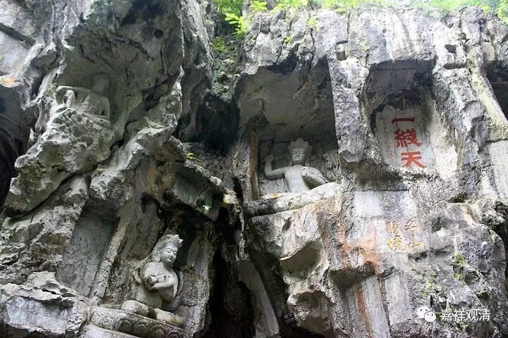

**《善说精髓》084（40）**

** 酉二、修习知已不勤功用以断彼之对治

**分二：戌一、明思及灭沉掉法，戌二、明生沉掉之因。**

** 戌一、明思及灭沉掉法**

** 

** “如同铁随磁石转，于善不善或无记，

**动心心所即是思。”

** 

再说思心所。

《集论》说：

** “何等为思？谓于心造作意业为体，于善、不善、无记品中役心為業。”**

** 

《菩提道次第广论》说：

** 

** “如由磁石增上力故，令铁随转，如是于善、不善、无记随一，能令心之心所，是名为思。”

** 

这里可以看出来，《善说精髓》用磁石做比喻的说法出自《广论》。“** 如同铁”“随”**着** “磁石”**而** “转”，“于善不善或无记”**能** “动心”**之** “心所”，**这** “即是思”。**

前面说过，藏传法相顺安慧，磁石的比喻其实也出自安慧，安慧《唯识三十论疏》说：

“思，使心造作，使意行动。当意行动的时候，其心对所缘似有所引，就象是铁受吸铁石之力牵引一样。”

《成唯识论》说：

** “思，谓令心造作为性，于善品等役心为业。谓能取境正因等相，驱役自心令造善等。”

应该说，《集论》、《成唯识论》、《安慧唯识三十颂释》，对思心所的解释是一致的，“令心造作”为性。思是“令心造作”。

而看《本论》的定义，“**于善不善或无记，动心（之）心所即是思** ”，这对应其他诸论似乎说的是思心所的业，如《集论》“**于善、不善、无记品中役心為業** ”、《成唯识论》说：“**于善品等役心为业** ”。这或许就是颂文不善于给予精确定义的缘故吧……

