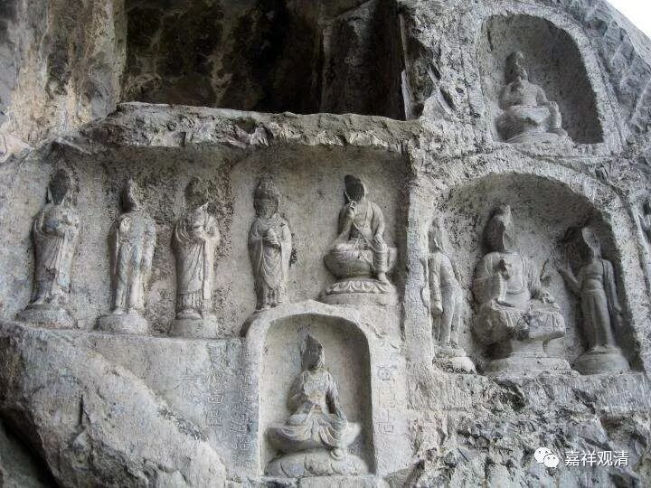

**《微课中观史》12·4**

传记当中讲，清辨论师对因明是相当熟悉的，汉传有一部比较著名的清辨论师的著作叫《掌珍论》，是把它当作因明的教材来翻译的，这里面当然也包含了很多中观的内容。“真性有為空，如幻缘生故，无为无有实，不起似空华。”这个就是《掌珍论》最前面的一段。我以前曾经碰到过SH某位研究因明的学者，他在跟我私下吃饭聊天的时候说，《掌珍论》一点都看不懂。因为他只是研究逻辑，但是对佛教的哲学不是很懂。

藏地有些“学院”的法师自诩为通教理，讲记出了一堆，又一堆，在讲到中观的时候，经常语出惊人，说“清辨不论是直接还是间接，都从来没说过世俗有自性……”，呵呵，书读得少的人经常会有这类莫名其妙的总结。这里，清辨《掌珍论》第一句就说：“真性有为空，如幻缘生故，无为无有实，不起似空华。”直接一巴掌扇在他脸上。“真性”，就是胜义谛，这是一个简别词，用来简别世俗谛。这句是说，在胜义谛上，一切法（有为法+无为法）无自性，反过来表明，他是许世俗谛有自性的。至少这里算是间接的证明。（“直接的文字”在相关的辨析里很多了。）

在藏文当中还有清辨论师对《异部宗轮论》的解释，好像叫《异部宗精释》，现在还没有翻译过来，我对这部书很有兴趣。藏传很多部派的一些说法，其实就来自于《异部宗精释》。但是这个情况也很有趣，他们会大量地引用清辨论师的一些说法——对部派的异说，对《异部宗轮论》的原文似乎不怎么引用。

《异部宗轮论》基本上是在讲述公元前后印度的各个佛教部派的思想，能够对这部论进行广泛的注解，由此也可以看出清辨论师这个人的学识是非常的渊博。他对自身中观派的观点有着清晰的理解，对唯识和因明也非常地善巧和熟悉。另一方面，他还确实表现出作为论师的厉害之处——他的文字非常多，虽然译成汉文的目前还不多。清辨论师好像没有专门驻扎在哪个寺院，我记得传记中说他是游走得比较多。

那么，在中期的印度中观系统当中，应该说有三次很重要的辩论，都是发生在公元六、七世纪左右。（我们今天先开个头吧？）这三次最重要的辩论当中，最早的一次就是清辨论师和护法论师的辩论，第二次应该是月称论师和月官论师的辩论——这个有点搞不清楚，也可能是第二，也可能是第三，那么另一次就是戒贤论师和智光论师的关于中观和唯识哪个更了义的辩论。

好，今天先到这里。

