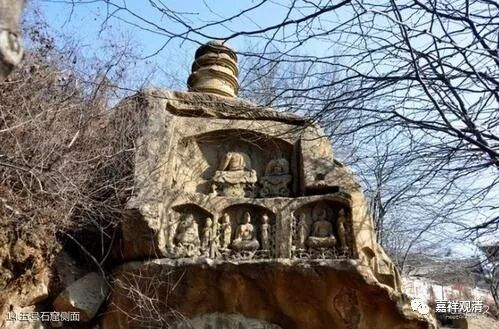

**《善说精髓》084（41）**

** “此说对治生沉掉，不勤功用造作思。”

** 

** “此说”，**是指此处所说。总的来说，思心所是五遍行之一，有心就有它，这里在谈对治昏沉、沉没、掉举、散乱的时候，这里的提到的“思”就是“** 对治生沉掉**”时的不去刻意地对治的那个思。“** 不勤功用**”，是指不努力实践、不随时纠正禅定中问题。“** 造作**”，就是“思”咯。《广论》说：“此中是说生沉、掉时，令心造作断彼之思。”

** “沉没心者太内摄，由失所缘行相故，”**

“** 沉没**”的原因是“** 心**”“** 太内摄**”，收摄太过，因此而丢“** 失**”了“** 所缘行相**”。

** “应修欢喜非厌患，或修佛像光明相，”

这个时候，“**应修欢喜** ”，就是说在心暗弱的时候，要让他兴奋起来，应该想想美好的东西，思维正面的、能令欢喜的对象。假如对净土有好乐心，就可以思维净土、或者如果对三宝有比较强的皈依心，也可以想想三宝、想想三宝的力量，想想光明，也可以思维法义。“**非厌患** ”，就是“非应修厌患”——这个时候，不应该思维自己不喜欢的内容，因为那样的话，心会更加沉没，更加没有驱动力。

“**或修佛像光明相** ”，这个时候，可以观想佛像、观想佛放光明照耀自己、观想日月光芒……

《菩提道次第广论》说：

**“为断沉、掉，发动心已，复应如何除沉、掉耶？

** 心沉没者，由太向内摄，失攀缘力，故应作意诸可欣事，能令心意向外流散，谓佛像等极殊妙事，非生烦恼可欣乐法。又可作意日、月光等诸光明相。沉没除已，即应无间坚持所缘而修。”

《瑜伽师地论》说，“光明”有两种，境上的光明——日月光明等，和“法光明”——佛法的内容。

