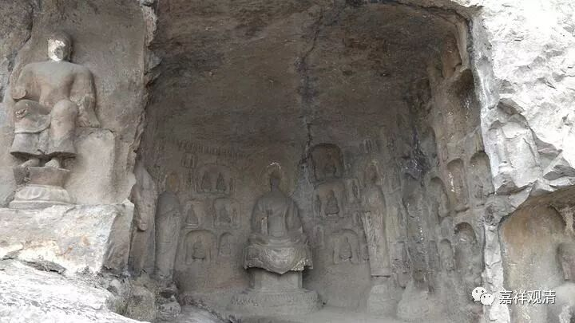

**《微课中观史》13·2**

我们先从佛教史来看看，佛教到底出现了哪些人物、哪些流派，佛教的这些流派到底讲了些什么内容，我们都要知道一下的。那么，我们已经从中观派的历史入手，讲了中观派的一些重要人物，大家慢慢地会对这些人物越来越熟悉。刚开始听的时候连这些名字都记不清楚，也听不懂，是吧？我们以前读书的时候也是这样的，不管是学习什么历史，学了半天人名也记不住。但是一旦你学习的时间长了，左右逢源，反复键入，慢慢地就变得很容易了，至少不那么难记了。其实学习就是不断重复键入的过程。

我们先来说说中观派的历史当中早期、中期和晚期的一些重要历史人物。早期的代表人物是圣龙树菩萨和圣天菩萨；中期的，比玄奘法师的年代再早一些的代表人物是佛护论师和清辨论师，接下去就是月称论师和寂天论师——这些都是真实存在的人物。

讲到清辨论师呢，我们昨天说他在那个时代是一个很厉害的人物。清辨论师的老师是僧护法师——佛法僧的僧，也有把这个僧翻译成众的，叫众护法师的。据多罗那他的佛教史——我们圈子里的有些人对多罗那他这个名字可能比较熟（据说是哲布尊丹巴的前世，或者说多罗那他后来转世成了格鲁系统当中外蒙古的顶级法王——哲布尊丹巴。但据最新考证，格鲁系的多罗那他和觉囊系的多罗那他其实是两个补特伽罗，只是后来因为藏人历史不好的缘故，慢慢都当做是一个补特伽罗了）。

多罗那他有一本书叫《印度佛教史》。这本《印度佛教史》有翻译过的，应该是民国时期张建木先生翻译的，张建木先生好像与熊十力先生是好朋友。（以后我们可以搞一块黑板，上面写上佛教史的人名，把这些人名互相联系起来，应该也挺有趣的。应该可以找到类似“金庸的表哥徐志摩”这种类型的八卦）多罗那他的佛教史当中就记录了一些传说，很多只是代表了藏地保留的一些传说。那么，根据多罗那他佛教史的记载，清辨论师在当时非常有名，建了非常非常多的寺院，据说有四、五十座之多，常随众有二千五百人，非常了不起。

清辨论师的著作呢，我们现在手上有的或者说已经翻译成汉文的有《般若灯论》，这是对《中观论》的注释。这部论典在汉文当中是有的，但是内容不全，而且翻译略显生涩。清辨论师的《掌珍论》，汉文版也是有的。最近有一位美女教授翻译了部分《思择焰论》，这本书我还没看到过，但是在网上好像已经有卖了，大家可以去找一下（现在只有很贵的二手书了，好像卖两千）。《思择焰论》也是清辨论师的论著，大家有兴趣可以去找一下。哎，明天正好是双十一，可以看看网上有没有，买一本《思择焰论》。

