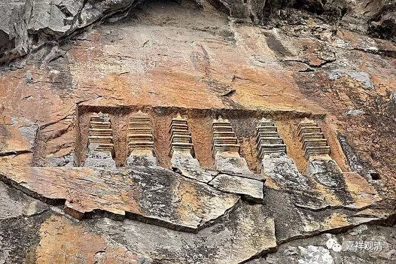

**《善说精髓》084（42）**

** “思择乐思境亦善。”

** 

可以修光明想，如果** “思择”“乐思境”**、观察自己喜欢的内容，** “亦善”**，也可以。这当然是说正确的观察对象，而不是贪心的所缘境。

** 

** “修广所缘及行相，”**

应该要** “修”“广”**大** “所缘”“及”**其“** 行相”。《广论》引《中观心论》云：“退弱应宽广，修广大所缘”。

** 

** “经行读诵修六念，冷水洗面瞻星辰，”

** 

如果还昏沉、瞌睡怎么办呢？可以** “经行、读诵、修六念，冷水洗面、瞻星辰”**。这是当年释迦牟尼佛给目犍连尊者的教说。

当年舍利弗、目犍连两位带着自己的弟子归投世尊，闻法后不久，他们的弟子们纷纷证四果了，还剩他们两位仍旧未成罗汉（此前他们都已经证得初果）。目犍连就去专修，七天过去了，仍旧没有证果，却困得不行瞌睡、昏沉、沉没都来了，这时候，释迦牟尼佛知道该给予特别指导的时间到了，就来到目犍连面前，给他开示了对治昏沉、瞌睡的方法：可以起来走走，可以思维法义（读诵经典）、可以冷水洗脸、看看天空，甚至实在不行可以休息一下、去睡一会儿……给予这样的教示以后，目犍连当天就证得阿罗汉果了，为僧团里神通第一。舍利弗证四果要在皈依佛陀一个月的时候了。

** 

** 

** 《瑜伽师地论》卷二十四对此总结道：

** 

** “从惛沈睡眠盖及能引惛沈睡眠障法，净修其心。**

** （光明想）为除彼故，于光明想善巧、精恳、善取、善思、善了、善达，以有明俱心及有光俱心。**

** （经行）或于屏处，或于露处，往返经行。

**（六念）于经行时，随缘一种净妙境界，极善示现、劝导、赞励、庆慰、其心。谓：或念佛、或法、或僧。或戒、或舍、或复念天。**

** （诵读）或于宣说惛沈睡眠过患相应所有正法，于此法中为除彼故，以无量门诃责、毁呰惛沈睡眠所有过失，以无量门称扬、赞叹惛沈睡眠永断功德。所谓契经、应颂、记别、讽诵、自说、因缘、譬喻、本事、本生、方广、希法及以论议。为除彼故，于此正法听闻、受持，以大音声若读、若诵，为他开示，思惟其义，称量观察。**

** （观方）或观方隅。

**（观星辰）或瞻星月诸宿道度。

** （冷水洗面）或以冷水洗洒面目。

**由是惛沈睡眠缠盖，未生不生，已生除遣。

** 如是方便从顺障法净修其心。”

** 

《瑜伽师地论》这段讲的很明白了，括号里新加的注释，帮助解读，大家可以看一下。

