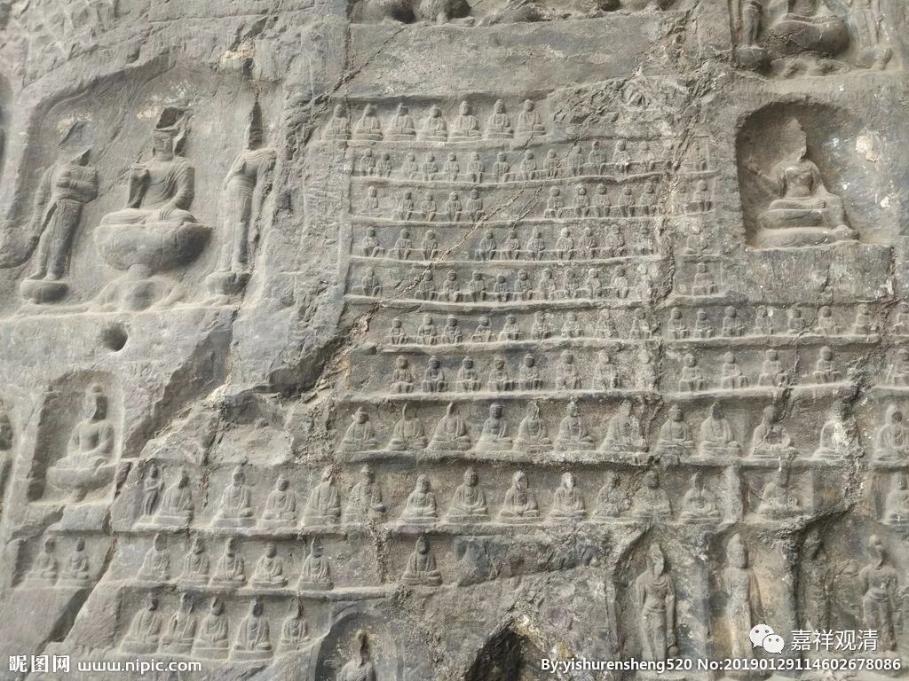

**《微课中观史》13·3**

清辨论师之后中观派的一个重要人物是月称论师嘛，他比清辨论师和佛护论师都要晚一辈或者晚两辈，因为有说月称论师曾经师从清辨论师的弟子观音禁和佛护论师的弟子莲花慧。

不过，现在藏传佛教当中比较通行的说法是，月称论师是直接跟龙树菩萨学的。在藏传通行的传说当中，佛护论师、清辨论师和月称论师这三位论师都是直接跟龙树菩萨学的——这个说法挺有趣的。目前就历史看起来，他们应该是各有师承的。月称论师在学习之后多分随顺了佛护论师的观点，也参考了清辨论师的一些善说。

年代上来说，一般认为（由于印度的历史相对模糊，所以人物年代基本上都靠推测，其中重要的推测年代的坐标就是汉僧游历后的记载），佛护论师的的年代大约是公元470-540年前后，相对应的一个坐标人物，唯识派的陈那论师大约是公元480-540年前后。清辨论师的年代大约是公元490-570年前后，对应的护法论师的年代大约是530-561年，护法寿命很短，31岁就因病去世了。月称论师的年代大约是600-650年前后，给他的寿命只大约地定50年的原因是，他夹在玄奘和义净两位求法高僧之间，而玄奘大师没有提及他的大名，所以一般推测当时他年龄不会太大。当然以上的年代只是大致的推测。

这方面汉地治佛教史就比较幸运，一方面历代都有人修《高僧传》，几乎和历代为前朝修史一样形成了一个传统，另外，还有很多金石墓志资料现存或出土，还有很多正史、笔记、地方志等等的文字记载，这就让汉地僧史的考录相对印度先天地就容易得多。

佛护、清辨、月称论师最重要的著作是他们各自为《中论》做了注解，分别是《中论佛护释》、《般若灯论》、《中观明句论》。据汉地传说，罗什以前印度注解《中论》的有数十家，也有说七十余家的，但佛护以前的中论释目前仅有汉译的《中论·青目释》了（藏传有《中论·无畏释》与青目释略近）。汉译的还有署名无著的《顺中论》，此论虽是纯中观的论典，但不是全篇的《中论释》。

月称论师的《中观明句论》现在应该是全世界最流行的《中论》权威注释本了。月称在《明句论》中认为清辨论师对佛护论师的注解稍微有点误解，因为两者推理的方式有点不一样，月称论师认为清辨论师对佛护的批评相当于把佛护的设问当作反问了，是在问句的理解上出现了问题。这个情况在我们平时也经常出现的。

