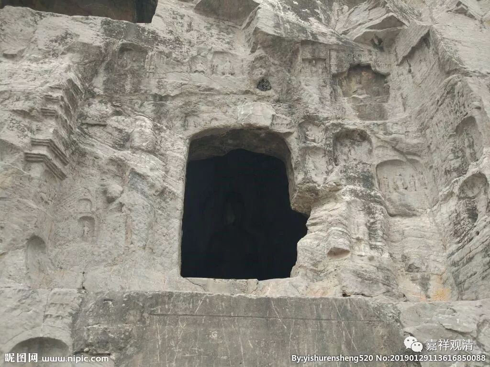

**微课堂佛教史014·1**

据说月称论师曾经做过那烂陀寺的看门人，这个看门人也是蛮厉害的。在藏传佛教的传说当中，能够做到看门人都是特别重要、特别厉害的人。而且还有传说月称论师曾经和月官论师有过一次辩论，这场辩论历经了差不多七年的时间。而辩论的结果有两种不同的说法，一种说是月官论师赢的，一种说是月称论师赢的。

那么，说月官论师赢的是哪一系呢？就是我们前面讲的多罗那他，因为他们这个觉囊派系统是比较往唯识方面理解的。当然，这个系不能算是纯的唯识，同时也不能算是纯的中观。一般来说，大家会觉得他们对中观和唯识的理解都会有一些错误。比较肯定的是，他们不是站在中观的立场的，而且相对来说，中观和唯识之间，他们是相对同情唯识的（实际主要就是看中观不顺眼）。所以在他们的传说当中，月官论师和月称论师之间的辩论呢，最后获胜的人是月官论师。但是西藏传说的主流都是认为辩论胜利的是月称论师。月称论师，月是月亮的月，称是称重的称。月官论师的那个官呢，是当官的官，他是个居士。

在唐老那里学习的时候，唐老说月称、月官辩论以后当时江湖上乃至牧童都会念一个颂子“家家龙树宗”……让我们背，我一时没反应过来——“家家龙树宗？大家都学中观派？”后来回到住处才反应过来，是“嗟嗟龙树宗”，唐老的四川口音让我听成了“家家龙树宗”。那个颂子是“嗟嗟龙树宗，有药亦有毒；无著世亲释，群生之甘露。”

陪唐老散步的时候，我小心地试探：“唐老，据说对这次辩论的结果还有另一种说法，说是月称赢的”，唐老歪头问：“你说什么？”我说：“还有另一个传说说是月称赢的。”唐老斩钉截铁地说：“没有第二种说法，就一种说法，月官赢的！”好吧，老师说了算！

月称论师的作品就比较多了，他对很多早期的中观派著作都进行了注解，比如《中观论》、《四百论》、《六十正理论》、《七十空性论》等等，月称论师都进行了注解。然后他自己也写了一些著作，其中比较重要的就是《入中论》，他先单独写了颂文，又同时给出了自释——就是他自己对于《入中论》颂文的解释。

月称论师还有一部著作叫《归依七十颂》。我在藏地的藏经目录当中，有看到过月称论师的《五蕴论》，我还没有搞清楚，因为还没去查过这部论到底是谁写的，到底是什么样的一个性质。

        修改于