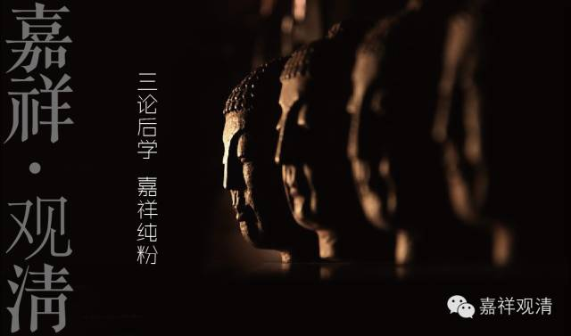

**《善说精髓》084（44）**

沉没以后，接着谈掉举。

** “掉举因贪趣境故，”**

之前说过，藏传依《集论》，名词定义多取安慧说，所以他说“** 掉举”“因贪趣境故**”，说掉举是贪的一份，心转向与其他的贪爱的对象。如果依《瑜伽》卷五十八、《成唯识论》、《集论》卷四，则掉举是和一切染污品相应的，不单单是贪的一分，也是独有其“嚣动”、“令心不寂静”的自相的。所以在玄奘系看来，掉举趋向余境的因未必是贪。这里我们还是依藏传顺着说吧。

** “应修无常可厌事，掉举自然得止息，”

这时候的对治法，目的就是要让兴奋的心平静下来，本论给的解决方法是“**应修无常”** 观，和**“可”** 以**“厌”** 离的**“事** ”，就是让心离开原先的所缘境，令兴奋的心和缓下来。你贪心想多了，那就想想无常、想想白骨观、脓烂想……这样，“**掉举”的心** 就因为得到相应的压制而**“自然得止息** ”。

**“太散暂停为教授，掉举太猛亦暂停。”

这一句呢，若依《广论》，意思是，如果掉举太久、太厉害，可以暂停正修的内容专修厌离，或者和前面“昏沉睡眠”的对治法一样，可以起坐休息一下；如果掉举不是很厉害，那可以在坐上摄心，仍旧安住于正修的所缘境上。

《菩提道次第广论》卷十五说：

** “故掉举太猛或太延长，应暂舍正修而修厌离，极为切要。非流散时，唯由摄录而能安住。若掉举无力，则由摄录，令住所缘。”**

《菩提道次第略论》卷五也说：

** “若是散乱力猛时长，暂时搁置，而修厌离。极为切要，心非流散，乃可摄住。若掉势不猛，则可摄录，安住所缘。”**

所以这句应当如《广论》、《略论》这样理解。

