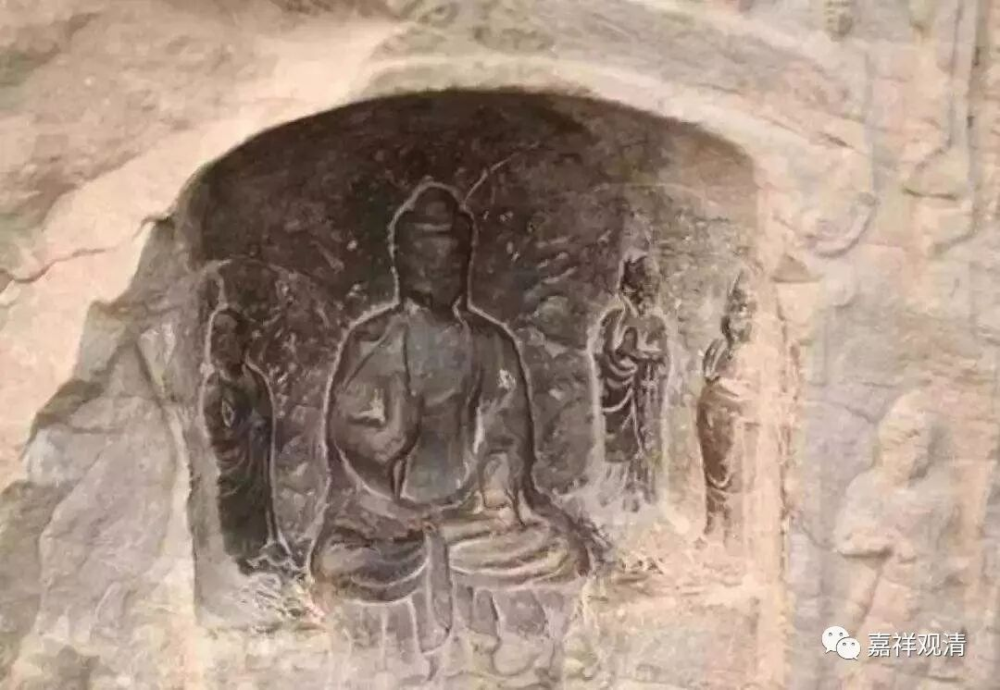

**《微课中观史》14·2**

我们在前面已经讲过，清辨论师和唯识派的护法论师算是有过一次未见面的辩论，后来月称论师和月官论师又有一次见面的、据说长达七年的辩论。在他们之间还有一次比较大的辩论，也是见诸文献的辩论，是戒贤论师和智光法师之间的辩论。

戒贤论师就是玄奘法师的老师。智光论师也是印度佛教中观派的代表人物，从时间上来说，和月称论师的前后也讲不清楚。一般还是认为他在月称稍前一点时间。这位智光法师和玄奘法师是同时代的，他和玄奘法师在那烂陀寺的关系也不错。玄奘法师回国以后，他们还先后有过两次通信。

那么，他们的这次辩论由日照三藏告诉了当时中国佛教的贤首国师法藏大师，于是法藏大师就把这场辩论的传说或者说这段历史记录了下来。

智光法师和戒贤法师这次辩论的主题是什么呢？他们辩论的主题是中观和唯识的了义和不了义，不过他们辩论的主要内容是教证，就是说中观和唯识的经典哪个更了义，或者说是一种说法。日照三藏传给法藏法师的说法呢，后来基本上就成为中国的大师们讲中观系的时候主要所用的方法。

戒贤论师依《解深密经》，许：最初，佛于鹿野苑演说四谛小乘之法，仅说人空，于缘生法定说实有，尚在有边。第二时中，依遍计所执而说“诸法自性皆空”，于依他、圆成尚未开显，此在空边。第三时中，具说三性三无性等，遍计无而依圆有，方为了义。

智光论师则依《大乘妙智经》，谓：佛初于鹿野苑，为小根基者开演四谛小乘之法，说心境俱有，破于外道；于第二时，为中根人诠说唯识大乘，说境空心有，破小乘实有；于第三时，方为上根，说、无相大乘，显心境俱空，平等一味，为真了义。

据汉传的这个传说，中观在说“三转那啥”的时候依《大乘妙智经》，完全不依《解深密经》立论，三转的前后次序和唯识系不同，立意也不同。藏传中观在三转那啥的时候还是主要依《解深密经》，别依《陀罗尼子在王请问经》，和智光论师的立论是不同的。

据法藏法师转述日照三藏的说法，说智光法师著有《般若灯论》，和清辨论师的《中论释》重名了，这或许也是一部《中论释》，但可惜现在没有传世。

据玄奘说，智光论师跟戒贤大师学习过，那这次辩论可以说智光法师是“当仁，不让于师”了。

