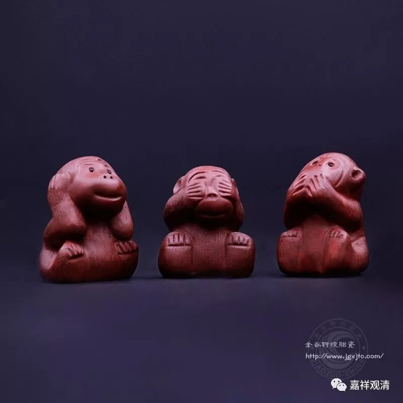

**《善说精髓》084（45）**

** “戌二、明生沉掉之因**

** 食不知量不守根，睡不勤行不正知，

**沉掉共因”

下面讲生起沉没、掉举的因。这里是举其要者而言。

生起沉没、掉举的因也分两类：沉掉的共因、沉没、掉举的不共因。先讲沉默掉举的共因。这里说四个：1、饮食不知量，对治就是饮食知量咯；2、不护根门，对治就是密护根门；3、长时睡眠而不精进，对治就是合理作息、悎悟瑜伽；4、不正知，对治就是正知而住。

《广论》卷二在“未修中间应如何行”时，依《瑜伽师地论》，说修止观有四种资粮，正是沉掉共因的对治：

** “复应学习四种资粮，是易引发奢摩他道、毘钵舍那道之正因，所谓密护根门、正知而行、饮食知量、精勤修习悎寤瑜伽、于眠息时应如何行。”

其中“**精勤修习悎寤瑜伽、于眠息时应如何行** ”摄为一种资粮，对治“**睡不勤行** ”。

首先，**“食不知量”** 。总的来说，“食不知量”能生沉掉，具体来说，吃得少容易饿着，容易生掉举；吃多了犯困，容易生起昏沉、沉没。肚子饿了，你想找东西吃啊，贪心起来了，想吃哪一家素斋，哪一道菜有味道~~~心就兴奋起来，四处流散。吃多了，真的困。我们以前禅堂里，几个堂主非要吃完午饭就打坐，然后都吃饱饱的，坐在那里打瞌睡、呼噜也起来了，口水也下来了，脑袋也耷拉下来了，从后面看过去就一个领子在那里竖着，脑袋都看不到了，冷不丁的能吓你一跳。

第二呢，“**不守根”，** 不护根门，“根”就是六根，眼睛到处看，耳朵到处听……平时心就流散，坐下来一定妄念纷飞。我以前看别人打游戏，然后一打坐，当当当当，屏幕上两个小坦克就出来打敌人坦克了……所以你要专门禅修的话，绝对要“外息诸缘”、“心如墙壁”，这样才“可以入道”，是吧。

达摩祖师说：“外息诸缘，内心无喘，心如墙壁，可以入道。”“可以入道”，说明是入道基础，不就是道哦。一帮文盲常常看不懂还以为就是道，在边上一通胡扯……

