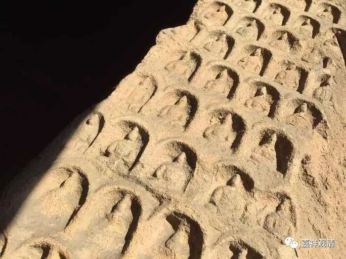

**《微课中观史》14·3**

唯识的三转那啥还用再讲吗？哦，有新人在听，那就稍微讲一下吧。

唯识派（《解深密经》）说佛陀的教法可以分成三转那啥。初转是讲什么呢？最初是讲四谛法类，中间的时候就开始讲般若法类，最后讲善辩法类。善辩法类就是讲唯识的三性三无性，讲得很清楚。所以最初是讲有，后来讲空，再后来讲三性三无性。

最初是小乘佛教讲的一切法——蕴界处，都是实有的，中间讲一切法空，最后讲依他起和圆成实是实有的，而遍计所执是空的。这个是唯识系的讲法。他们所依据的经典是什么呢？是《解深密经》。唯识派认为这就是了义的说法，最终了义的是哪部经典呢？就是《解深密经》，就是唯识派认为最终了义的经典。

智光论师针对唯识派的这种说法呢，另外挑选了《大乘妙智经》，说最初说一切有，然后说心有而外境无，最后说一切法无自性。

按照藏传后期的说法，是《无尽慧经》或者《无尽意经》。《无尽慧经》和《无尽意经》这两部经典我专门查过，在汉传的《大宝积经》和《大集经》当中，各有一部《无尽慧经》和《无尽意经》。如果看这两部经中所讲的胜义谛和世俗谛，跟藏传所引用的文字差不多，在这两部经典里面都有讲二谛的部分，一部叫《无尽慧经》，一部叫《无尽意经》，就不知道完整对应的应该是哪一部。《大集经》和《大宝积经》都是丛书性质的大乘的佛经。但是智光论师他找的是《大乘妙智经》，他的说法就放到下次再讲吧。

其实还有一种三转那啥，是《宝性论》依《陀罗尼自在王请问经》讲的，《陀罗尼自在王请问经》好像也是《大集经》里的一会，这个三转和前面的也有不同，一般解释为是专门针对大乘利根行者的。

这两天我的时差还没倒过来，现在应该是睡觉的时间了。好吧，今天的佛教史就先讲到这里，谢谢大家。

