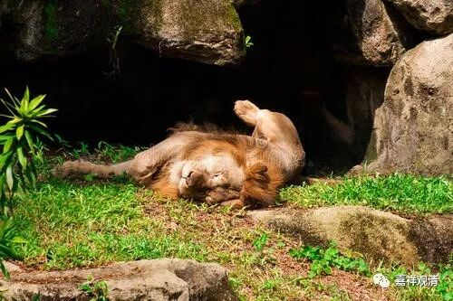
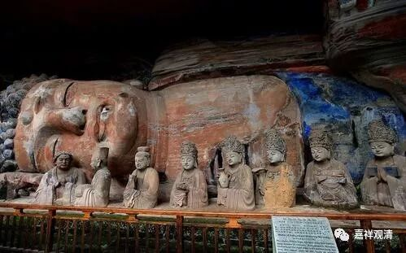

**《善说精髓》084（46）**

第三呢。“** 睡、不勤行**”，睡不勤行，就是贪睡，不勤加修行。印度人把一天分为六时，所谓“昼夜六时”，一时就是四个小时。阿含和戒律里面告诉我们，只有夜晚的“中夜”（十点至二点）才是应该睡觉的时间。初夜、后夜都应该禅诵经行——或者禅修、或者学习。《瑜伽师地论》对我们宽松一些了，晚上分四时了，每一时三个小时。《瑜伽》说中间的六个小时属于睡觉时间（谢谢弥勒菩萨）……其他时间呢，除了生病、疲极等原因，都应该坚持禅诵……

然后即使睡觉呢，也有专门做法，以右侧卧（狮子卧）的姿势，在忆念光明中入睡……然后时间一到，就警觉地起身继续禅诵。

《菩提道次第广论》卷二说：

“临睡息时，应出房外，洗足入内，右胁而卧，重叠左足于右足上，犹如狮子而正睡眠。如狮子卧者，犹如一切旁生之中，狮力最大，心高而稳，摧伏于他。如是修习悎寤瑜伽，亦应由其大势力等，伏他而住，故如狮卧。饿鬼、诸天及受欲人，所有卧状，则不能尔，彼等一切悉具懈怠，精进微劣，少伏他故。又有异门，犹如狮子右脇卧者，法尔令身，能不缓散，虽睡沈已，亦不忘念，睡不浓厚，无诸恶梦。若不如是而睡眠者，违前四种，一切过失，悉当生起。”

这里说多睡、贪睡是止观、是灭除沉掉的障碍，我们尽量做吧……好像一天四个小时有点难哦，六个小时也才凑合……

这里的“狮子卧”，我理解为象佛那样右侧卧，佛，就是人中狮子、法狮子，以狮子来比喻佛，说佛讲法，也说“狮子吼”。但一般外面讲，说“狮子卧”就是世间野外、动物园里狮子的卧姿，我发觉不是。狮子卧姿五花八门啥都有，并不一定是右侧卧，右侧卧在世间狮子的卧姿中甚至连一半都没有。

所以，狮子卧应该理解为佛的卧姿。

