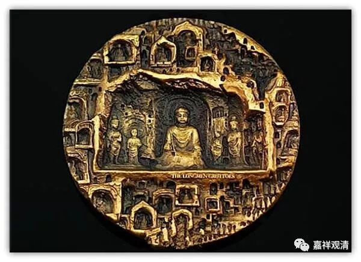

**《微课堂佛教史》015·1**

好，我们继续佛教史。

我们是从中观派的历史开始讲的，现在已经讲到中观派中期的佛护论师、清辨论师和月称论师，也提到了一位智光论师，他肯定是和玄奘法师同时期的。至于月称论师到底是在玄奘法师之前，还是在玄奘法师之后，还是两个人同时，因为没有直接明确的记载就不确定了。他们本来应该是要碰到的，但是居然没有碰到过，所以暂时就算月称比玄奘要略晚一点点。

接下来稍微晚一点的一位人物是谁呢？就是寂天论师，那么其他几位我们就不讲了。寂天论师比前面讲的这几位要稍微晚一点，应该把他算在中观派的中期里面的。寂天论师的老师到底是谁呢？好像不太清楚……那么，寂天论师所在的时代，也是那烂陀寺非常发达的时代，所以这个故事就又回到那烂陀寺去了。他的故事很有趣，各种版本的内容大致上差不多，但是因为他的故事和周利槃陀的故事有点接近，所以经常会出现重合或者相交叉的版本。

我们就稍微复原一下早期的版本，也不管这个是不是历史的真事。据说寂天论师也是一位王族，好像还曾经做过国王，然后就跑了，去到那烂陀寺学习。我觉得这个传说多少有点问题：假如他就是国王的话，那他在那烂陀寺学习，还有人敢把他赶走吗？应该只是王族这种性质的吧，而且不是像我们现在所认识的阿拉伯王子这种王族，应该理解为刹帝利种姓的这种性质，但是后来慢慢地把他讲成是国王的孩子等等。就像我们现在传说的高丽的金地藏，在中国就说他是王子，但是如果看早期的记载，他根本不是王子，最多讲王族，或者是王家的族人，跟太子差得很远，这里就顺带一说而已。

寂天论师出家以后呢，在寺院里面被大家称为“三事者”，说他只会做三件事——吃饭、睡觉、拉屎，就叫他“三事者”。其实他是一个内密的修行人，非常了不起，自己的修行功德别人根本就看不出来，这个才是真的有修行啊！

那么，从现在的所保存的寂天论师的著作来看，他应该远不是一个“三事者”，可能他就是做人比较低调，大家都不太熟悉他。寂天论师有很多很多的著作，也看了很多很多书，并且在看书过程中作了摘录，后来就变成了《集经论》，是吧？这部论典以前也曾经翻译过汉文的，这就说明他看了很多书，又作了摘录。寂天论师又写了《入菩萨行论》，创作还是很勤奋的。所以说他是“三事者”，应该只是一个故事，对吧？这样大量地看书、写书，拥有大量的作品的一个人，很难说大家看不到他学习啊。但是故事就是这样的，故事里面就说大家认为他啥事都不做，只会做这三个事情，其实他是内密菩萨行。

